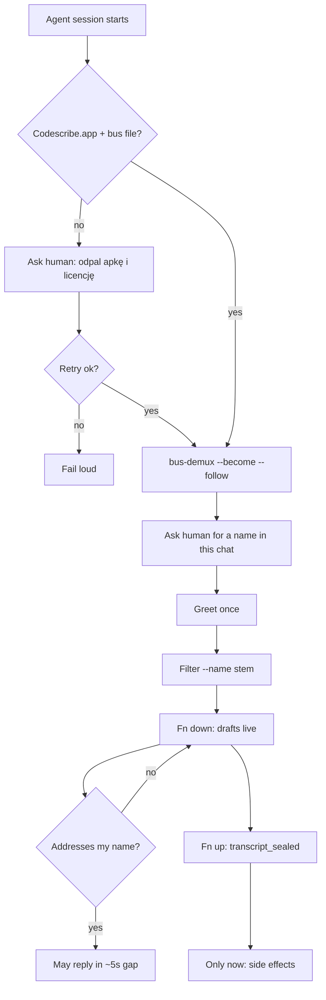

# `codescribe` attach flow

```mermaid
flowchart TD
    A[Agent session starts] --> B{Codescribe.app + bus file?}
    B -->|no| C[Ask human: odpal apkę i licencję]
    C --> D{Retry ok?}
    D -->|no| E[Fail loud]
    D -->|yes| F[bus-demux --become --follow]
    B -->|yes| F
    F --> G[Ask human for a name in this chat]
    G --> H[Greet once]
    H --> I[Filter --name stem]
    I --> J[Fn down: drafts live]
    J --> K{Addresses my name?}
    K -->|yes| L[May reply in ~5s gap]
    K -->|no| J
    J --> M[Fn up: transcript_sealed]
    M --> N[Only now: side effects]
```
