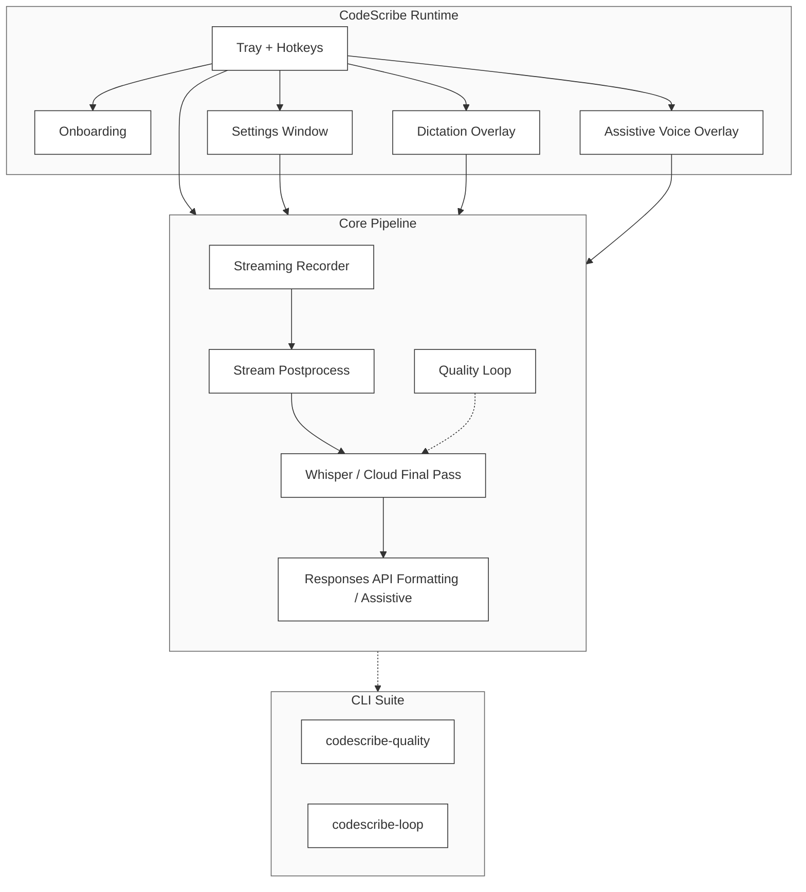

# ⌜ CodeScribe ⌟

**Native macOS tray dictation and assistive voice overlay with local Whisper live preview, optional cloud final transcript paths, and quality tooling.**

## Overview

CodeScribe is a native macOS menu-bar application that captures audio through global hotkeys, shows live local
transcription while you speak, and pastes or routes the final result into the focused application. The shipped product
in this repo is a tray app with three explicit surfaces: onboarding, settings, and overlays.

Local Whisper is the low-latency path. Cloud STT is optional and currently used as a post-capture transcript backend,
not as live cloud preview. AI formatting and assistive mode use OpenAI-compatible Responses API endpoints configured in
Settings or `~/.codescribe/.env`.



> **Current runtime truth:** live overlay preview is local Whisper. Cloud STT is configurable in Settings, but in the current build it is still a **post-capture** path rather than live cloud preview.

> **Status:** current release (see `Cargo.toml`) ships as a native macOS tray/settings/overlay app with local live preview, tiered settings (`settings.json` + Keychain + optional `.env`), and quality-loop tooling.

See: [`docs/WHISPER_LIVE.md`](docs/WHISPER_LIVE.md) | [`docs/BACKLOG.md`](docs/BACKLOG.md) | [`docs/ARCHITECTURE.md`](docs/ARCHITECTURE.md)

## API Provider

CodeScribe uses **OpenAI-compatible Responses API** (`/v1/responses`) endpoints for AI formatting and assistive mode.

### Multi-Provider Setup (Recommended)

Use different providers for different modes — e.g., cheaper model for formatting, powerful model for assistive:

```env
# ~/.codescribe/.env

# Shared defaults
LLM_ENDPOINT=https://api.openai.com/v1/responses
LLM_MODEL=gpt-4.1-mini
LLM_API_KEY=sk-proj-xxx

# Formatting mode overrides (Formatting mode / cleanup pass)
LLM_FORMATTING_ENDPOINT=https://api.libraxis.cloud/v1/responses
LLM_FORMATTING_MODEL=gpt-4.1-mini
LLM_FORMATTING_API_KEY=vista-xxx

# Assistive mode overrides (Assistive mode / agent chat)
LLM_ASSISTIVE_ENDPOINT=https://api.openai.com/v1/responses
LLM_ASSISTIVE_MODEL=gpt-4.1
LLM_ASSISTIVE_API_KEY=sk-proj-xxx
```

> **Note:** All requests use `previous_response_id` for conversation chaining. Context persists across transcriptions.

## Features

- **Pure Rust Implementation** — Native macOS app built entirely in Rust with candle-core + Metal GPU
- **Embedded-first Whisper** — Default installs ship with an embedded model; `make install-no-embed` is available when you prefer runtime-managed weights.
- **Whisper Live** — Streaming transcription happens _during recording_ (chunks + overlap), so `stop()` is
  near-instant
- **Stream postprocess** — semantic gating + cleanup of live chunks before final output
- **IPC Server** — Stable runtime interface for GUI/clients
- **Quality Loop + Report** — Automated quality scoring and batch reports
- **CLI Suite** — `codescribe`, `codescribe-quality`, `codescribe-loop`
- **Metal GPU Acceleration** — Hardware-accelerated inference on Apple Silicon
- **System Tray App** — Minimal menu-bar presence with animated status glyphs
- **Global Hotkeys** — Hold Fn (default) or double‑tap Option to record
- **Provider Separation** — Different LLM providers for formatting vs assistive mode
- **AI Formatting** — Optional post-processing via Responses API
- **Slug Filenames** — Transcripts named with first 3 words for easy identification

## Tech Stack

| Component        | Technology                        | Purpose                    |
| ---------------- | --------------------------------- | -------------------------- |
| Language         | Rust 2024 Edition                 | Native performance         |
| ML Framework     | candle-core + candle-transformers | Whisper inference          |
| GPU Acceleration | Metal (Apple Silicon)             | Hardware-accelerated STT   |
| System Tray      | tray-icon + muda + tao            | Menu bar app               |
| Hotkeys          | CGEventTap (core-graphics)        | Global key detection       |
| Audio            | cpal + hound + symphonia          | Recording & format support |
| HTTP Client      | reqwest                           | LLM API calls              |
| API Format       | openai-harmony                    | Responses API support      |
| Security         | cap-std                           | Path safety hardening      |
| Embeddings       | candle-transformers (MiniLM)      | Local semantic gating      |

## Installation

### Prerequisites

- **macOS 14+** (Sonoma or later)
- **Apple Silicon** (M1, M2, M3, or later)
- **Rust Toolchain** (1.85+ with edition 2024 support)

### Install from Source

```bash
# Clone the repository
git clone https://github.com/VetCoders/CodeScribe.git
cd CodeScribe

# Install CLI (embedded Whisper + MiniLM)
make install

# Verify installation
codescribe --version
```

### Install via Release DMG

Tagged builds can publish a signed-or-ad-hoc DMG through GitHub Releases:

1. Open [Releases](https://github.com/VetCoders/CodeScribe/releases)
2. Download `CodeScribe_<version>.dmg`
3. Drag `CodeScribe.app` into `Applications`

> **Current truth:** source install is the guaranteed path inside this repo. The release workflow lives in `.github/workflows/release.yml` and publishes DMGs on `v*` tags.

### Build Options

```bash
make build              # Debug build (external model)
make release            # Release build (embedded Whisper + MiniLM)
make install            # Install CLI with embedded models
make install-app        # Build + install macOS .app (auto-downloads models if missing)
make install-no-embed   # Dev-only: install without embedding (needs CODESCRIBE_MODEL_PATH)
```

## Quick Start

```bash
# Start tray app
codescribe

# Open/create config file
make config
# or: codescribe --config

# Verbose logging
codescribe -v

# CLI transcription
codescribe transcribe audio.wav
codescribe transcribe -l pl audio.m4a
codescribe transcribe -f audio.mp3  # with AI formatting
```

## Default Hotkeys (macOS)

- **Dictation**: hold your configured modifier (default: **Hold Fn/Globe**) → release to send + paste
- **Formatting**: **Double‑tap Left Option** → hands‑free recording + AI formatting (auto‑paste ON)
- **Assistive (Agent)**: **Double‑tap Right Option** → voice‑chat overlay + agent response (auto‑paste OFF)

Hotkeys are configured in **Settings → Modes & Shortcuts**. Double‑tap modes auto‑send an utterance when you pause, and stop on the next double‑tap.

## Settings & Secrets

- GUI settings: `~/Library/Application Support/CodeScribe/settings.json`
- API keys: macOS Keychain (`com.vetcoders.codescribe`)
- Power‑user overrides: `~/.codescribe/.env`

## How It Works

```mermaid
flowchart TD
    A[Hotkey Press] --> B{Mode?}
    B -->|Hold Fn| C[Start Recording]
    B -->|Double Option| C
    C --> D[Recording]
  D -->|live chunks| E[Whisper STT (streaming)]
    D -->|Release / Toggle| F[Stop]
    F --> G[Finalize last chunk]
    G --> H{AI Enabled?}
    H -->|Yes| I[LLM Formatting]
    H -->|No| J[Raw Transcript]
    I --> K[Paste to Active App]
    J --> K

    E -.- E1[Metal GPU • embedded model]
    I -.- I1[Responses API • previous_response_id]
```

### Transcription Pipeline

Live transcription is now modeled as:

- committed utterances already safe to keep
- one active preview tail for the current utterance
- corrections that rewrite only that active tail

That means streaming partials are appended session-wide, but partial-pass fixes
only backspace inside the current tail instead of overwriting earlier committed
text. Final utterances keep their timestamp/segment metadata through the event
pipeline, while overlays/chat bubbles still receive only backspace-encoded
`TranscriptDelta` payloads.

### Recording Modes

| Mode                  | Trigger                   | Description                                |
| --------------------- | ------------------------- | ------------------------------------------ |
| **Dictation**         | Hold `Fn/Globe` (default) | Fast transcript (AI optional), auto‑paste  |
| **Formatting**        | Double‑tap `Left Option`  | AI formatting pass, auto‑paste             |
| **Assistive (Agent)** | Double‑tap `Right Option` | Agent chat with optional selection context |

See [`docs/BACKLOG.md`](docs/BACKLOG.md) for detailed mode descriptions and future enhancements (VAD, Overlay).

## Configuration

GUI settings live in `settings.json`, secrets in Keychain, and power‑user overrides in `~/.codescribe/.env`.

```bash
# Open config helper (creates ~/.codescribe/.env if missing)
make config
```

### Environment Variables

```env
# STT (Speech-to-Text)
WHISPER_LANGUAGE=pl                  # pl | en | de | fr (no auto!)
# CODESCRIBE_MODEL_PATH=             # Override embedded model

# Hotkeys
HOLD_MODS=ctrl                       # ctrl | ctrl_alt | ctrl_shift | ctrl_cmd
TOGGLE_TRIGGER=double_option         # double_option | double_ralt | none
HOLD_START_DELAY_MS=800              # Delay before recording starts

# AI Formatting
AI_FORMATTING_ENABLED=1              # 1=format via LLM, 0=raw transcript

# LLM Provider (shared defaults)
LLM_ENDPOINT=https://api.openai.com/v1/responses
LLM_MODEL=gpt-4.1-mini
LLM_API_KEY=sk-proj-xxx

# Provider separation (optional)
# LLM_FORMATTING_{ENDPOINT,MODEL,API_KEY}=
# LLM_ASSISTIVE_{ENDPOINT,MODEL,API_KEY}=

# History
HISTORY_ENABLED=1                    # Save transcripts
DUMP_AUDIO_LOGS=0                    # 1=save .wav paired with .txt

# Audio
BEEP_ON_START=1
SOUND_VOLUME=0.5
# AUDIO_INPUT_DEVICE=                # Specific device name

# Logging
LOG_LEVEL=INFO                       # TRACE | DEBUG | INFO | WARN | ERROR
```

See `.env.example` for complete reference.

## CLI Reference

### `codescribe` (Tray App)

Main application — runs as menu bar app with global hotkeys.

```bash
codescribe [OPTIONS]

Options:
  -v, --verbose      Enable verbose logging
  --config           Create/edit config file
  --version          Show version
  -h, --help         Show help
```

### `codescribe transcribe`

CLI transcription without tray app.

```bash
codescribe transcribe FILE [OPTIONS]

Arguments:
  FILE               Audio file (WAV, MP3, M4A)

Options:
  -l, --language     Language hint (pl, en, de, fr)
  -f, --format       Apply AI formatting
  -m, --model        Model name (if using external)
  --llm              LLM model for formatting
  -h, --help         Show help
```

## Model

CodeScribe uses **whisper-large-v3-turbo-mlx-q8**:

- 4-layer turbo architecture (vs 32 layers in full model)
- Q8 quantization (~894MB weights)
- ~10x faster than whisper-large-v3
- Metal GPU acceleration

### Embedded Model (Default)

Release builds include the model via `include_bytes!`:

```bash
cargo build --release          # ~888MB binary with model
CODESCRIBE_NO_EMBED=1 cargo build --release  # Dev-only experiment (not supported for distribution)
```

### External Model (Development)

For development or custom models:

1. `CODESCRIBE_MODEL_PATH` environment variable
2. `~/.codescribe/models/whisper-large-v3-turbo-mlx-q8/`
3. `./models/whisper-large-v3-turbo-mlx-q8/`

Model files required:

- `config.json`
- `weights.safetensors`
- `tokenizer.json`
- `mel_filters.npz`

## Architecture

```
CodeScribe/
├── codescribe-core/           # Core library (Whisper, audio, config, quality)
│   ├── src/
│   │   ├── lib.rs             # Core exports
│   │   ├── whisper/           # Embedded Whisper engine
│   │   ├── audio/             # Recorder + streaming
│   │   ├── config/            # Config + prompts
│   │   ├── quality_loop.rs    # Self-improvement loop
│   │   └── ...
├── src/
│   ├── lib.rs                 # App exports (macOS tray/hotkeys/UI)
│   ├── main.rs                # CLI entry point
│   ├── controller.rs          # Recording/transcription orchestration
│   ├── tray/                  # Tray menu + handlers
│   ├── hotkeys.rs             # CGEventTap hotkey handler
│   └── ...
├── models/                    # Whisper model files (build-time only)
├── tests/                     # Unit + E2E tests
└── docs/
    ├── WHISPER_LIVE.md        # Embedded + streaming transcription (DONE)
    └── ARCHITECTURE.md        # Technical documentation
```

## Development

```bash
# Clone and setup
git clone https://github.com/VetCoders/CodeScribe.git
cd CodeScribe

# Development build (external model)
CODESCRIBE_MODEL_PATH=./models/whisper-large-v3-turbo-mlx-q8 cargo run

# Quality checks
make lint           # clippy + fmt check
make test           # Unit + integration tests
make check          # Full quality gate

# Formatting
make format         # cargo fmt

```

### Makefile Targets

```
make build            # Debug build
make release          # Release build (embedded model)
make install          # Install CLI (~888MB)
make install-no-embed # Dev-only: install without embedding
make config           # Edit ~/.codescribe/.env
make start            # Start as daemon
make stop             # Stop running instance
make logs             # View logs
make lint             # Clippy + format check
make test             # Run tests
make check            # Full quality gate
make download-model   # Download Whisper model
```

## Code Quality

| Tool           | Purpose    | Config            |
| -------------- | ---------- | ----------------- |
| **Clippy**     | Linting    | `-D warnings`     |
| **rustfmt**    | Formatting | Rust 2024 edition |
| **cargo test** | Testing    | Unit + E2E        |

## Permissions

CodeScribe requires macOS permissions for:

- **Microphone** — Audio recording
- **Accessibility** — Global hotkey detection
- **Input Monitoring** — Keyboard event capture

Grant permissions in System Settings > Privacy & Security when prompted.

## Current Focus

- Keep the VAD auto-stop path honest and fully integrated before presenting it as the default hands-off mode.
- Preserve the explicit split between onboarding, settings, dictation overlay, and assistive overlay.
- Ship the macOS distribution path cleanly: bundle, sign, and notarize the DMG story.

See [`docs/BACKLOG.md`](docs/BACKLOG.md) for the working backlog and [`docs/ARCHITECTURE_VISION.md`](docs/ARCHITECTURE_VISION.md) for longer-range ideas that are not part of the current shipped surface.

## License

Apache License 2.0

---

**Made with (งಠ_ಠ)ง by the ⌜ VetCoders ⌟ 𝖙𝖊𝖆𝖒 (c) 2024-2026
Maciej & Monika + Klaudiusz (AI) + Junie (AI)**
