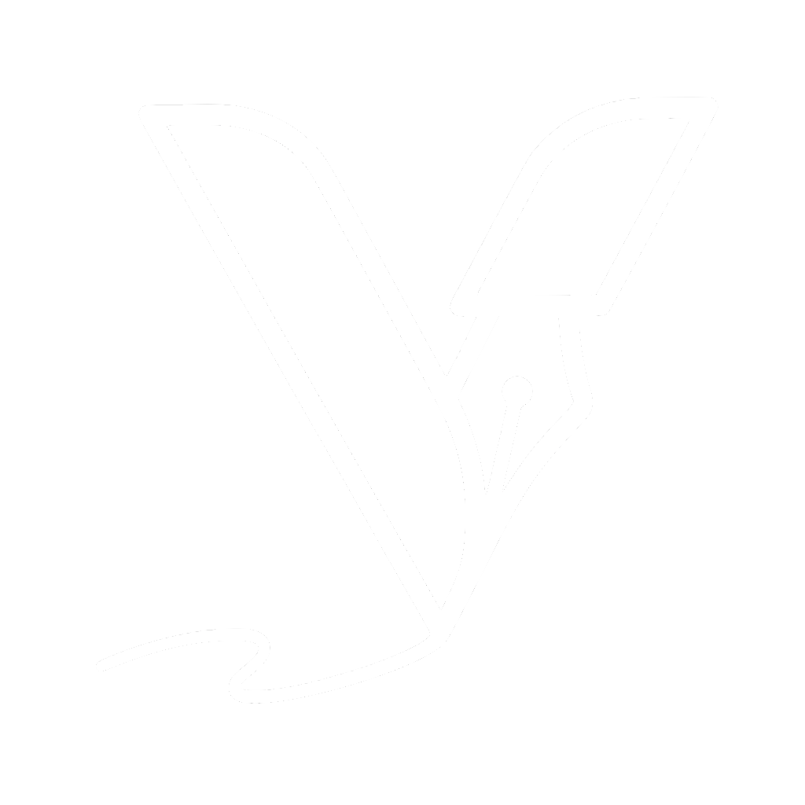

# VistaScribe — macOS menu‑bar speech‑to‑text (PL/EN)

<p align="center"></p>

VistaScribe to lekka aplikacja na macOS (pasek menu), która nagrywa dźwięk globalnym skrótem, transkrybuje lokalnie (MLX Whisper) i od razu wkleja wynik w aktywne pole (symulacja ⌘V). Prywatnie — bez chmury i bez kluczy API.

VistaScribe is a lightweight macOS menu‑bar app. Record with a global hotkey, transcribe locally (MLX Whisper) and paste instantly into the active field (simulated ⌘V). Privacy‑friendly, no cloud required.

## Features / Najważniejsze
- Local STT: Whisper MLX (Large v3 Turbo / Large v3 / Medium)
- Hotkeys: Hold Ctrl (exclusive by default) or double‑tap Option (toggle)
- Tray feedback: Ready / Listening… / Processing… + soft start sound (Tink/Pop)
- Formatting strategies: `light`, `light_plus` (bez modelu), `llm` (np. Qwen ~4B), `openai`
- Models menu in app: download Whisper or open models folder

## Quick start (.dmg) / Szybki start (.dmg)
1) Helpers/Get Models.command → download Whisper (required)
2) Helpers/Install Backend.command → install & start background server
3) Drag “VistaScribe.app” to /Applications (or run Helpers/Install App.command)
4) Grant macOS permissions: Microphone, Accessibility, Input Monitoring
5) Hold Ctrl to record (Exclusive: inne modyfikatory nie uruchomią nagrywania)

## Hotkeys & Feedback (runtime + .env)
- Hotkeys menu: wybór kombinacji (Ctrl / Ctrl+Option / Ctrl+Shift / Ctrl+Command), Exclusive toggle. “Save Hotkeys to .env”.
- Feedback: Enable Start Sound, wybór dźwięku (Tink/Pop), głośność. “Save Feedback to .env”.
- Optional env vars:
  - `HOLD_MODS=ctrl|ctrl+alt|ctrl+shift|ctrl+cmd`, `HOLD_EXCLUSIVE=1|0`
  - `BEEP_ON_START=1|0`, `SOUND_NAME=Tink|Pop`, `SOUND_VOLUME=0.0–1.0`
  - `FORMAT_ENABLED=1|0`, `FORMAT_STRATEGY=light|light_plus|llm|openai`
  - `WHISPER_DIR=…`, `LLM_ID=…` (np. Qwen 3 4B)

## Developer setup
```bash
uv sync
uv run python scripts/get_models.py --whisper large-v3-turbo   # or: large-v3 / medium
uv run python main.py        # tray app
# or HTTP backend:
uv run python backend.py
```

## Build .app / .dmg
- .app (py2app):
  ```bash
  (cd packaging && python setup.py py2app)
  ```
- DMG:
  ```bash
  (cd packaging/dmg && ./build_dmg.sh)
  open packaging/dmg/VistaScribe.dmg
  ```

For internal team onboarding see: `docs/TEAM_SETUP.md`.

### Signing / Notarization (outside App Store)
Masz “Developer ID Application”? Możesz podpisać i (opcjonalnie) znotaryzować:
```bash
packaging/scripts/sign_and_notarize.sh \
  --app packaging/dist/VistaScribe.app \
  --cert "Developer ID Application: Your Name (TEAMID)" \
  --profile AC_PROFILE_NAME \
  --dmg packaging/dmg/VistaScribe.dmg
```
Entitlements: packaging/entitlements.plist (minimal, bez sandboxa). Notary eliminuje ostrzeżenia Gatekeepera.

## Notes / Uwagi
- “light_plus” daje szybkie, czytelne formatowanie bez LLM (zalecane na start).
- Chcesz LLM formatter? Ustaw `LLM_ID` (np. Qwen 3 4B) i `FORMAT_STRATEGY=llm`.
- Whisper modele trzymaj lokalnie w `./models` (gitignored). Helpers/Get Models.command pobierze je za Ciebie.

## License
MIT
