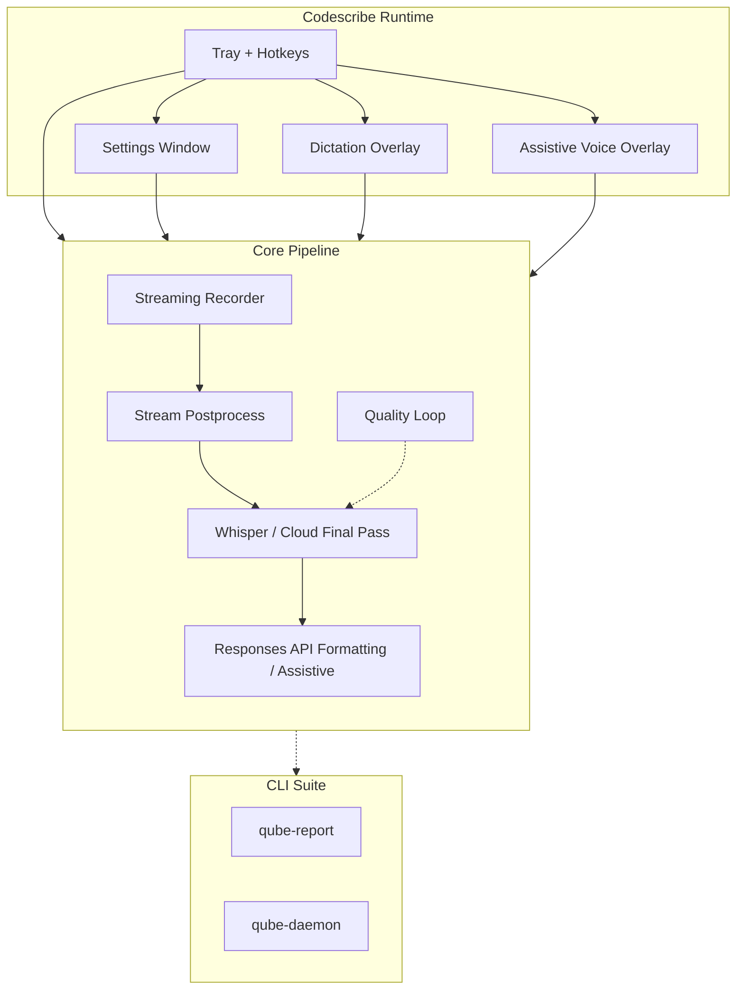
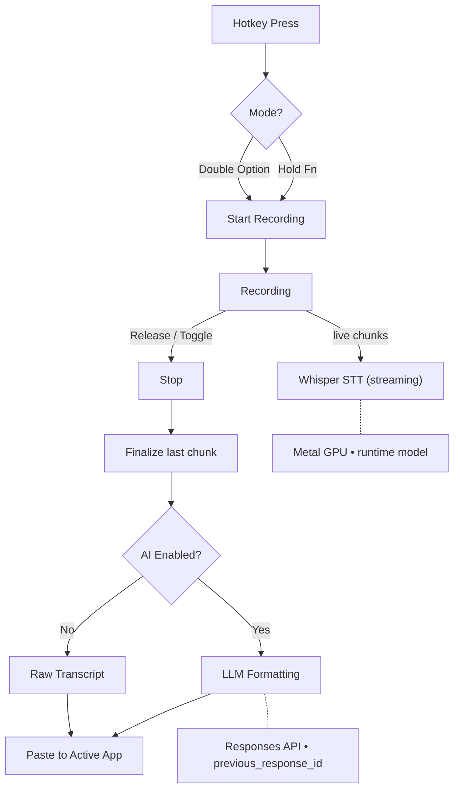

# ⌜ Codescribe ⌟

[](Cargo.toml)
[](LICENSE)
[](https://github.com/vetcoders/codescribe/actions/workflows/rust.yml)
[](https://vetcoders.github.io/codescribe/)

**Native macOS tray dictation and assistive voice overlay with local Whisper live preview, optional cloud final transcript paths, and quality tooling.**

## Overview

Codescribe is a native macOS menu-bar application that captures audio through global hotkeys, shows live local
transcription while you speak, and pastes or routes the final result into the focused application. The shipped product
in this repo is a tray app whose SwiftUI front-end has two explicit surfaces: settings and overlays.

Local Whisper is the low-latency path. Cloud STT is optional and currently used as a post-capture transcript backend,
not as live cloud preview. AI formatting and assistive mode use OpenAI Responses API (`/v1/responses`) by default,
configured in Settings or `~/.codescribe/.env`.



> **Current runtime truth:** live overlay preview is local Whisper. Cloud STT is configurable in Settings, but in the current build it is still a **post-capture** path rather than live cloud preview.

> **Status:** current source version is `0.13.0` (see `Cargo.toml`) and ships as a native macOS tray/settings/overlay app with local live preview, tiered settings (`settings.json` + Keychain + optional `.env`), and quality-loop tooling.

See: [`docs/WHISPER_LIVE.md`](docs/WHISPER_LIVE.md) | [`docs/ARCHITECTURE.md`](docs/ARCHITECTURE.md)

## OpenAI Provider

Codescribe uses **OpenAI Responses API** (`/v1/responses`) by default for AI formatting and assistive mode.

### Default Setup

Put your OpenAI API key in Settings. Codescribe stores it in macOS Keychain and applies it to both AI modes:

```env
# ~/.codescribe/.env

# Shared defaults
LLM_ENDPOINT=https://api.openai.com/v1/responses
LLM_MODEL=gpt-4.1
# Store LLM_API_KEY in Settings / macOS Keychain, not in committed files.

# Formatting mode / cleanup pass
LLM_FORMATTING_ENDPOINT=https://api.openai.com/v1/responses
LLM_FORMATTING_MODEL=gpt-4.1
# Store LLM_FORMATTING_API_KEY in Settings / macOS Keychain.

# Assistive mode / agent chat
LLM_ASSISTIVE_ENDPOINT=https://api.openai.com/v1/responses
LLM_ASSISTIVE_MODEL=gpt-5.5
# Store LLM_ASSISTIVE_API_KEY in Settings / macOS Keychain.
```

For the exact resolver used by formatting, assistive, and the agent provider —
including precedence, reset/unset behavior, endpoint normalization, and
key-optional local endpoints — see [`docs/lane-truth.md`](docs/lane-truth.md).

> **Note:** All requests use `previous_response_id` for conversation chaining. Context persists across transcriptions.

### MCP Extension Path

Codescribe can load custom MCP servers from `~/.codescribe/mcp.json`. That keeps the free product useful with user-owned tools today, while leaving room for first-party Pro integrations such as AICX and Loctree later.

## Features

- **Rust core + SwiftUI app** — Native macOS SwiftUI shell over the Rust engine through UniFFI, with candle-core + Metal GPU
- **Two DMG variants** — The standard DMG embeds Silero VAD + MiniLM support assets and resolves Whisper from cache/download. The `_full` DMG embeds Silero + MiniLM + Whisper for users who prefer one larger download.
- **Whisper Live** — Streaming transcription happens _during recording_ (chunks + overlap), so `stop()` is
  near-instant
- **Stream postprocess** — semantic gating + cleanup of live chunks before final output
- **IPC Server** — Stable runtime interface for GUI/clients
- **Quality Loop + Report** — Automated quality scoring and batch reports
- **Qube CLI tools** — `qube-report` and `qube-daemon` from `bin/qube_report.rs` / `bin/qube_daemon.rs`
- **Metal GPU Acceleration** — Hardware-accelerated inference on Apple Silicon
- **System Tray App** — Minimal menu-bar presence with animated status glyphs
- **Global Hotkeys** — Hold Fn (default) or double‑tap Option to record
- **OpenAI Responses by default** — Formatting uses `gpt-4.1`; Assistive uses `gpt-5.5`
- **Custom MCP Servers** — Add your own MCP tools through `~/.codescribe/mcp.json`
- **AI Formatting** — Optional post-processing via Responses API
- **Slug Filenames** — Transcripts named with first 3 words for easy identification

## Tech Stack

| Component        | Technology                        | Purpose                    |
| ---------------- | --------------------------------- | -------------------------- |
| Language         | Rust 2024 Edition                 | Native performance         |
| ML Framework     | candle-core + candle-transformers | Whisper inference          |
| GPU Acceleration | Metal (Apple Silicon)             | Hardware-accelerated STT   |
| System Tray      | tray-icon + muda + tao            | Menu bar app               |
| Hotkeys          | CGEventTap (core-graphics)        | Global key detection       |
| Audio            | cpal + hound + symphonia          | Recording & format support |
| HTTP Client      | reqwest                           | LLM API calls              |
| API Format       | openai-harmony                    | Responses API support      |
| Security         | cap-std                           | Path safety hardening      |
| Embeddings       | candle-transformers (MiniLM)      | Local semantic gating      |

## Installation

### Prerequisites

- **macOS 14+** (Sonoma or later)
- **Apple Silicon** (M1, M2, M3, or later)
- **Rust Toolchain** (1.85+ with edition 2024 support)

### Install from Source

```bash
# Clone the repository
git clone https://github.com/vetcoders/codescribe.git
cd codescribe

# Install the hook runner once (required for local commit/push gates)
pipx install pre-commit

# Build the SwiftUI app
make app PROFILE=release

# Install the app bundle into /Applications
make install-app

# Verify installation (prints the version)
make version
```

### Install via Release DMG

Tagged builds publish DMGs through GitHub Releases:

1. Open [Releases](https://github.com/vetcoders/codescribe/releases)
2. Download `Codescribe_<version>-<builddate>-<sha>.dmg` for the standard build, or the `_full` variant for the larger build with embedded Whisper.
3. Drag `Codescribe.app` into `Applications`

> **Current truth:** `v0.12.3` is published on GitHub Releases as a Developer ID signed, notarized and stapled DMG (`releases/latest/download/Codescribe.dmg`); source install remains the freshest path for unreleased work on this branch. The release workflow is wired to fail if the required Apple signing/notary secrets are missing.

### Build Options

```bash
make app                # Debug SwiftUI app build
make app PROFILE=release # Release SwiftUI app build
make install-app        # Build + install macOS .app into /Applications
make release-qube       # Build qube CLI tools
make install            # Install qube CLI tools + repo-local git hooks
```

## Quick Start

```bash
# Build and install the app
make install-app

# Launch installed app bundle
make start

# Open/create config file
make config
# or: edit ~/.codescribe/.env directly

# View app logs
make logs
```

## Default Hotkeys (macOS)

- **Dictation**: hold your configured modifier (default: **Hold Fn/Globe**) → release to send + paste
- **Formatting**: **Double‑tap Left Option** → hands‑free recording + AI formatting (auto‑paste ON)
- **Assistive (Agent)**: **Double‑tap Right Option** → voice‑chat overlay + agent response (auto‑paste OFF)

Hotkeys are configured in **Settings → Modes & Shortcuts**. Double‑tap modes auto‑send an utterance when you pause, and stop on the next double‑tap.

## Settings & Secrets

- GUI settings: `~/Library/Application Support/Codescribe/settings.json`
- API keys: macOS Keychain (`com.vetcoders.codescribe`)
- Power‑user overrides: `~/.codescribe/.env`

## How It Works



### Transcription Pipeline

Live transcription is now modeled as:

- committed utterances already safe to keep
- one active preview tail for the current utterance
- corrections that rewrite only that active tail

That means streaming partials are appended session-wide, but partial-pass fixes
only backspace inside the current tail instead of overwriting earlier committed
text. Final utterances keep their timestamp/segment metadata through the event
pipeline, while overlays/chat bubbles still receive only backspace-encoded
`TranscriptDelta` payloads.

### Recording Modes

| Mode                  | Trigger                   | Description                                |
| --------------------- | ------------------------- | ------------------------------------------ |
| **Dictation**         | Hold `Fn/Globe` (default) | Fast transcript (AI optional), auto‑paste  |
| **Formatting**        | Double‑tap `Left Option`  | AI formatting pass, auto‑paste             |
| **Assistive (Agent)** | Double‑tap `Right Option` | Agent chat with optional selection context |

See [`docs/guide/modes.md`](docs/guide/modes.md) for detailed mode descriptions.

## Configuration

GUI settings live in `settings.json`, secrets in Keychain, and power‑user overrides in `~/.codescribe/.env`.

```bash
# Open config helper (creates ~/.codescribe/.env if missing)
make config
```

### Environment Variables

```env
# STT (Speech-to-Text)
WHISPER_LANGUAGE=auto                # auto | pl | en
# CODESCRIBE_MODEL_PATH=             # Override runtime Whisper model lookup

# Hotkeys behavior
# Per-mode bindings live in Settings -> Modes & Shortcuts (settings.json)
HOLD_EXCLUSIVE=1                     # ignore extra modifiers during hold
HOLD_START_DELAY_MS=800              # Delay before recording starts
DOUBLE_TAP_INTERVAL_MS=200           # Toggle gesture timing
TOGGLE_SILENCE_SEC=5.0               # Auto-send after silence in toggle modes

# AI Formatting
AI_FORMATTING_ENABLED=1              # 1=format via LLM, 0=raw transcript

# OpenAI Responses provider (shared defaults)
LLM_ENDPOINT=https://api.openai.com/v1/responses
LLM_MODEL=gpt-4.1
# Store LLM_API_KEY in Settings / macOS Keychain.

# Mode-specific overrides (optional)
# LLM_FORMATTING_{ENDPOINT,MODEL,API_KEY}=
# LLM_ASSISTIVE_{ENDPOINT,MODEL,API_KEY}=

# History
HISTORY_ENABLED=1                    # Save transcripts
DUMP_AUDIO_LOGS=0                    # 1=save .wav paired with .txt

# Audio
BEEP_ON_START=1
SOUND_VOLUME=0.5
# AUDIO_INPUT_DEVICE=                # Specific device name

# Logging
LOG_LEVEL=INFO                       # TRACE | DEBUG | INFO | WARN | ERROR
```

See `.env.example` for complete reference.

## Runtime and CLI Reference

### `Codescribe.app`

The user-facing app is the native SwiftUI bundle built by `make app` and installed with `make install-app`. It runs as a menu-bar app with global hotkeys and talks to the Rust core through the UniFFI bridge.

### Qube Tools

The repo still ships Rust CLI utilities for batch quality work:

```bash
qube-report --help
qube-daemon --help
```

## Model

Codescribe uses **whisper-large-v3-turbo-mlx-q8**:

- 4-layer turbo architecture (vs 32 layers in full model)
- Q8 quantization (~894MB weights)
- ~10x faster than whisper-large-v3
- Metal GPU acceleration

### Runtime Whisper (Current)

User-delivery app builds (`make app PROFILE=release`, `make install-app`, the release DMG) embed the Rust support assets through the SwiftUI bundle pipeline: Silero VAD, the MiniLM semantic embedder, and Whisper (`CODESCRIBE_EMBED_WHISPER=1`). Fast developer Rust builds stay lean and resolve Whisper at runtime from the locations below; that same resolution order is the fallback whenever a build is not embedded.

1. `CODESCRIBE_MODEL_PATH` environment variable
2. `~/.codescribe/models/whisper-large-v3-turbo-mlx-q8/`
3. `./models/whisper-large-v3-turbo-mlx-q8/`
4. Hugging Face cache snapshots for `LibraxisAI/whisper-large-v3-turbo-mlx-q8`

`CODESCRIBE_NO_EMBED=1` remains a development/recovery path and disables optional embedded support assets too; it is not the public standard DMG mode.

Model files required:

- `config.json`
- `weights.safetensors`
- `tokenizer.json`
- `mel_filters.npz`

## Architecture

```text
Codescribe/
├── core/                      # Portable pipeline, STT, config, quality
├── app/                       # Rust engine library (macOS)
│   ├── agent/                 # Assistive agent + tools
│   ├── controller/            # Recording/transcription orchestration
│   ├── os/                    # Hotkeys, permissions, clipboard, thermal
│   └── presentation/          # Overlay delta/typing emitter
├── bridge/                    # UniFFI bridge (Rust <-> Swift)
├── macos/Codescribe/          # SwiftUI front-end
│   ├── Screens/               # Tray, Settings, Overlay, AgentChat
│   ├── DesignSystem/          # Tokens, typography, components
│   └── Bridge/                # Generated UniFFI Swift bindings
├── bin/                       # CLI entry points (qube-report, qube-daemon)
├── tests/                     # Integration + E2E tests
└── docs/                      # Product + technical docs
```

## Development

```bash
# Clone and setup
git clone https://github.com/vetcoders/codescribe.git
cd codescribe

# Development app build with explicit runtime Whisper fallback
CODESCRIBE_MODEL_PATH=./models/whisper-large-v3-turbo-mlx-q8 make app PROFILE=debug
open macos/build/Build/Products/Debug/Codescribe.app

# Quality checks
make lint           # clippy + fmt check
make test           # Unit + integration tests
make check          # Full quality gate

# Formatting
make format         # cargo fmt

```

### Makefile Targets

```
make app              # Debug SwiftUI app build
make app PROFILE=release # Release SwiftUI app build
make install-app      # Build + install /Applications/Codescribe.app
make release-qube     # Build qube CLI tools
make install          # Install qube CLI tools + repo-local hooks
make release-dmgs     # Build both signed + notarized release DMGs
make config           # Edit ~/.codescribe/.env
make start            # Launch Codescribe.app
make stop             # Stop running instance
make logs             # View logs
make lint             # Clippy + format check
make test             # Run tests
make check            # Full quality gate
make download-model   # Download Whisper model
```

## Code Quality

| Tool           | Purpose    | Config            |
| -------------- | ---------- | ----------------- |
| **Clippy**     | Linting    | `-D warnings`     |
| **rustfmt**    | Formatting | Rust 2024 edition |
| **cargo test** | Testing    | Unit + E2E        |

## Permissions

Codescribe requires macOS permissions for:

- **Microphone** — Audio recording
- **Accessibility** — Global hotkey detection
- **Input Monitoring** — Keyboard event capture

Grant permissions in System Settings > Privacy & Security when prompted.

## Current Focus

- Keep the VAD auto-stop path honest and fully integrated before presenting it as the default hands-off mode.
- Preserve the explicit split between settings, dictation overlay, and assistive overlay.
- Ship the macOS distribution path cleanly: bundle, sign, and notarize the DMG story.

See [`docs/PUBLIC_RELEASE_CHECKLIST.md`](docs/PUBLIC_RELEASE_CHECKLIST.md) for the public launch gate.

## License

Codescribe is licensed under the Functional Source License 1.1, ALv2 Future
License (FSL-1.1-ALv2).

This is a Fair Source / source-available license while the current FSL terms
apply. You may read, fork, build, and modify the source for permitted purposes
including personal use, education, research, and professional services.
Competing Use is not permitted: do not make codescribe available as a
commercial product or service that substitutes for codescribe.

Each released version automatically converts to Apache-2.0 two years after the
date we make that version available. See [`LICENSE`](LICENSE) and
<https://fsl.software> for the full terms.

---

**𝚅𝚒𝚋𝚎𝚌𝚛𝚊𝚏𝚝𝚎𝚍. with AI Agents by Vetcoders (c)2024-2026 LibraxisAI**
