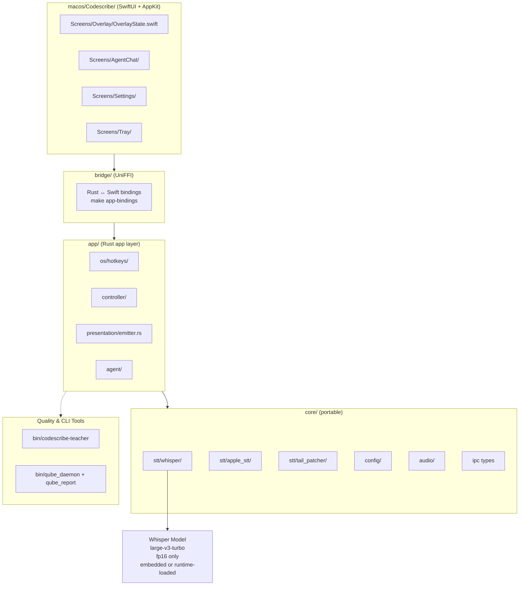

# Codescribe Architecture

> Created by Vetcoders (c)2026
>
> **2026-05-26:** transcription pipeline is now layered. See
> [ADR — Layered Incremental Transcription Pipeline](./ADR/2026-05-26-LAYERED_INCREMENTAL_TRANSCRIPTION.md)
> for the authoritative model. Sections below describe the packaging and module layout that hosts it.

## Layered Incremental Transcription (since 2026-05-26)

Live transcription is no longer a single Whisper stream. The ADR specifies five cooperating
layers, with Apple Speech as the live primary and Whisper / lexicon / small LLM / Silero
paralingual classifier filling in behind it. The overlay renders the union of layer events and
never wipes and retypes — _NEVER REWRITE FROM ZERO_ is the operator-mandated invariant. Since
the UI moved to Swift, the enforcement point is
`macos/Codescribe/Screens/Overlay/OverlayState.swift`: `applyReplaceRange` delegates to
`OverlayTranscriptSegment.replaceRange`, which returns `false` (patch dropped) for any range
that does not address the committed segment.

**Two of the five layers execute today.** The table below is
inventory, not intent — the ADR's
[Phase delivery status](./ADR/2026-05-26-LAYERED_INCREMENTAL_TRANSCRIPTION.md#phase-delivery-status-2026-08-08)
carries the per-phase detail.

| Layer           | Engine                                                                      | Status                                 | Where it lives                                                                                                                                |
| --------------- | --------------------------------------------------------------------------- | -------------------------------------- | --------------------------------------------------------------------------------------------------------------------------------------------- |
| 0 — Live        | Apple `SFSpeechRecognizer` (primary) · local recovery only in `local_power` | ✅ shipped, default                    | `core/stt/apple_stt/` + `core/stt/whisper/`                                                                                                   |
| 1 — Tail Patch  | authorized cloud provider or local Whisper in `local_power`                 | ✅ delivered; product-mode constrained | `core/asr_session/` + `core/stt/tail_patcher/`, wired into both live session paths                                                            |
| 2 — Lexicon     | Dictionary substitution                                                     | ⚠️ partial, different shape            | `core/pipeline/stream_postprocess.rs::apply_lexicon`, applied at seal time on the Apple path — not the ADR's debounced `core/lexicon/` module |
| 2 — LLM polish  | Small inline LLM                                                            | ❌ not built                           | no `core/llm/inline_polish.rs`; stop-path `core/llm/ai_formatting.rs` is a different surface                                                  |
| 3 — Paralingual | Silero classifier head                                                      | ❌ not built                           | `InsertAnnotation` transport exists end-to-end; no producer                                                                                   |
| 4 — Final BAM   | Session-end contextual pass                                                 | ❌ not built                           | no `core/pipeline/final_bam.rs`; `FINAL_PASS_MODE` is a different mechanism                                                                   |
| Orchestrator    | —                                                                           | ❌ not built, not currently needed     | both live paths share the `tail_patcher` gate directly; no `app/controller/layered_orchestrator.rs`                                           |

Existing files (`core/stt/whisper/`, `core/audio/streaming_recorder.rs`, `core/vad/silero_ort.rs`)
keep their public APIs — Layer 1 reuses them as its backend.

### Final pass routing & stop-path receipts (since W11, 2026-07-23)

The Apple bridge (`core/stt/apple_stt/codescribe-stt-bridge.swift`) probes
backends per locale: `SpeechTranscriber` only when supported **and installed**,
else `SFSpeechRecognizer` on-device (notably pl-PL — measured 0.24–2.3 s final
pass vs the 20–30 s double-Whisper era). A third lane,
`DictationTranscriber` — the SpeechAnalyzer module behind the SYSTEM dictation
and the only Apple analyzer whose catalog carries pl-PL — sits between them but
stays **off unless `CODESCRIBE_APPLE_DICTATION_TRANSCRIBER=1`**; it is a
measurement PoC (W4-A), not a shipped default. Stop-path final-pass routing is owned
by `FINAL_PASS_MODE` (`always|smart|off`, Smart default; Settings → Dictation →
"Final pass"). **Smart only** skips the full stop re-pass on a typed,
adjudicator-backed completeness decision (`StreamingCompleteness`) — never on
punctuation and never rewritten by live engine (Off stays Off; Off never forces
Whisper at stop). Live gap-fill is product-mode constrained. `cloud` uses only
its authorized gateway provider and carries zero permission for local weights.
The legacy Whisper tail-patch additionally requires `local_power` plus
`CODESCRIBE_LAYERED_TRANSCRIPTION=phase1+`; the phase env alone cannot arm it.
Smart does not enable layered. Dictionary/lexicon always runs in postprocess.

Two INFO receipts prove the path in `codescribe.log`:

- `stop_path_budget: total=…s phases={rec_stop,final_pass,postproc,format,delivery} remainder=…s`
  — closes when the stop pipeline returns; remainder is explicit, never relabeled.
- `assistive_delivery_budget: total=…s outcome=delivered|no_pending_context|empty_transcript`
  — assistive overlay submission is user-triggered after the stop budget ends,
  so its real agent-runtime send reports its own wall clock.

The Settings "Active STT" row consumes the last serving verdict published by
`app/controller/serving_status.rs` through UniFFI `current_serving_verdict()` —
runtime truth (including Apple→Whisper recovery when `local_power` permits it),
never configured preference.

## System Overview


```mermaid
flowchart TB
    %% High-level packaging / layers

    subgraph UI["macos/Codescribe/ (SwiftUI + AppKit)"]
        direction LR
        OVERLAY[Screens/Overlay/OverlayState.swift]
        CHAT[Screens/AgentChat/]
        SETTINGS[Screens/Settings/]
        TRAY[Screens/Tray/]
    end

    subgraph BRIDGE["bridge/ (UniFFI)"]
        FFI[Rust ↔ Swift bindings\nmake app-bindings]
    end

    subgraph APP["app/ (Rust app layer)"]
        direction LR
        HK[os/hotkeys/]
        CTRL[controller/]
        PRES[presentation/emitter.rs]
        AGENT[agent/]
    end

    subgraph CORE["core/ (portable)"]
        direction LR
        WH[stt/whisper/]
        APPLE[stt/apple_stt/]
        TAIL[stt/tail_patcher/]
        CO[config/]
        AU[audio/]
        IPC_CORE[ipc types]
    end

    UI --> BRIDGE
    BRIDGE --> APP
    APP --> CORE

    WH --> MODEL[Whisper Model\nlarge-v3-turbo\nfp16 only\nembedded or runtime-loaded]

    subgraph TOOLS[Quality & CLI Tools]
        TEACH[bin/codescribe-teacher]
        QUBE[bin/qube_daemon + qube_report]
    end

    APP -.-> TOOLS
```

## Module Architecture

### Recording Flow

```
┌─────────────┐    ┌────────────┐    ┌───────────────┐    ┌──────────────┐
│ CGEventTap  │───►│ os/hotkeys/│───►│ controller/   │───►│ stt/apple_stt│
│ (macOS API) │    │            │    │   mod.rs      │    │  + whisper/  │
└─────────────┘    └────────────┘    └───────────────┘    └──────────────┘
       │                                    │                     │
       │                                    ▼                     ▼
       │                            ┌──────────────┐      ┌──────────────┐
       │                            │ Screens/     │      │ Screens/     │
       │                            │ AgentChat/   │      │ Overlay/     │
       │                            └──────────────┘      └──────────────┘
       │                              (Swift, via bridge/ UniFFI)
       │
  Fn hold → Raw mode (no AI)
  Fn+Shift hold → Assistive arm (default; Cmd selectable in Settings)
  Double Option → Toggle mode (respects AI setting)
```

### Voice Chat UI (Mission Control)

```
┌─────────────────────────────────────────────────────────────────┐
│ Status Header                                        [Collapse] │
├─────────────────────────────────────┬───────────────────────────┤
│ LEFT PANEL (60%)                    │ RIGHT PANEL (40%)         │
│                                     │                           │
│ Chat bubbles (NSStackView)          │ [Drawer][Transcription]   │
│ ┌─────────────────────────────┐     │                           │
│ │ User message (blue, right)  │     │ Draft files list          │
│ └─────────────────────────────┘     │ [Format] [Copy] [Augment] │
│       ┌─────────────────────────┐   │                           │
│       │ AI response (gray,left) │   │ Agent tab + tools          │
│       └─────────────────────────┘   │ Settings button → window   │
│                                     │                           │
│ [Attach] [Input...] [Send]          │                           │
└─────────────────────────────────────┴───────────────────────────┘
```

## File Structure

```
Codescribe/
├── core/                         # Core library (portable, no macOS deps)
│   ├── stt/whisper/              # Embedded Whisper engine
│   ├── audio/                    # Recorder + StreamingRecorder
│   ├── vad/                      # Silero VAD
│   ├── config/                   # Tiered config + defaults
│   ├── llm/                      # Responses API client
│   ├── pipeline/                 # Streaming + postprocess
│   ├── embedder/                 # MiniLM embedder
│   └── quality/                  # Quality loop + reports
│
├── app/                          # Rust app layer (state machine, OS integration)
│   ├── controller/               # Recording state machine, stop-path, serving truth
│   ├── os/                       # Hotkeys (CGEventTap), permissions, clipboard,
│   │                             #   selection, hold badge, tray status, thermal
│   ├── presentation/             # PresentationEmitter (typing animation)
│   ├── agent/                    # Agent loop, tools, monitor
│   └── agent_delivery.rs         # Voice → thread delivery gateway
│
├── bridge/                       # UniFFI bridge (Rust ↔ Swift); `make app-bindings`
│
├── macos/Codescribe/             # The macOS app UI — SwiftUI/AppKit
│   ├── App.swift                 # AppDelegate / lifecycle
│   ├── Core/                     # AppModel, ComposerDictation, chat/thread engines
│   ├── Screens/
│   │   ├── Overlay/              # OverlayState.swift — layered render enforcement point
│   │   ├── AgentChat/            # Assistive chat surface
│   │   ├── Settings/             # Settings window + SettingsViewModel
│   │   ├── Onboarding/           # First-run flow
│   │   └── Tray/                 # Menu bar UI
│   ├── Services/                 # UpdaterService (Sparkle), platform services
│   └── DesignSystem/             # Tokens, shared components
│
├── bin/                          # CLI binaries
│   ├── codescribe-teacher.rs     # Teacher / correction replay
│   ├── qube_daemon.rs            # Qube donor daemon
│   └── qube_report.rs            # Qube reporting
│
├── tests/                        # Integration/E2E tests
├── assets/                       # Icons + packaged assets
├── scripts/                      # Release + tooling scripts
│
├── docs/
│   ├── guide/                    # User documentation
│   │   ├── README.md             # Quick start
│   │   ├── installation.md
│   │   ├── modes.md
│   │   ├── chat-overlay.md
│   │   ├── settings.md
│   │   ├── troubleshooting.md
│   │   └── privacy.md
│   ├── ARCHITECTURE.md           # This file
│   ├── WHISPER_LIVE.md           # Streaming transcription
│   └── TEAM_SETUP.md             # Developer setup
│
└── tests/                        # Integration tests
```

## Key Components

### Controller State Machine

```rust
// app/controller/types.rs
pub enum State {
    Idle,      // Ready for input
    RecHold,   // Recording (hold mode)
    RecToggle, // Recording (toggle mode)
    Busy,      // Processing transcription
}
```

State transitions:

- `Idle` + Fn down → (800ms delay) → `RecHold`
- `Idle` + Double Option → `RecToggle`
- `RecHold` + Fn up → `Busy` → `Idle`
- `RecToggle` + Double Option → `Busy` → `Idle`
- `RecToggle` + 5s silence (VAD) → auto‑send (stays `RecToggle`)

### Mode Determination

```rust
// app/controller/mod.rs - handle_hotkey_event()
match (hotkey, flags) {
    (Hold, no_arm)    => force_raw = true,   // Fn: always raw
    (Hold, arm_mod)   => assistive = true,   // configured arm (Shift default / Cmd alt)
    // Act-on-selection is a delivery lane when a selection is present (W10-D),
    // not a separate dead Cmd chord.
    (Toggle, force_ai)=> force_ai = true,    // Left Option x2: force AI
    (Toggle, _)       => /* respects AI_FORMATTING_ENABLED */
}
```

### Agent Chat UI Components (`macos/Codescribe/Screens/AgentChat/`)

The Rust AppKit `ui/voice_chat/` module (`mod.rs` / `api.rs` / `handlers.rs` / `state.rs`,
`VoiceChatOverlayState`) no longer exists — the surface was rewritten in Swift.

| Module                              | LOC  | Purpose                                         |
| ----------------------------------- | ---- | ----------------------------------------------- |
| `AgentChatStore.swift`              | 2464 | Chat/thread state, config + thread change buses |
| `MessageList.swift`                 | 1535 | Message rendering, streaming assistant bubbles  |
| `ChatComponents.swift`              | 1008 | Shared bubble / attachment / tool components    |
| `Composer.swift`                    | 823  | Input composer (dictation, attachments, send)   |
| `ThreadRail.swift`                  | 498  | Thread list rail                                |
| `AgentChatView.swift`               | 473  | Screen composition                              |
| `ComposerTextView.swift`            | 370  | NSTextView bridge for the composer              |
| `AssistivePromptPresentation.swift` | 346  | Assistive-lane prompt presentation              |

### Whisper Engine

- **Singleton pattern**: One global instance, lazy initialized
- **Metal acceleration**: Uses Apple GPU via candle-core
- **Streaming**: Chunks processed during recording
- **Embedded-first**: Builds embed Whisper when the snapshot is present at build time; runtime lookup from `CODESCRIBE_MODEL_PATH`, repo-local models, or HF cache remains the fallback path

## Implementation Status

| Feature                                      | Status |
| -------------------------------------------- | ------ |
| Local Whisper STT (Metal GPU)                | ✅     |
| Runtime Whisper model lookup                 | ✅     |
| Global hotkeys (CGEventTap)                  | ✅     |
| Three recording modes (Raw/Assistive/Toggle) | ✅     |
| Voice Chat UI (split panel)                  | ✅     |
| Chat bubbles (NSStackView)                   | ✅     |
| Drafts panel with tabs                       | ✅     |
| Settings window from tray + overlay          | ✅     |
| AI formatting (Responses API)                | ✅     |
| Streaming AI responses                       | ✅     |
| Attachments in chat                          | ✅     |
| Tray app with submenus                       | ✅     |
| History with slug filenames                  | ✅     |
| IPC server (runtime interface)               | ✅     |
| Stream postprocess (semantic gating)         | ✅     |
| Quality loop + report                        | ✅     |
| Codescribe Core separation                   | ✅     |
| VAD (auto-stop on silence)                   | ✅     |
| Transcription overlay                        | ✅     |
| Tauri GUI (future)                           | 📋     |

## Model Location

**Current runtime truth**: daily builds keep Whisper and MiniLM weights out of
Cargo artifacts. MiniLM loads from the signed app resource (or HF cache for CLI
and development); Whisper resolves from the paths below. Explicit fat builds
may still opt into binary embedding:

1. `CODESCRIBE_MODEL_PATH` environment variable
2. `~/.codescribe/models/whisper-large-v3-turbo/` (fp16 default)
3. A complete explicitly configured Hugging Face snapshot

Every candidate must contain config, tokenizer, mel filters and safetensors
weights, and must pass config plus safetensors-header checks proving that it is
not quantized. Q8 has no runtime fallback path.

MiniLM resolution: `CODESCRIBE_EMBEDDER_PATH`, then
`Codescribe.app/Contents/Resources/models/embedder`, then the configured/default
Hugging Face cache snapshot. `CODESCRIBE_EMBED_EMBEDDER=1` is the explicit
binary-embed escape hatch.

## Related Documentation

- [`guide/README.md`](guide/README.md) — User documentation
- [`WHISPER_LIVE.md`](WHISPER_LIVE.md) — Runtime Whisper + streaming transcription
- [`TEAM_SETUP.md`](TEAM_SETUP.md) — Developer setup guide

---

**Made with ⌜ Codescribe ⌟ by Vetcoders (c) 2024-2026**
