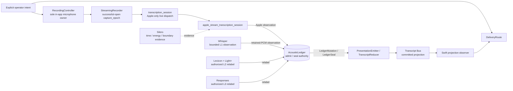

# Codescribe Architecture

> Created by Vetcoders (c)2026
>
> **Current structural map (2026-08-25, HEAD `484095ce`):** transcription follows the canonical
> [four-layer engine contract](./THE_ENGINE_CONTRACT.md). The 2026-05-26
> [five-layer ADR](./ADR/2026-05-26-LAYERED_INCREMENTAL_TRANSCRIPTION.md)
> is a superseded historical proposal. Normal live capture is the Apple session
> plus one acoustic ledger and one Rust reducer; sections below describe the
> packaging and module layout that hosts that route. This is source evidence,
> not a C8A compiler or runtime claim.

## Layered Incremental Transcription (since 2026-05-26)

Live transcription is no longer a single Whisper stream. Exactly four machine
layers cooperate: Apple, Whisper, Lexicon + Light+, and the existing Responses
formatter. Their observations enter `AcousticLedger`; corrections, bounded
patches, annotations, and marker placement are resolved by the Rust transcript
reducer in `app/presentation/emitter.rs`. That reducer emits an immutable,
complete rendered projection through the Transcript Bus, together with the
acoustic receipts that justify it.

Swift is a projection consumer, not a second reducer.
`OverlayState.applyTranscriptProjection` is the only admitted Swift
transcript-text input. It displays and delivers the projection's complete
`renderedText` after validating its sequence, reducer revision, and acoustic
receipts. `OverlayState` does not own transcript segments, fold previews/finals,
apply replacement ranges, rebase reducer markers, or reconstruct transcript
highlights. _NEVER REWRITE FROM ZERO_ is enforced upstream by occurrence/span
identity and reducer authority, not by a Swift text-mutation API.

| Layer | Engine | Current authority and exact surface |
| --- | --- | --- |
| **L0 — Apple** | First live text observer | `transcription_session` delegates to `apple_stream_transcription_session`; Apple observations enter `AcousticLedger` through `admit_ledger_label` |
| **L1 — Whisper** | Bounded observation on retained PCM | `core/stt/tail_provider.rs` and `core/stt/tail_patcher/` feed the same Apple-ledger session; Whisper owns no parallel live route |
| **L2 — Lexicon + Light+** | Deterministic authorized relabeling | `admit_ledger_label` records the Lexicon observation; `core/pipeline/light_plus.rs` is the shaping surface, and `custom_lexicon_entries` is the persisted custom-lexicon loading path |
| **L3 — Responses formatter** | Configured Formatting-lane observation | `core/llm/inline_format.rs` schedules authorized text through `core/llm/ai_formatting.rs`; `RuntimeSettingsSnapshot::llm_lanes()` supplies sealed lane truth |

Silero sits beside these layers as VAD and PCM-time evidence. Speech boundaries,
silence duration, pause timing, and pre-roll are its truthful outputs. Named
laughter/noise classes require an optional measured provider; plain Silero does
not claim them. Final BAM is superseded and has no producer, while
`SessionFinalised` closes lifecycle only.

`AcousticLedger::admit` and `AcousticLedger::seal` own physical occurrence
decisions. `EngineEvent::LedgerMutation` / `LedgerSeal` flow to
`PresentationEmitter` / `TranscriptReducer`; Transcript Bus and Swift observe
the committed projection. `DeliveryRoute` follows explicit operator intent.

### Explicit Retranscribe and stop-path receipts

The Apple bridge (`core/stt/apple_stt/codescribe-stt-bridge.swift`) probes
backends per locale: `SpeechTranscriber` only when supported **and installed**,
else `SFSpeechRecognizer` on-device (notably pl-PL — measured 0.24–2.3 s final
pass vs the 20–30 s double-Whisper era). A third lane,
`DictationTranscriber` — the SpeechAnalyzer module behind the SYSTEM dictation
and the only Apple analyzer whose catalog carries pl-PL — sits between them but
stays **off unless `CODESCRIBE_APPLE_DICTATION_TRANSCRIBER=1`**; it is a
measurement PoC (W4-A), not a shipped default.

Normal stop performs no whole-file inference. It closes the Apple stream,
drains already-admitted live observations within the bounded budget, seals the
ledger, publishes the reducer projection, and delivers through the explicit
route. `FINAL_PASS_MODE` and its alias remain migration tokens only. Explicit
Retranscribe is a separate operator action over a selected completed artifact;
its proposal does not become live Transcript Bus truth automatically. Live
Whisper repair is orthogonal and stays bounded to an authorized occurrence in
the Apple-ledger session.

Two INFO receipts prove the path in `codescribe.log`:

- `stop_path_budget: total=…s phases={rec_stop,final_pass,postproc,format,delivery} remainder=…s`
  — closes when the stop pipeline returns; remainder is explicit, never relabeled.
- `assistive_delivery_budget: total=…s outcome=delivered|no_pending_context|empty_transcript`
  — assistive overlay submission is user-triggered after the stop budget ends,
  so its real agent-runtime send reports its own wall clock.

The Settings "Active STT" row consumes the last serving verdict published by
`app/controller/serving_status.rs` through UniFFI `current_serving_verdict()` —
runtime truth (including Apple→Whisper fallback), never configured preference.

## System Overview


```mermaid
flowchart LR
    INTENT[Explicit operator intent]
    CTRL[RecordingController\nsole in-app microphone owner]
    REC[StreamingRecorder\nsuccessful-open capture_epoch]
    DISPATCH[transcription_session\nApple-only live dispatch]
    APPLE[apple_stream_transcription_session]
    SILERO[Silero\ntime / energy / boundary evidence]
    WHISPER[Whisper\nbounded L1 observation]
    LEXICON[Lexicon + Light+\nauthorized L2 relabel]
    FORMATTER[Responses\nauthorized L3 relabel]
    LEDGER[(AcousticLedger\nadmit / seal authority)]
    REDUCER[PresentationEmitter / TranscriptReducer]
    BUS[Transcript Bus\ncommitted projection]
    SWIFT[Swift projection observer]
    ROUTE[DeliveryRoute]

    INTENT --> CTRL --> REC --> DISPATCH --> APPLE
    SILERO -. evidence .-> APPLE
    APPLE -- Apple observation --> LEDGER
    WHISPER -- retained-PCM observation --> LEDGER
    LEXICON -- relabel --> LEDGER
    FORMATTER -- relabel --> LEDGER
    LEDGER -- LedgerMutation / LedgerSeal --> REDUCER --> BUS --> SWIFT
    INTENT --> ROUTE
    SWIFT --> ROUTE
```

## Module Architecture

### Recording Flow

```
┌─────────────┐    ┌────────────┐    ┌───────────────┐    ┌──────────────┐
│ CGEventTap  │───►│ os/hotkeys/│───►│ controller/   │───►│ STT observers│
│ (macOS API) │    │            │    │   mod.rs      │    │ Apple/Whisper│
└─────────────┘    └────────────┘    └───────────────┘    └──────┬───────┘
       │                                                         ▼
       │                                               ┌─────────────────┐
       │                                               │ AcousticLedger  │
       │                                               │ + Rust reducer  │
       │                                               └────────┬────────┘
       │                                                        ▼
       │                                               ┌─────────────────┐
       │                                               │ complete Swift  │
       │                                               │ projection      │
       │                                               └─────────────────┘
       │                                                 (display/delivery)
       │
  Fn hold → Raw mode (no AI)
  Fn+Shift hold → Assistive arm (default; Cmd selectable in Settings)
  Double Option → Toggle mode (respects AI setting)
```

### Voice Chat UI (Mission Control)

```
┌─────────────────────────────────────────────────────────────────┐
│ Status Header                                        [Collapse] │
├─────────────────────────────────────┬───────────────────────────┤
│ LEFT PANEL (60%)                    │ RIGHT PANEL (40%)         │
│                                     │                           │
│ Chat bubbles (NSStackView)          │ [Drawer][Transcription]   │
│ ┌─────────────────────────────┐     │                           │
│ │ User message (blue, right)  │     │ Draft files list          │
│ └─────────────────────────────┘     │ [Format] [Copy] [Augment] │
│       ┌─────────────────────────┐   │                           │
│       │ AI response (gray,left) │   │ Agent tab + tools          │
│       └─────────────────────────┘   │ Settings button → window   │
│                                     │                           │
│ [Attach] [Input...] [Send]          │                           │
└─────────────────────────────────────┴───────────────────────────┘
```

## File Structure

```
Codescribe/
├── core/                         # Core library (portable, no macOS deps)
│   ├── stt/whisper/              # Embedded Whisper engine
│   ├── audio/                    # Recorder + StreamingRecorder
│   ├── vad/                      # Silero VAD
│   ├── config/                   # Tiered config + defaults
│   ├── llm/                      # Responses API client
│   ├── pipeline/                 # Streaming + postprocess
│   ├── embedder/                 # MiniLM embedder
│   └── quality/                  # Quality loop + reports
│
├── app/                          # Rust app layer (state machine, OS integration)
│   ├── controller/               # Recording state machine, stop-path, serving truth
│   ├── os/                       # Hotkeys (CGEventTap), permissions, clipboard,
│   │                             #   selection, hold badge, tray status, thermal
│   ├── presentation/             # Rust transcript reducer + immutable projection bus
│   ├── agent/                    # Agent loop, tools, monitor
│   └── agent_delivery.rs         # Voice → thread delivery gateway
│
├── bridge/                       # UniFFI bridge (Rust ↔ Swift); `make app-bindings`
│
├── macos/Codescribe/             # The macOS app UI — SwiftUI/AppKit
│   ├── App.swift                 # AppDelegate / lifecycle
│   ├── Core/                     # AppModel, ComposerDictation, chat/thread engines
│   ├── Screens/
│   │   ├── Overlay/              # OverlayState.swift — projection display/delivery boundary
│   │   ├── AgentChat/            # Assistive chat surface
│   │   ├── Settings/             # Settings window + SettingsViewModel
│   │   ├── Onboarding/           # First-run flow
│   │   └── Tray/                 # Menu bar UI
│   ├── Services/                 # UpdaterService (Sparkle), platform services
│   └── DesignSystem/             # Tokens, shared components
│
├── bin/                          # CLI binaries
│   ├── codescribe-teacher.rs     # Teacher / correction replay
│   ├── qube_daemon.rs            # Qube donor daemon
│   └── qube_report.rs            # Qube reporting
│
├── tests/                        # Integration/E2E tests
├── assets/                       # Icons + packaged assets
├── scripts/                      # Release + tooling scripts
│
├── docs/
│   ├── guide/                    # User documentation
│   │   ├── README.md             # Quick start
│   │   ├── installation.md
│   │   ├── modes.md
│   │   ├── chat-overlay.md
│   │   ├── settings.md
│   │   ├── troubleshooting.md
│   │   └── privacy.md
│   ├── ARCHITECTURE.md           # This file
│   ├── WHISPER_LIVE.md           # Streaming transcription
│   └── TEAM_SETUP.md             # Developer setup
│
└── tests/                        # Integration tests
```

## Key Components

### Controller State Machine

```rust
// app/controller/types.rs
pub enum State {
    Idle,      // Ready for input
    RecHold,   // Recording (hold mode)
    RecToggle, // Recording (toggle mode)
    Busy,      // Processing transcription
}
```

State transitions:

- `Idle` + Fn down → (800ms delay) → `RecHold`
- `Idle` + Double Option → `RecToggle`
- `RecHold` + Fn up → `Busy` → `Idle`
- `RecToggle` + Double Option → `Busy` → `Idle`
- `RecToggle` + 5s silence (VAD) → auto‑send (stays `RecToggle`)

### Mode Determination

```rust
// app/controller/mod.rs - handle_hotkey_event()
match (hotkey, flags) {
    (Hold, no_arm)    => force_raw = true,   // Fn: always raw
    (Hold, arm_mod)   => assistive = true,   // configured arm (Shift default / Cmd alt)
    // Act-on-selection is a delivery lane when a selection is present (W10-D),
    // not a separate dead Cmd chord.
    (Toggle, force_ai)=> force_ai = true,    // Left Option x2: force AI
    (Toggle, _)       => /* respects AI_FORMATTING_ENABLED */
}
```

### Agent Chat UI Components (`macos/Codescribe/Screens/AgentChat/`)

The Rust AppKit `ui/voice_chat/` module (`mod.rs` / `api.rs` / `handlers.rs` / `state.rs`,
`VoiceChatOverlayState`) no longer exists — the surface was rewritten in Swift.

| Module                              | LOC  | Purpose                                         |
| ----------------------------------- | ---- | ----------------------------------------------- |
| `AgentChatStore.swift`              | 2464 | Chat/thread state, config + thread change buses |
| `MessageList.swift`                 | 1535 | Message rendering, streaming assistant bubbles  |
| `ChatComponents.swift`              | 1008 | Shared bubble / attachment / tool components    |
| `Composer.swift`                    | 823  | Input composer (dictation, attachments, send)   |
| `ThreadRail.swift`                  | 498  | Thread list rail                                |
| `AgentChatView.swift`               | 473  | Screen composition                              |
| `ComposerTextView.swift`            | 370  | NSTextView bridge for the composer              |
| `AssistivePromptPresentation.swift` | 346  | Assistive-lane prompt presentation              |

### Whisper Engine

- **Singleton pattern**: One global instance, lazy initialized
- **Metal acceleration**: Uses Apple GPU via candle-core
- **Streaming**: Chunks processed during recording
- **Embedded-first**: Builds embed Whisper when the snapshot is present at build time; runtime lookup from `CODESCRIBE_MODEL_PATH`, repo-local models, or HF cache remains the fallback path

## Implementation Status

| Feature                                      | Status |
| -------------------------------------------- | ------ |
| Local Whisper STT (Metal GPU)                | ✅     |
| Runtime Whisper model lookup                 | ✅     |
| Global hotkeys (CGEventTap)                  | ✅     |
| Three recording modes (Raw/Assistive/Toggle) | ✅     |
| Voice Chat UI (split panel)                  | ✅     |
| Chat bubbles (NSStackView)                   | ✅     |
| Drafts panel with tabs                       | ✅     |
| Settings window from tray + overlay          | ✅     |
| AI formatting (Responses API)                | ✅     |
| Streaming AI responses                       | ✅     |
| Attachments in chat                          | ✅     |
| Tray app with submenus                       | ✅     |
| History with slug filenames                  | ✅     |
| IPC server (runtime interface)               | ✅     |
| Acoustic-ledger admission + reducer projection | ✅ structurally mapped |
| Quality loop + report                        | ✅     |
| Codescribe Core separation                   | ✅     |
| VAD (auto-stop on silence)                   | ✅     |
| Transcription overlay                        | ✅     |
| Tauri GUI (future)                           | 📋     |

## Model Location

**Current runtime truth**: daily builds keep Whisper and MiniLM weights out of
Cargo artifacts. MiniLM loads from the signed app resource (or HF cache for CLI
and development); Whisper resolves from the paths below. Explicit fat builds
may still opt into binary embedding:

1. `CODESCRIBE_MODEL_PATH` environment variable
2. `~/.codescribe/models/whisper-large-v3-turbo/` (fp16 default)
3. A complete explicitly configured Hugging Face snapshot

Every candidate must contain config, tokenizer, mel filters and safetensors
weights, and must pass config plus safetensors-header checks proving that it is
not quantized. Q8 has no runtime fallback path.

MiniLM resolution: `CODESCRIBE_EMBEDDER_PATH`, then
`Codescribe.app/Contents/Resources/models/embedder`, then the configured/default
Hugging Face cache snapshot. `CODESCRIBE_EMBED_EMBEDDER=1` is the explicit
binary-embed escape hatch.

## Related Documentation

- [`guide/README.md`](guide/README.md) — User documentation
- [`WHISPER_LIVE.md`](WHISPER_LIVE.md) — Runtime Whisper + streaming transcription
- [`TEAM_SETUP.md`](TEAM_SETUP.md) — Developer setup guide

---

**Made with ⌜ Codescribe ⌟ by Vetcoders (c) 2024-2026**
