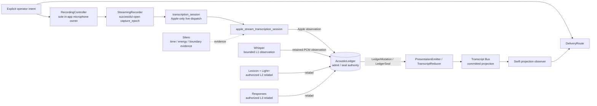

# Codescribe Architecture

> Created by Vetcoders (c)2026
>
> **Current structural map (2026-08-25):** `484095ce` was the last
> executable-code cut before docs successor `d57196ab`; C11 is the next
> structural executable cut, with its actual commit recorded only in the
> durable C11 report. Compiler and runtime are `NOT_ASSESSED`. Transcription follows the canonical
> [four-layer engine contract](./THE_ENGINE_CONTRACT.md). The 2026-05-26
> [five-layer ADR](./ADR/2026-05-26-LAYERED_INCREMENTAL_TRANSCRIPTION.md)
> is a superseded historical proposal. Normal live capture is the Apple session
> plus one acoustic ledger and one Rust reducer; sections below describe the
> packaging and module layout that hosts that route. This is source evidence,
> not a C8A compiler or runtime claim.

## Layered Incremental Transcription (since 2026-05-26)

Live transcription is no longer a single Whisper stream. Exactly four machine
layers cooperate: Apple, Whisper, Lexicon + Light+, and the existing Responses
formatter. Their authorized labels enter `AcousticLedger`; the Rust transcript
reducer in `app/presentation/emitter.rs` accepts only ledger mutation/seal
receipts. Raw correction, range-patch, annotation, and final events are
diagnostics rather than document inputs. That reducer emits an immutable,
complete rendered projection through the Transcript Bus, together with the
acoustic receipts that justify it.

Swift is a projection consumer, not a second reducer.
`OverlayState.applyTranscriptProjection` is the only admitted Swift
transcript-text input. It displays and delivers the projection's complete
`renderedText` after validating its sequence, reducer revision, and acoustic
receipts. `OverlayState` does not own transcript segments, fold previews/finals,
apply replacement ranges, rebase reducer markers, or reconstruct transcript
highlights. _NEVER REWRITE FROM ZERO_ is enforced upstream by occurrence/span
identity and reducer authority, not by a Swift text-mutation API.

| Layer                        | Engine                                 | Current authority and exact surface                                                                                                                                                                                                                                                                                                                                                                                      |
| ---------------------------- | -------------------------------------- | ------------------------------------------------------------------------------------------------------------------------------------------------------------------------------------------------------------------------------------------------------------------------------------------------------------------------------------------------------------------------------------------------------------------------ |
| **L0 — Apple**               | First live text observer               | `transcription_session` delegates to `apple_stream_transcription_session`; Apple observations enter `AcousticLedger` through `admit_ledger_label`                                                                                                                                                                                                                                                                        |
| **L1 — Whisper**             | Bounded observation on retained PCM    | `core/stt/tail_provider.rs` and `core/stt/tail_patcher/` feed the same Apple-ledger session; Whisper owns no parallel live route                                                                                                                                                                                                                                                                                         |
| **L2 — Lexicon + Light+**    | Deterministic authorized relabeling    | `admit_ledger_label` records the Lexicon observation; `core/pipeline/light_plus.rs` shapes committed words during capture at PCM sentence boundaries and the frozen Stop canvas before paste, skipped for the literal Ctrl-hold take. The reducer publishes ledger-stamped `light-plus` presentation revisions without claiming acoustic finality; `custom_lexicon_entries` is the persisted custom-lexicon loading path |
| **L3 — Responses formatter** | Configured Formatting-lane observation | `core/llm/inline_format.rs` schedules authorized text through `core/llm/ai_formatting.rs`; `RuntimeSettingsSnapshot::llm_lanes()` supplies sealed lane truth                                                                                                                                                                                                                                                             |

Silero sits beside these layers as VAD and PCM-time evidence. Speech boundaries,
silence duration, pause timing, and pre-roll are its truthful outputs. Named
laughter/noise classes require an optional measured provider; plain Silero does
not claim them. Final BAM is superseded and has no producer, while
`SessionFinalised` closes lifecycle only.

`AcousticLedger::admit` and `AcousticLedger::seal` own physical occurrence
decisions. `EngineEvent::LedgerMutation` / `LedgerSeal` flow to
`PresentationEmitter` / `TranscriptReducer`; Transcript Bus and Swift observe
the committed projection. Preview is overlay-only paint and cannot write Bus or
delivery. Terminal ledger seal closes Bus truth; arbitrary text seal/draft APIs
and the raw-event delta reducer do not exist. `DeliveryRoute` follows explicit
operator intent.

### Explicit Retranscribe and stop-path receipts

The Apple bridge (`core/stt/apple_stt/codescribe-stt-bridge.swift`) probes
backends per locale: `SpeechTranscriber` only when supported **and installed**,
else `SFSpeechRecognizer` on-device (notably pl-PL — measured 0.24–2.3 s final
pass vs the 20–30 s double-Whisper era). A third lane,
`DictationTranscriber` — the SpeechAnalyzer module behind the SYSTEM dictation
and the only Apple analyzer whose catalog carries pl-PL — sits between them but
stays **off unless `CODESCRIBE_APPLE_DICTATION_TRANSCRIBER=1`**; it is a
measurement PoC (W4-A), not a shipped default.

Normal stop performs no whole-file inference. It closes the Apple stream,
drains already-admitted live observations within the bounded budget, seals the
ledger, publishes the reducer projection, and delivers through the explicit
route. `FINAL_PASS_MODE` and its alias are retired; repair removes the persisted
setting. Explicit
Retranscribe is a separate operator action over a selected completed artifact;
its proposal does not become live Transcript Bus truth automatically. Live
Whisper repair is orthogonal and stays bounded to an authorized occurrence in
the Apple-ledger session.

Two INFO receipts prove the path in `codescribe.log`:

- `stop_path_budget: total=…s phases={rec_stop,final_pass,postproc,format,delivery} remainder=…s`
  — closes when the stop pipeline returns; remainder is explicit, never relabeled.
- `assistive_delivery_budget: total=…s outcome=delivered|no_pending_context|empty_transcript`
  — assistive overlay submission is user-triggered after the stop budget ends,
  so its real agent-runtime send reports its own wall clock.

The Settings "Last transcription engine" row consumes the last serving verdict published by
`app/controller/serving_status.rs` through UniFFI `current_serving_verdict()` —
runtime truth (including Apple→Whisper fallback), never configured preference.

## System Overview


```mermaid
flowchart LR
    INTENT[Explicit operator intent]
    CTRL[RecordingController\nsole in-app microphone owner]
    REC[StreamingRecorder\nsuccessful-open capture_epoch]
    DISPATCH[transcription_session\nApple-only live dispatch]
    APPLE[apple_stream_transcription_session]
    SILERO[Silero\ntime / energy / boundary evidence]
    WHISPER[Whisper\nbounded L1 observation]
    LEXICON[Lexicon + Light+\nauthorized L2 relabel]
    FORMATTER[Responses\nauthorized L3 relabel]
    LEDGER[(AcousticLedger\nadmit / seal authority)]
    REDUCER[PresentationEmitter / TranscriptReducer]
    BUS[Transcript Bus\ncommitted projection]
    SWIFT[Swift projection observer]
    ROUTE[DeliveryRoute]

    INTENT --> CTRL --> REC --> DISPATCH --> APPLE
    SILERO -. evidence .-> APPLE
    APPLE -- Apple observation --> LEDGER
    WHISPER -- retained-PCM observation --> LEDGER
    LEXICON -- relabel --> LEDGER
    FORMATTER -- relabel --> LEDGER
    LEDGER -- LedgerMutation / LedgerSeal --> REDUCER --> BUS --> SWIFT
    INTENT --> ROUTE
    SWIFT --> ROUTE
```

## Module Architecture

### Recording Flow

```
┌─────────────┐    ┌────────────┐    ┌───────────────┐    ┌──────────────┐
│ CGEventTap  │───►│ os/hotkeys/│───►│ controller/   │───►│ STT observers│
│ (macOS API) │    │            │    │   mod.rs      │    │ Apple/Whisper│
└─────────────┘    └────────────┘    └───────────────┘    └──────┬───────┘
       │                                                         ▼
       │                                               ┌─────────────────┐
       │                                               │ AcousticLedger  │
       │                                               │ + Rust reducer  │
       │                                               └────────┬────────┘
       │                                                        ▼
       │                                               ┌─────────────────┐
       │                                               │ complete Swift  │
       │                                               │ projection      │
       │                                               └─────────────────┘
       │                                                 (display/delivery)
       │
  Fn hold → Raw mode (no AI)
  Fn+Shift hold → Assistive arm (default; Cmd selectable in Settings)
  Double Option → Toggle mode (respects AI setting)
```

### Voice Chat UI (Mission Control)

```
┌─────────────────────────────────────────────────────────────────┐
│ Status Header                                        [Collapse] │
├─────────────────────────────────────┬───────────────────────────┤
│ LEFT PANEL (60%)                    │ RIGHT PANEL (40%)         │
│                                     │                           │
│ Chat bubbles (NSStackView)          │ [Drawer][Transcription]   │
│ ┌─────────────────────────────┐     │                           │
│ │ User message (blue, right)  │     │ Draft files list          │
│ └─────────────────────────────┘     │ [Format] [Copy] [Augment] │
│       ┌─────────────────────────┐   │                           │
│       │ AI response (gray,left) │   │ Agent tab + tools          │
│       └─────────────────────────┘   │ Settings button → window   │
│                                     │                           │
│ [Attach] [Input...] [Send]          │                           │
└─────────────────────────────────────┴───────────────────────────┘
```

## File Structure

```
Codescribe/
├── core/                         # Core library (portable, no macOS deps)
│   ├── stt/whisper/              # Embedded Whisper engine
│   ├── audio/                    # Recorder + StreamingRecorder
│   ├── vad/                      # Silero VAD
│   ├── config/                   # Tiered config + defaults
│   ├── llm/                      # Responses API client
│   ├── pipeline/                 # Streaming + postprocess
│   ├── embedder/                 # MiniLM embedder
│   └── quality/                  # Quality loop + reports
│
├── app/                          # Rust app layer (state machine, OS integration)
│   ├── controller/               # Recording state machine, stop-path, serving truth
│   ├── os/                       # Hotkeys (CGEventTap), permissions, clipboard,
│   │                             #   selection, hold badge, tray status, thermal
│   ├── presentation/             # Rust transcript reducer + immutable projection bus
│   ├── agent/                    # Agent loop, tools, monitor
│   └── agent_delivery.rs         # Voice → thread delivery gateway
│
├── bridge/                       # UniFFI bridge (Rust ↔ Swift); `make app-bindings`
│
├── macos/Codescribe/             # The macOS app UI — SwiftUI/AppKit
│   ├── App.swift                 # AppDelegate / lifecycle
│   ├── Core/                     # AppModel, ComposerDictation, chat/thread engines
│   ├── Screens/
│   │   ├── Overlay/              # OverlayState.swift — projection display/delivery boundary
│   │   ├── AgentChat/            # Assistive chat surface
│   │   ├── Settings/             # Settings window + SettingsViewModel
│   │   ├── Onboarding/           # First-run flow
│   │   └── Tray/                 # Menu bar UI
│   ├── Services/                 # UpdaterService (Sparkle), platform services
│   └── DesignSystem/             # Tokens, shared components
│
├── bin/                          # CLI binaries
│   ├── codescribe-teacher.rs     # Teacher / correction replay
│   ├── qube_daemon.rs            # Qube donor daemon
│   └── qube_report.rs            # Qube reporting
│
├── tests/                        # Integration/E2E tests
├── assets/                       # Icons + packaged assets
├── scripts/                      # Release + tooling scripts
│
├── docs/
│   ├── guide/                    # User documentation
│   │   ├── README.md             # Quick start
│   │   ├── installation.md
│   │   ├── modes.md
│   │   ├── chat-overlay.md
│   │   ├── settings.md
│   │   ├── troubleshooting.md
│   │   └── privacy.md
│   ├── ARCHITECTURE.md           # This file
│   ├── WHISPER_LIVE.md           # Streaming transcription
│   └── TEAM_SETUP.md             # Developer setup
│
└── tests/                        # Integration tests
```

## Key Components

### Native credential I/O ownership

`LicenseService` remains the license authority on MainActor; its serial storage
queue performs SecItem reads/writes/deletes. It publishes a verified signed
payload only after a successful read or durable activation. A storage failure
retains an already verified payload, while every entitlement read reevaluates
its original timestamps at the current clock. Cold pending/unavailable access
never grants Agentic. Malformed signed data fails closed.

`ProviderCredentialIO` serializes Settings and Setup credential operations off
MainActor. `provider_access_snapshot` acquires through the existing Rust bundle
cache and I/O mutex; passive settings, provider, lane and readiness projections
use files/env/cache. The returned revision and each view model's generation
prevent an earlier read from overwriting a later mutation. Refresh requests
coalesce per model and share a five-second physical-read window across models.
Permission refreshes do not start credential acquisition. See
[Provider registry](providers/README.md#credential-acquisition-and-ui-projections)
for cache states and retry ownership, and [Settings](guide/settings.md) for the
pending/error UI contract.

Settings projections parse the committed atomic document through the existing
`UserSettings` authority without its credential transaction lease. With no
settings document, the same import builder supplies an in-memory `.env`
projection; that preview neither prepares a durable import nor performs repair.
Projection and repair share one analysis grammar. An existing malformed,
unsupported or unreadable document records a refusal before capture, keeping
the runtime seal disarmed. Safe known-field normalization is in-memory only;
projection never reports a backup or completed repair. The writer
retains serialization of cancellation, import settlement and persistence; a
passive UI read does not become a waiting writer. Capability matrix also uses
committed settings for workspace roots through the shared root resolver. First
settings writer loads and acquiring imports serialize initial `.env` preparation
under the same transaction lease before publishing the document. Promoted
settings and secret-free pending rows survive an edit before credential access.
The config bootstrap mutex
covers env publication and cache-based capture only, after all credential work.
Individual OAuth record errors travel as provider-indexed snapshot metadata,
leaving independent registry and recovery controls usable.

### Controller State Machine

```rust
// app/controller/types.rs
pub enum State {
    Idle,      // Ready for input
    RecHold,   // Recording (hold mode)
    RecToggle, // Recording (toggle mode)
    Busy,      // Processing transcription
}
```

State transitions:

- `Idle` + Fn down → (800ms delay) → `RecHold`
- `Idle` + Double Option → `RecToggle`
- `RecHold` + Fn up → `Busy` → `Idle`
- `RecToggle` + Double Option → `Busy` → `Idle`
- `RecToggle` + 5s silence (VAD) → auto‑send (stays `RecToggle`)

### Mode Determination

```rust
// app/controller/mod.rs - handle_hotkey_event()
match (hotkey, flags) {
    (Hold, no_arm)    => force_raw = true,   // Fn: always raw
    (Hold, arm_mod)   => assistive = true,   // configured arm (Shift default / Cmd alt)
    // Act-on-selection is a delivery lane when a selection is present (W10-D),
    // not a separate dead Cmd chord.
    (Toggle, force_ai)=> force_ai = true,    // Left Option x2: force AI
    (Toggle, _)       => /* respects AI_FORMATTING_ENABLED */
}
```

### Agent Chat UI Components (`macos/Codescribe/Screens/AgentChat/`)

The Rust AppKit `ui/voice_chat/` module (`mod.rs` / `api.rs` / `handlers.rs` / `state.rs`,
`VoiceChatOverlayState`) no longer exists — the surface was rewritten in Swift.

| Module                              | LOC  | Purpose                                         |
| ----------------------------------- | ---- | ----------------------------------------------- |
| `AgentChatStore.swift`              | 2464 | Chat/thread state, config + thread change buses |
| `MessageList.swift`                 | 1535 | Message rendering, streaming assistant bubbles  |
| `ChatComponents.swift`              | 1008 | Shared bubble / attachment / tool components    |
| `Composer.swift`                    | 823  | Input composer (dictation, attachments, send)   |
| `ThreadRail.swift`                  | 659  | Thread list rail                                |
| `AgentChatView.swift`               | 679  | Screen composition                              |
| `ComposerTextView.swift`            | 370  | NSTextView bridge for the composer              |
| `AssistivePromptPresentation.swift` | 346  | Assistive-lane prompt presentation              |

### Agent window header

The detail chrome (`AgentChatView.swift`) carries one title — the current
thread's — and nothing that competes with it. The native titlebar keeps the
window title, dragging and the close / minimise / fullscreen controls; the
content never repeats a window-level header. The minimise button and ⌘M are
enabled but hide the window (`HidingWindow` / `DockPresence`) instead of
miniaturising it, so App Exposé never shows an empty tile; the tray's
"Open chat", the summon shortcut and the passive voice reveal bring it back.

- **Left:** the sidebar toggle (`⌃⌘S`) immediately before the thread title,
  followed by the turn count, the thread's model and the live turn status.
  The toggle lives in the detail chrome so it stays reachable while the
  native sidebar is collapsed.
- **Right:** exactly two controls. The pin (always on top) shows its state
  rather than hinting at it — pinned is the filled glyph on an accent plate
  with the `selected` trait and an "On" Accessibility value, unpinned is the
  outline glyph with no plate. It writes only `AgentChat.alwaysOnTop.v1`;
  `AgentWindowCapabilities` applies the window level.
- **"•••" menu:** the single home for the header's actions — thread section
  (Rename, Add to / Remove from favorites, Markdown exports when the thread
  is persisted), the "Conversation width" submenu (Standard / Wide / Full
  width, the conversation column's density — not the window size), "Open
  settings", and the destructive "Delete Thread" last, behind the shared
  confirmation. There is no separate width selector or Settings gear in the
  chrome.

An empty thread does not scroll: `ChatLayoutPolicy.emptyStateHeight` sizes the
no-turns block to the viewport minus everything else the scroll document
carries (list padding on both edges, the stack gap and the live-edge anchor),
so the content fits exactly instead of overshooting by those points.

### Thread history interactions

The rail (`ThreadRail.swift`) and the detail toolbar menu (`AgentChatView.swift`)
share three contracts:

- **Selection is one action with three entry points.** A pointer click, the
  row's Accessibility activation and the keyboard all call the same `select`
  path in `ThreadRail`. To Accessibility a row is a single button labelled
  with the thread title, with the `selected` trait on the open thread and
  Rename / Add to favorites / Delete as named actions, worded exactly as the
  header menu words them; while a title is being renamed
  the row exposes its children so the text field stays reachable. Rows are
  keyboard focus targets: Return or Space opens the focused row, Up / Down
  opens the neighbouring row in visible order (`ThreadRailNavigation`,
  no wrap-around). Rows join the Tab order under macOS keyboard navigation,
  like the app's other custom buttons.
- **Deletion always confirms.** Both the rail's context menu and the toolbar
  menu present the same `ThreadDeleteConfirmation`; the dialog names the
  thread and Cancel keeps it. There is no undo path, and the copy says so.
- **Markdown export reports its outcome.** The toolbar menu names the fixed
  destination (the Transcripts folder from Settings › About › Local data) in a
  section header; there is no file chooser. After the write, an alert shows
  the file name and folder with "Reveal in Finder" and "Open" buttons, or an
  "Export failed" alert naming the thread and the folder to check. Finder is
  never opened as a side effect of the menu action. `ThreadExportOutcome`
  carries the result; `RealThreadsEngine` still collapses the bridge error
  into `nil`, so the failure alert cannot quote the underlying reason.

### Max consultation continuity

A Max consultation is an ordinary `Thread` in the shared `ThreadStore`,
distinguished by `mode == "max"` (`MAX_CONSULTATION_MODE`) and the
`max-consultation` tag. One consultation is _selected_
(`threads/consultations/selection/current.json`); only the explicit
"New consultation" action (`begin_new_max_consultation`) changes that file.
Viewing or selecting an older consultation in the Agent window never changes
the selection.

Continuity is logical, not a provider chain: the consultation owner
(`ConsultationRuntime`, held by `RecordingController`) restores the thread's
messages under its lease and replays them with every request; the provider's
response chain is reset per turn. The same owner serves both entry points:

- **Voice.** A Max dictation take enters the owner through
  `FormattingConsultation` (`format_text_with_status_for_policy`).
- **Agent window.** A typed turn on a thread whose stored mode is `max` is
  routed by the bridge (`CodescribeAgent::run_max_consultation_turn`) into
  `RecordingController::enqueue_max_consultation_text_turn`: same FIFO,
  Formatting lane, Max prompt and Max approval broker as speech. The turn runs
  under Max regardless of the dictation formatting level selected at the
  moment, because the consultation is Max by identity. The window renders the
  owner's events for that turn (`subscribe_max_consultation_events`); the
  owner persists history once, in `max` mode, so the Assistive lane and its
  `assistive` delivery never touch a consultation.

Guards:

- `ThreadDeliveryGateway::deliver` refuses to rewrite a `max` thread with any
  other mode, so no lane can silently convert a consultation and break the
  next `restore_consultation`.
- Only the selected consultation accepts new typed turns; typing into an older
  one fails with a readable error. Older consultations stay readable.
- Max tool approvals suspend in the controller's broker. The Agent window
  shows the card for the turn it is rendering and answers it through the same
  exact (session, thread, call) match (`CodescribeAgent::resolve_tool_approval`
  falls through to that broker). The Settings › Creator panel keeps showing
  the same pending cards.
- Stop cannot abort an admitted Max instruction: the owner never replays or
  rolls back tool effects. The window settles its bubble; the answer still
  lands in history and appears on the next refresh.
- A turn interrupted by a crash or a failure is **abandoned**, not retained for
  recovery. The journal (`core/agent/thread_store/consultation.rs`) retires
  that identity into `abandoned` on the next `ConsultationJournal::open` — or
  immediately, when this owner observes the failure — drops the instructions
  still waiting behind it, and the conversation continues. An abandoned
  identity is refused for life exactly like a completed one, so nothing is
  replayed and no tool effect is rolled back or retried. The gap is explained
  in history as a thread note
  (`ThreadDeliveryGateway::record_consultation_recovery`); a consultation with
  no thread file yet is only logged. "New consultation" is never required to
  get a consultation working again. The one state that still blocks execution
  is a journal that cannot be written, because then the owner cannot prove
  what it retired.

### Restored tool inspector metadata

`RealThreadsEngine` projects persisted messages from `CodescribeThreads` into
the existing `ToolLine` presentation. `ThreadStore` saves `tool_use` blocks with
`id`, `name` and `input`, and `tool_result` blocks with `tool_use_id`, nested
`content` and `is_error`. The bridge serializes these stored content blocks
unchanged into `CsThreadMessage.rawJson`; this is the storage block format,
not the runtime `ContentBlock` serialization with its `payload` envelope.

Restoration retains a nonblank `tool_use_id` as `ToolLine.callID`, making the
existing inspector available even without a summary or timing. The name comes
only from a preceding or same-message `tool_use` with that exact ID; an
uncorrelated result keeps the existing generic `tool result` detail. Explicit
`is_error: true` maps to `failed` / `.failed`, and `false` to `ran` /
`.succeeded`. Missing, null or incorrectly typed outcome evidence maps to
`ended` / `.unknown`. A result with a missing, blank or incorrectly typed ID
remains a tool row without a call ID. Incorrectly typed optional fields and
non-object blocks do not discard readable sibling blocks. Undecodable JSON
retains the existing flattened-message path.

`reason` stays absent: live UI summaries are redacted and truncated by
`summarize_tool_result` in `core/agent/session.rs` before being sent as UI
events, and that summary field is not persisted. Nested result `content` is
stored, but is not promoted to an inspector summary. `startedAt` and
`durationMs` are UI-only and remain absent after restoration; message
timestamps do not establish tool duration. No storage schema or persistence
authority changes. The internal `restoredMessages(from:)` seam runs the same
projection over bridge records for integrator-owned hermetic fixtures.

### Whisper Engine

- **Singleton pattern**: One global instance, lazy initialized
- **Metal acceleration**: Uses Apple GPU via candle-core
- **Streaming**: Chunks processed during recording
- **Embedded-first**: Builds embed Whisper when the snapshot is present at build time; runtime lookup from `CODESCRIBE_MODEL_PATH`, repo-local models, or HF cache remains the fallback path

## Implementation Status

| Feature                                        | Status                 |
| ---------------------------------------------- | ---------------------- |
| Local Whisper STT (Metal GPU)                  | ✅                     |
| Runtime Whisper model lookup                   | ✅                     |
| Global hotkeys (CGEventTap)                    | ✅                     |
| Three recording modes (Raw/Assistive/Toggle)   | ✅                     |
| Voice Chat UI (split panel)                    | ✅                     |
| Chat bubbles (NSStackView)                     | ✅                     |
| Drafts panel with tabs                         | ✅                     |
| Settings window from tray + overlay            | ✅                     |
| AI formatting (Responses API)                  | ✅                     |
| Streaming AI responses                         | ✅                     |
| Attachments in chat                            | ✅                     |
| Tray app with submenus                         | ✅                     |
| History with slug filenames                    | ✅                     |
| IPC server (runtime interface)                 | ✅                     |
| Acoustic-ledger admission + reducer projection | ✅ structurally mapped |
| Quality loop + report                          | ✅                     |
| Codescribe Core separation                     | ✅                     |
| VAD (auto-stop on silence)                     | ✅                     |
| Transcription overlay                          | ✅                     |
| Tauri GUI (future)                             | 📋                     |

## Model Location

**Current runtime truth**: daily builds keep Whisper and MiniLM weights out of
Cargo artifacts. MiniLM loads from the signed app resource (or HF cache for CLI
and development); Whisper resolves from the paths below. Explicit fat builds
may still opt into binary embedding:

1. `CODESCRIBE_MODEL_PATH` environment variable
2. `~/.codescribe/models/whisper-large-v3-turbo/` (fp16 default)
3. A complete explicitly configured Hugging Face snapshot

Every candidate must contain config, tokenizer, mel filters and safetensors
weights, and must pass config plus safetensors-header checks proving that it is
not quantized. Q8 has no runtime fallback path.

MiniLM resolution: `CODESCRIBE_EMBEDDER_PATH`, then
`Codescribe.app/Contents/Resources/models/embedder`, then the configured/default
Hugging Face cache snapshot. `CODESCRIBE_EMBED_EMBEDDER=1` is the explicit
binary-embed escape hatch.

## Composer model filtering and Audio observation

`RealComposerPaletteSource` checks a metadata-only stamp before settings, runtime
lane, provider-registry and catalog reads. Its warm hit still performs one stat
of the canonical settings file plus existing in-memory locks; it does not parse
JSON or acquire credentials. The stamp uses that mtime, credential-bundle revision
and the generation inside the existing last-good runtime snapshot cache. Missing
metadata refuses palette reuse. A mutation during discovery cannot label earlier
entries with a newer stamp, and a runtime loader begun before invalidation cannot
repopulate the cleared cache. No separate settings owner or revision store is
introduced. Mtime detection retains its existing limit: restoring the same file
timestamp can conceal an external change.

The Audio readiness consumer observes both existing owners: `OverlayState`
through Observation and `TrayViewModel` through its published flags. A single
injected tuple keeps them paired; fake and preview settings engines stay detached
unless owners are supplied. The real provider resolves AppModel only when Audio
appears. Start uses the tray's canonical admission callback before its existing
controller start; final-pass work remains processing. The shared view action and
consumer are internal seams for integrator tests, not another recording path.
Unresolved credential status uses semantic secondary ink in Settings, preserving
the native light/dark appearance contract until availability is established.

## Related Documentation

- [`guide/README.md`](guide/README.md) — User documentation
- [`WHISPER_LIVE.md`](WHISPER_LIVE.md) — Runtime Whisper + streaming transcription
- [`TEAM_SETUP.md`](TEAM_SETUP.md) — Developer setup guide

---

**Made with ⌜ Codescribe ⌟ by Vetcoders (c) 2024-2026**
