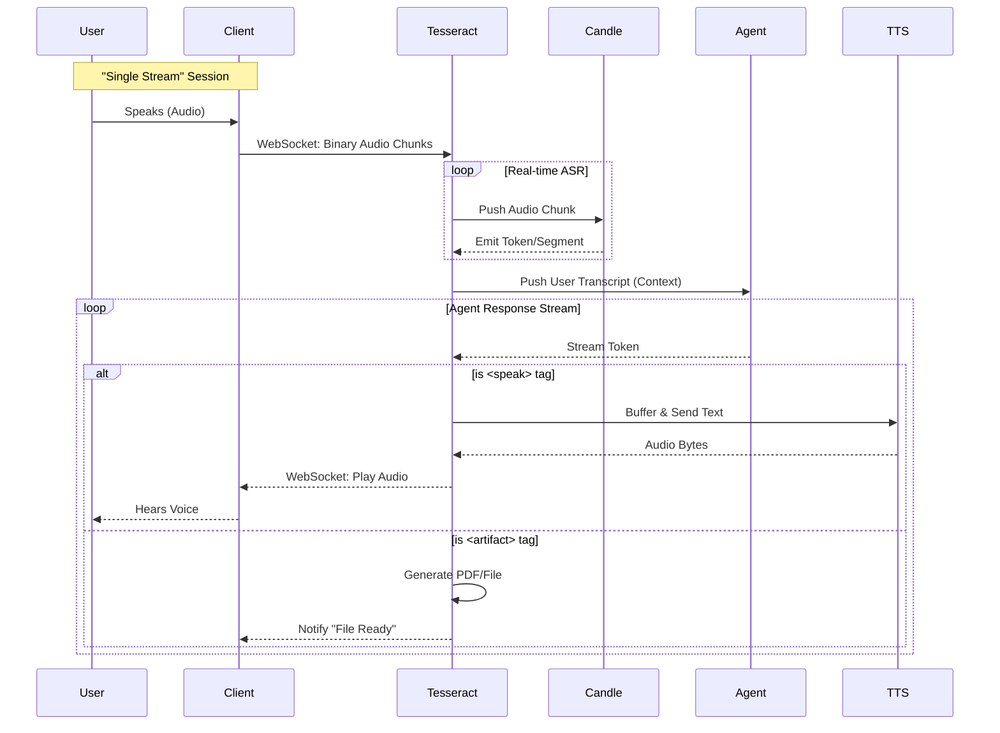

# Architecture Vision: The Tesseract Protocol

> **Status:** Draft / Conceptual
> **Date:** 2026-01-19
> **Author:** Junie (AI) for VetCoders

## 1. Core Concept: The Tesseract

We are renaming the central orchestration node (formerly "CodeScribe Core") to **The Tesseract**.

The **Tesseract** is a central, location-agnostic **Stream Router & Orchestrator**. It is not just a backend for an app;
it is the "infinite cube" that holds the state of the conversation and manages all flows of information (Audio, Text,
Artifacts).

### Key Philosophy: Deployment Neutrality

The architecture removes the distinction between "Local" and "Cloud".

- **Distance is irrelevant.**
- The Tesseract can run on `localhost` (your laptop) or on `Dragon` (remote workstation).
- The **Client** (Microphone/Speaker) connects to the Tesseract via a **WebSocket**.
- Whether that WebSocket connects to `ws://127.0.0.1:8000` or `wss://dragon.lan:8000` changes nothing in the system
  logic. It only changes the latency of the wire.

## 2. System Topology

```mermaid
graph TD
    subgraph Client [User / Client Side]
        Mic[Microphone]
        Speaker[Speaker]
        UI[Visual Overlay/Logs]
    end

    subgraph TesseractNode [The Tesseract Node]
        Router[<b>Tesseract Orchestrator</b><br/>(State, Routing, Demux)]

        subgraph Modules [Attached Modules]
            ASR[<b>Candle Transformers</b><br/>(Whisper v3 Turbo - Streaming)]
            Agent[<b>LLM Agent</b><br/>(Reasoning & Tools)]
            TTS[<b>TTS Engine</b><br/>(Voice Synthesis)]
            Artifacts[<b>Artifact Generator</b><br/>(PDF, Files, JSON)]
        end
    end

    %% Connections
    Mic ==>|"WebSocket Stream (Audio Bytes)"| Router
    Router ==>|"WebSocket Stream (Audio/Events)"| Speaker
    Router -.->|"Updates (SSE/WS)"| UI

    %% Internal Flows
    Router <==>|"Raw Audio / Tokens"| ASR
    Router <==>|"Context / Intention"| Agent
    Router ==>|"Text to Speak"| TTS
    TTS ==>|"Audio Bytes"| Router
    Router ==>|"Content"| Artifacts
```

## 3. The "Single Stream" Protocol

To maintain synchronization and simplicity, the Agent/Model does not open multiple TCP connections. Instead, it emits a
**single continuous stream** of tokens. The Tesseract is responsible for **demuxing** (splitting) this stream based on
**Tags**.

### Stream Structure

The stream contains interspersed content types, delimited by XML-like tags or special markers.

**Example Stream Flow (Server to Client):**

```text
[STREAM_START]
... (thinking tokens, internal log) ...
<audio_intent>Here is the summary of the patient's condition.</audio_intent>
[ROUTER DETECTS TAG -> Routes content to TTS -> Sends Audio Bytes to Client]
...
<pdf_gen>
  { "patient": "Fretka Ziggy", "diagnosis": "Healthy" }
</pdf_gen>
[ROUTER DETECTS TAG -> Routes content to PDF Generator -> Saves File -> Notifies Client]
...
<ui_message>Displaying chart...</ui_message>
[ROUTER DETECTS TAG -> Routes to Overlay]
...
[STREAM_END]
```

### Routing Logic (The Demuxer)

1. **Default Channel**: Tokens flow to the internal buffer/context.
2. **Audio Channel (`<speak>` / `<audio>` tag)**:
    - Tesseract buffers text within tags.
    - Sends to TTS Module.
    - TTS returns Audio Bytes.
    - Tesseract pushes Audio Bytes down the Client WebSocket.
3. **Artifact Channel (`<artifact>` / `<task>` tag)**:
    - Content is diverted to specific handlers (e.g., PDF writer, File saver).
    - Client receives only a notification ("Report generated").

## 4. Components Breakdown

### A. The Client (Workstation / Laptop)

- **Role**: Dumb terminal for I/O.
- **Responsibility**: Capture Audio (Microphone), Play Audio (Speaker), Render simple UI.
- **Protocol**: WebSocket.

### B. The Tesseract (Orchestrator)

- **Role**: The "Brain stem".
- **Responsibilities**:
    - Maintains Session State.
    - Manages the WebSocket connection.
    - **Candle Bridge**: Feeds audio chunks to Whisper; receives text tokens.
    - **Agent Bridge**: Feeds transcript to LLM; receives response stream.
    - **Demuxer**: Parses response stream tags and routes data.

### C. Candle Transformers (ASR Module)

- **Correction**: Replaces the previous "Kendrew" concept for ASR.
- **Role**: High-performance inference runtime for Whisper v3 Turbo.
- **Input**: Audio chunks (f32).
- **Output**: Text tokens/segments + Timestamps.

### D. LLM Agent (The Mind)

- **Role**: Reasoning and generation.
- **Input**: Conversation history + System Prompt.
- **Output**: Multi-modal response stream (Text, Audio intents, Tool calls).

## 5. Deployment Scenarios

### Scenario A: Local Monolith

- **Hardware**: MacBook Pro (M3).
- **Setup**: Client and Tesseract run on the same machine.
- **Transport**: WebSocket over `localhost`.
- **Latency**: Minimal.

### Scenario B: Cloud/Dragon Offload

- **Hardware**: Laptop (Client) + Dragon Workstation (Tesseract).
- **Setup**:
    - Laptop runs only the Client (Mic/Speaker).
    - Dragon runs Tesseract, Candle, LLM, TTS.
- **Transport**: WebSocket over LAN/VPN (`wss://dragon...`).
- **Latency**: Network RTT + Inference.
- **Benefit**: Laptop stays cool/quiet; Dragon uses massive RAM/GPU for better models.

## 6. Sequence Flow (The "Loop")


