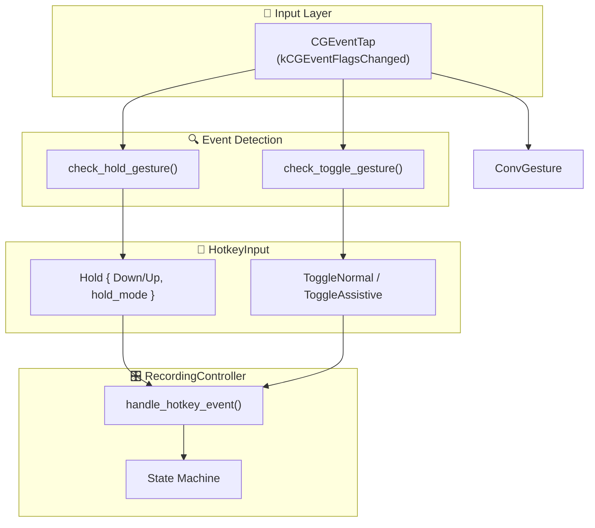
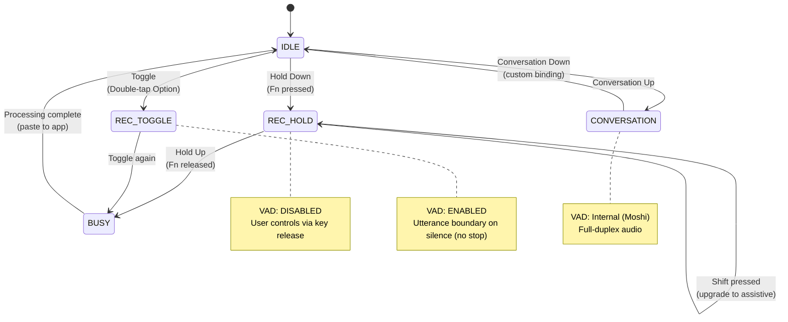
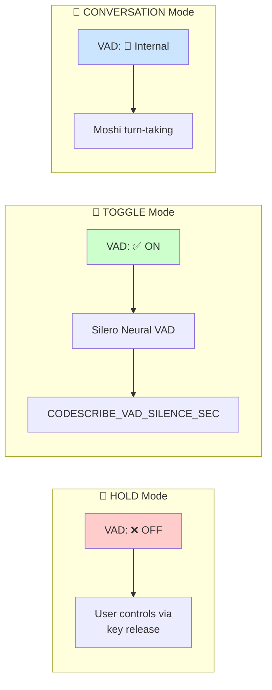
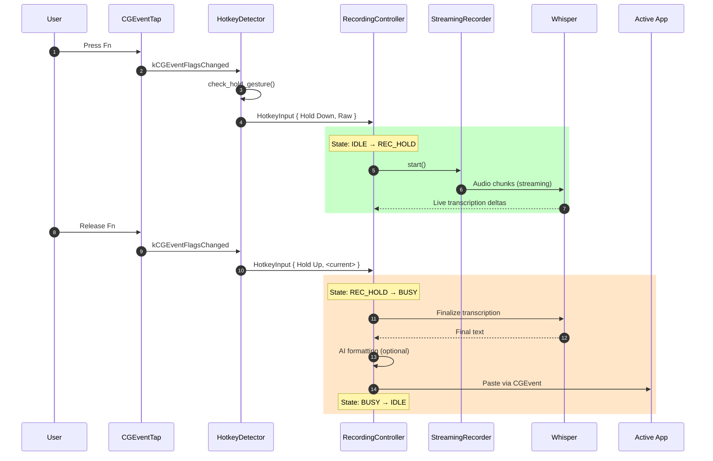
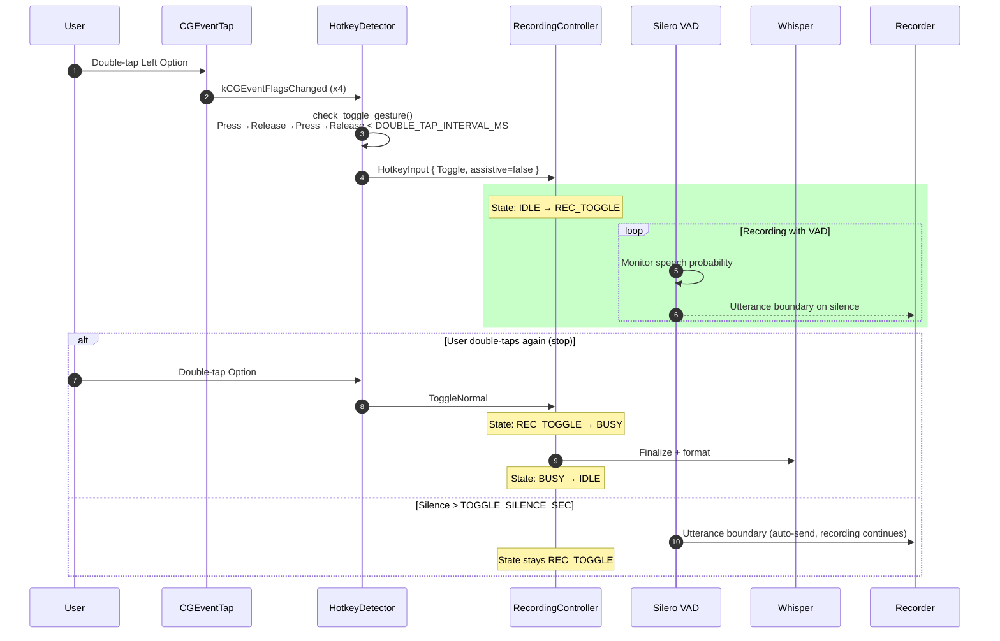
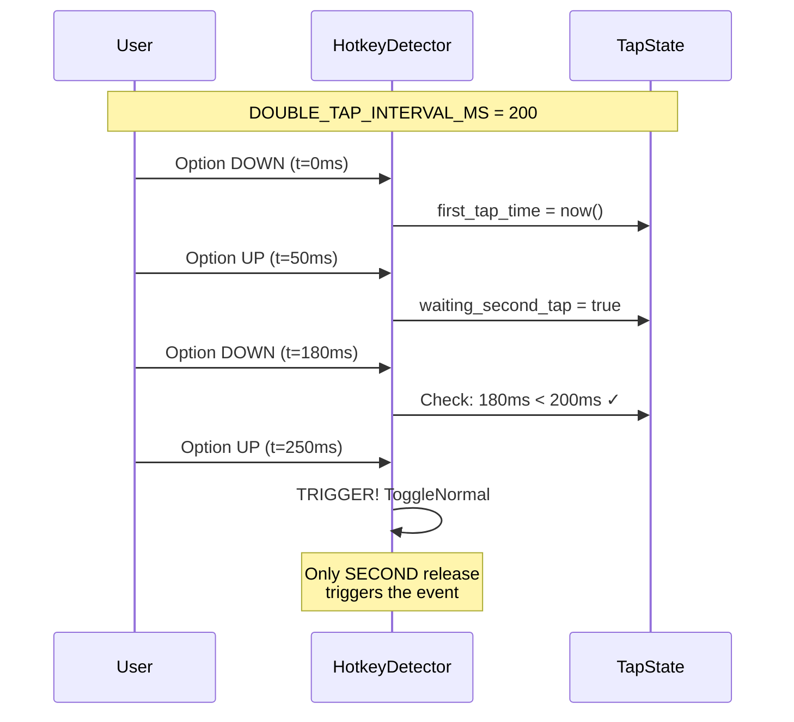

# Hotkeys Contract

> Technical specification for CodeScribe hotkey system.
>
> Created by M&K (c)2026 VetCoders

---

## Overview

CodeScribe uses a low-level CGEventTap to detect modifier-only keypresses on macOS.
This approach avoids TSMGetInputSourceProperty crashes on macOS 26.2+ (Sequoia).



---

## Modes

### 1. Hold Mode (Push-to-Talk)

**Trigger:** Press and hold configured modifier combo
**Behavior:** Recording starts on key down, stops on key up
**VAD:** DISABLED - user has 100% control via key release

| Config                 | Keys          | Use Case                          |
| ---------------------- | ------------- | --------------------------------- |
| `HOLD_MODS=fn`         | Fn            | **Default** (best for terminals)  |
| `HOLD_MODS=ctrl`       | Ctrl          | Legacy / terminal-heavy users     |
| `HOLD_MODS=ctrl_alt`   | Ctrl+Option   | Legacy power-combo preset         |
| `HOLD_MODS=ctrl_shift` | Ctrl+Shift    | Assistive always (legacy)         |
| `HOLD_MODS=ctrl_cmd`   | Ctrl+Command  | macOS power users (legacy)        |

**Events:**

```rust
HotkeyInput { key_type: Hold, action: Down, hold_mode: Raw }         // Fn only
HotkeyInput { key_type: Hold, action: Down, hold_mode: Chat }        // Fn+Shift
HotkeyInput { key_type: Hold, action: Down, hold_mode: Selection }   // Fn+Cmd
HotkeyInput { key_type: Hold, action: Up,   hold_mode: <current> }   // Release
```

**Mode modifiers (default Fn):** Shift → Chat, Cmd → Selection (while holding Fn).

---

### 2. Toggle Mode (Hands-Free)

**Trigger:** Double-tap Option key within `DOUBLE_TAP_INTERVAL_MS` (default **200ms**, range 100–450ms)
**Behavior:** First tap starts recording, second tap toggles send/stop
**VAD:** ENABLED – auto‑sends on `TOGGLE_SILENCE_SEC` of silence (default 5s) without stopping recording

| Config                         | Keys                                           | Mode            |
| ------------------------------ | ---------------------------------------------- | --------------- |
| `TOGGLE_TRIGGER=double_option` | Left Option = normal, Right Option = assistive | Default         |
| `TOGGLE_TRIGGER=double_lalt`   | Left Option only                               | Minimal         |
| `TOGGLE_TRIGGER=double_ralt`   | Right Option only (assistive)                  | Minimal         |
| `TOGGLE_TRIGGER=none`          | Toggle disabled                                | Hold-only users |

**Events:**

```rust
HotkeyInput { key_type: Toggle, action: Press, assistive: false } // Left Option
HotkeyInput { key_type: Toggle, action: Press, assistive: true }  // Right Option
```

---

### 3. Conversation Mode (Moshi Full‑Duplex) — experimental

Conversation mode exists in the controller, but **has no default hotkey binding** in the current release.
If you wire a custom trigger, it runs full‑duplex audio (mic → Moshi → speaker) and uses Moshi’s internal
turn‑taking. Requires Moshi models at `~/.codescribe/models/moshiko-q8/`.

---

## State Machine



**States:**

- `IDLE` - Waiting for hotkey
- `REC_HOLD` - Recording (hold mode, no VAD)
- `REC_TOGGLE` - Recording (toggle mode, VAD active)
- `BUSY` - Processing transcription/AI formatting
- `CONVERSATION` - Moshi full-duplex active

---

## VAD Behavior Contract



| Mode             | VAD Segmentation | Reason                                                             |
| ---------------- | ---------------- | ------------------------------------------------------------------ |
| **Hold**         | ✅ YES           | VAD segments utterances; user controls start/stop via key release. |
| **Toggle**       | ✅ YES           | Hands-free mode uses utterance boundaries (no stop).               |
| **Conversation** | Internal         | Moshi handles turn-taking internally.                              |

---

## Environment Variables

### Hotkey Configuration

| Variable              | Default         | Options                                        | Reload  |
| --------------------- | --------------- | ---------------------------------------------- | ------- |
| `HOLD_MODS`           | `fn`            | `fn`, `ctrl`, `ctrl_alt`, `ctrl_shift`, `ctrl_cmd` | RESTART |
| `HOLD_EXCLUSIVE`      | `true`          | `true`, `false`                                | RESTART |
| `TOGGLE_TRIGGER`      | `double_option` | `double_option`, `double_lalt`, `double_ralt`, `none` | RESTART |
| `HOLD_START_DELAY_MS` | `800`           | 0-1000                                         | RESTART |
| `DOUBLE_TAP_INTERVAL_MS` | `200`        | 100-450                                        | RESTART |
| `TOGGLE_SILENCE_SEC`  | `5.0`           | 0.5-10.0                                       | RESTART |

### VAD Configuration

| Variable                     | Default | Range    | Description                       |
| ---------------------------- | ------- | -------- | --------------------------------- |
| `CODESCRIBE_VAD_THRESHOLD`   | `0.5`   | 0.1-0.95 | Speech probability threshold      |
| `CODESCRIBE_VAD_SILENCE_SEC` | `1.2`   | 0.1-10.0 | Silence before utterance boundary |

---

## Event Flow

### Hold Mode (Push-to-Talk)



### Toggle Mode (Hands-Free)



### Conversation Mode (Moshi Full‑Duplex)

Conversation mode is available in the controller but **not bound to a default hotkey** in the current release.
Wire it manually if you need full‑duplex audio (mic → Moshi → speaker).

---

## Implementation Notes

### CGEventTap (macOS)

```rust
// We ONLY read CGEventFlags - no keyboard layout queries
let flags = CGEventGetFlags(event);
let ctrl = (flags & kCGEventFlagMaskControl) != 0;
let alt = (flags & kCGEventFlagMaskAlternate) != 0;
// etc.
```

**Why:** TSMGetInputSourceProperty (used by rdev/global-hotkey) crashes on macOS 26.2+ when called from event tap callback thread.

### Double-Tap Detection



```rust
const DOUBLE_TAP_INTERVAL_MS: u64 = 200;

// Sequence: Press → Release → Press → Release (within interval)
// Only the SECOND release triggers ToggleNormal/ToggleAssistive
```

### Exclusive Mode

When `HOLD_EXCLUSIVE=true` (default):

- Option taps are ignored if Option is part of an unrelated hold combo
- Prevents accidental toggle while trying to hold legacy Ctrl-based combos

---

## Troubleshooting

| Symptom                      | Cause                           | Fix                                                           |
| ---------------------------- | ------------------------------- | ------------------------------------------------------------- |
| Hotkeys don't work           | Accessibility permission denied | System Settings → Privacy → Accessibility → Enable CodeScribe |
| Double-tap too sensitive     | Interval too short              | Increase `DOUBLE_TAP_INTERVAL_MS` (100–450ms)                 |
| Recording won't stop (hold)  | Key stuck in system             | Release all modifiers, try again                              |
| VAD cuts utterance too early | Threshold too high              | Lower `CODESCRIBE_VAD_THRESHOLD`                              |

---

## File Locations

| File                               | Purpose                              |
| ---------------------------------- | ------------------------------------ |
| `app/os/hotkeys.rs`                | CGEventTap listener, event detection |
| `app/controller/mod.rs`            | State machine, event handling        |
| `app/controller/types.rs`          | State enum                           |
| `core/vad/config.rs`               | VAD configuration                    |
| `core/audio/streaming_recorder.rs` | Silero VAD segmentation              |

---

_Copyright © 2024–2026 VetCoders_
