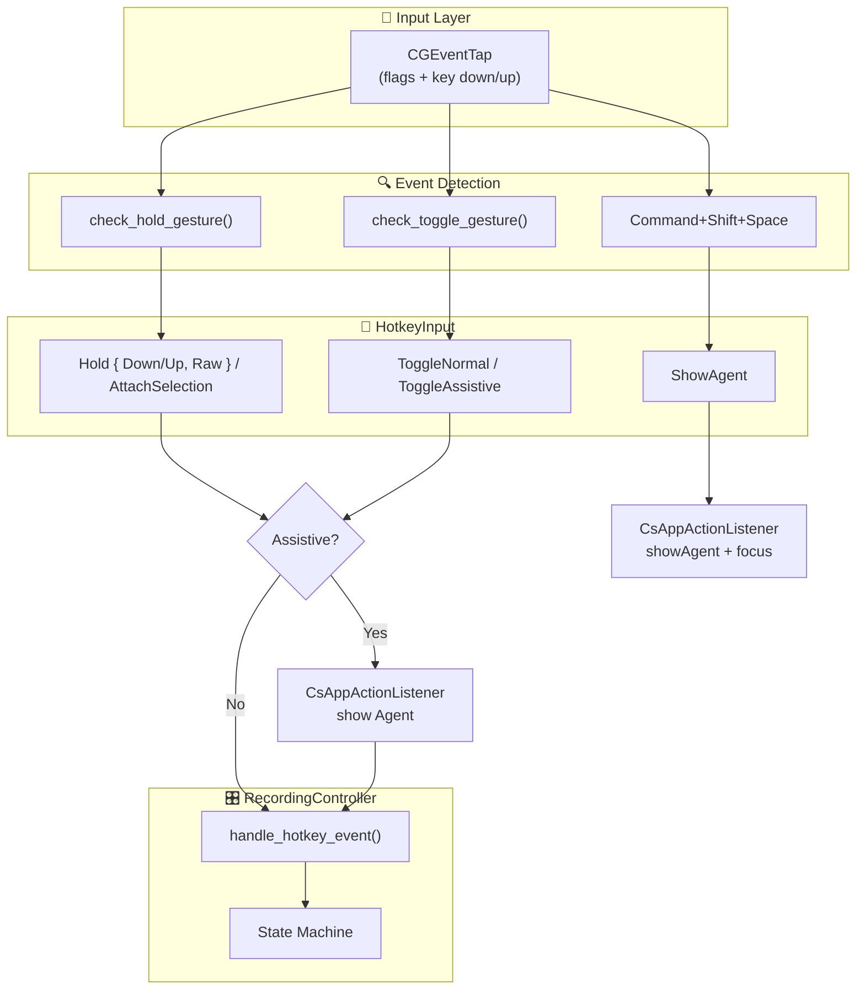
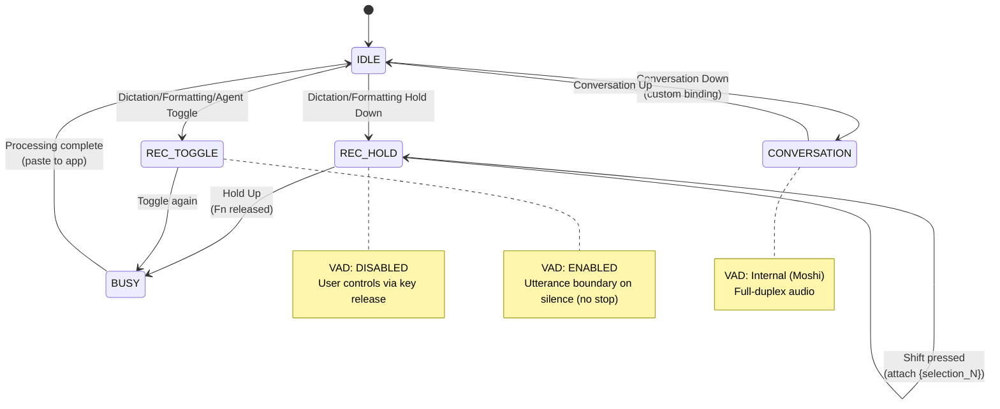
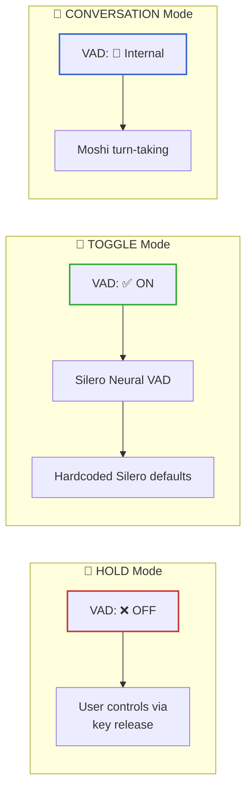
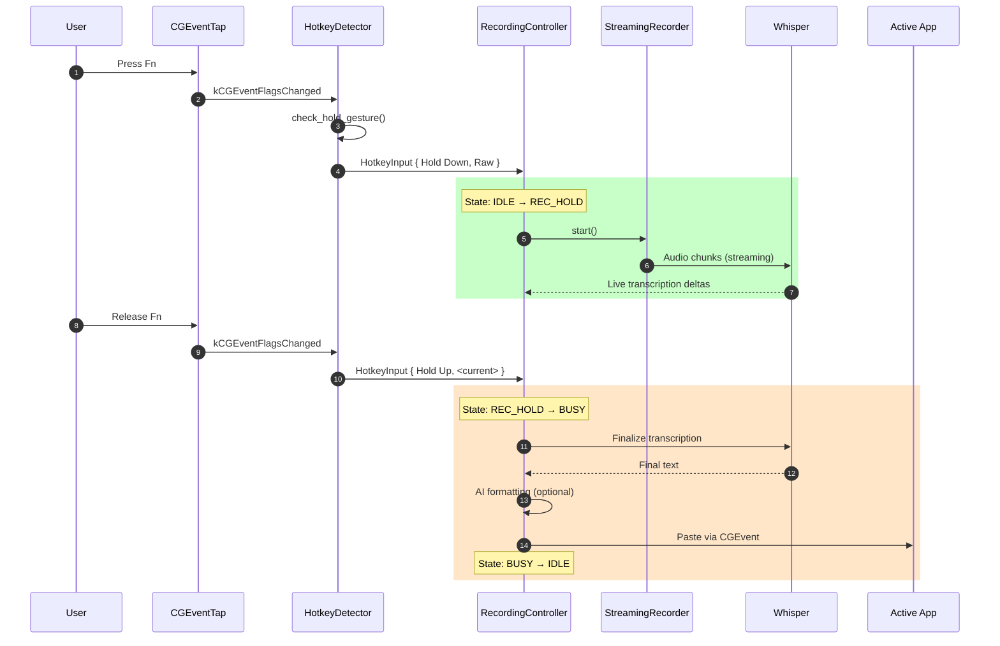
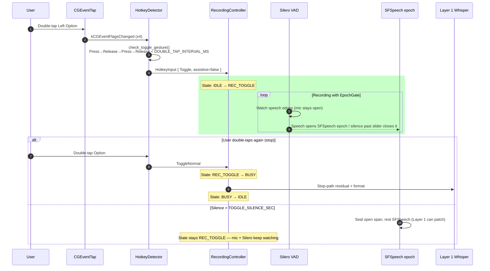
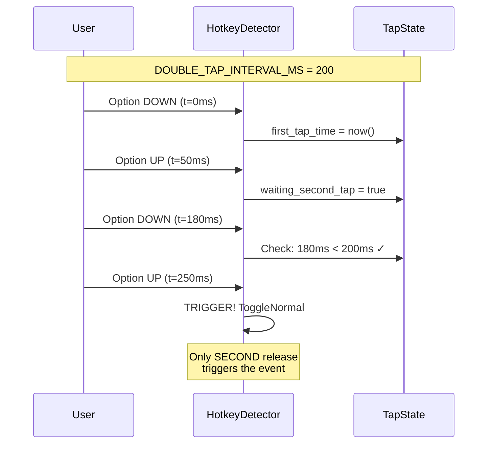

# Hotkeys Contract

> Technical specification for codescribe hotkey system.
>
> Created by Vetcoders (c)2026

---

## Overview

Codescribe uses a low-level CGEventTap to detect modifier-only keypresses on macOS.
This approach avoids TSMGetInputSourceProperty crashes on macOS 26.2+ (Sequoia).

Canonical hotkey configuration is **mode-first**:

- `Dictation`, `Formatting`, and `Assistive` each own one `ShortcutBinding`
- bindings are persisted in `~/Library/Application Support/Codescribe/settings.json`
- legacy `.env` hotkey keys such as `HOLD_MODS` / `TOGGLE_TRIGGER` are no longer part of the runtime contract
- fixed application commands are a separate, non-configurable command plane and never become `WorkMode` bindings

### Agent summon command (not a recording mode)

`Command+Shift+Space` emits one `HotkeyEvent::ShowAgent` per physical Space
press. The bridge delivers it to `CsAppActionListener`, which fronts the single
existing Agent window and requests composer focus. This route does not construct
or call `RecordingController`, publish `on_recording_preparing`, create a thread,
send a payload, or change the Idle state. Key-up re-arms the chord so macOS key
repeat cannot emit duplicate commands.

This fixed MVP chord is intentionally outside the configurable
`WorkMode -> ShortcutBinding` contract.

Assistive bindings notify the same app-action plane to front/focus the Agent
window, then deliver the recording event to the same `RecordingController` as
Dictation. Agent, Assistive, and Dictation therefore share microphone, VAD, STT,
committed-text correction, and transcript publication. Only downstream UI and
delivery differ. Assistive keeps the Dictation overlay closed; a process-wide
start gate prevents any competing recorder from opening.

**Thread routing (operator contract 2026-08-13).** An assistive turn always
lands in the thread the Agent rail currently has selected — the thread the
user is looking at. The rail publishes every selection change through
`CodescribeHotkeys.set_assistive_target_thread`; the controller rebinds its
runtime (rejoin + rehydrate) when the target differs from the bound thread. A
new thread is only ever minted by an explicit "+ New thread" (published as a
`nil` target, consumed once — one press mints one thread, not one per
utterance). If the Agent UI never published a selection (window never
opened), the lane continues its bound conversation as before.

**Delivery destination (operator contract 2026-08-15).** The hotkey picks the
_intent_; it does not paste into the frontmost app. `resolve_delivery_route`
(`docs/DELIVERY_ROUTE.md`) is the only destination function:

- Assistive hold → Agent composer (first-class message, never Cmd+V)
- Hold Fn / Globe → Orient canvas, plus auto-paste **only** into the app
  latched at key-down — never into Codescribe itself
- Overlay **To Agent** → Agent composer, even after the session reset

Focus at stop time is not an input. A tagged `<codescribe mode="raw">` paste
into the Agent composer is a doctrine violation.


```mermaid
flowchart TB
    subgraph Input["🎹 Input Layer"]
        CGEventTap["CGEventTap<br/>(flags + key down/up)"]
    end

    subgraph Detection["🔍 Event Detection"]
        HoldGesture["check_hold_gesture()"]
        ToggleGesture["check_toggle_gesture()"]
        CommandGesture["Command+Shift+Space"]
    end

    subgraph Events["📨 HotkeyInput"]
        HoldEvent["Hold { Down/Up, Raw } / AttachSelection"]
        ToggleEvent["ToggleNormal / ToggleAssistive"]
        ShowAgent["ShowAgent"]
    end

    subgraph Controller["🎛️ RecordingController"]
        Handler["handle_hotkey_event()"]
        StateMachine["State Machine"]
    end

    CGEventTap --> HoldGesture
    CGEventTap --> ToggleGesture
    HoldGesture --> HoldEvent
    ToggleGesture --> ToggleEvent
    CGEventTap --> CommandGesture
    CommandGesture --> ShowAgent
    HoldEvent --> AssistiveSplit{"Assistive?"}
    ToggleEvent --> AssistiveSplit
    AssistiveSplit -->|No| Handler
    AssistiveSplit -->|Yes| AgentNotice["CsAppActionListener<br/>show Agent"]
    AgentNotice --> Handler
    ShowAgent --> AppAction["CsAppActionListener<br/>showAgent + focus"]

    Handler --> StateMachine
```

---

## Modes

### 1. Hold Mode (Push-to-Talk)

**Trigger:** Press and hold configured modifier combo
**Behavior:** Recording starts on key down, stops on key up
**VAD:** DISABLED - user has 100% control via key release

| Mode binding              | Keys         | Use Case                         |
| ------------------------- | ------------ | -------------------------------- |
| `Dictation=HoldFn`        | Fn           | **Default** (best for terminals) |
| `Dictation=HoldCtrl`      | Ctrl         | Terminal-heavy users             |
| `Dictation=HoldCtrlAlt`   | Ctrl+Option  | Power-combo preset               |
| `Dictation=HoldCtrlShift` | Ctrl+Shift   | Alternate hold dictation         |
| `Dictation=HoldCtrlCmd`   | Ctrl+Command | macOS power users                |

Fn hold-down (Raw) captures any live OS selection once as `{selection_1}`.
Mid-hold Shift (or the configured arm modifier, default Shift, optional
Command) attaches further pulses as `{selection_2..n}`. Neither upgrade
`HoldMode` to Chat, fronts Agent, hides the overlay, or stops the Fn take.

Fn+Shift from idle is dictation, not Assistive. Voice chat is the Assistive
work-mode binding (default: double-tap Right Option), not Hold Fn+Shift.

**Events:**

```rust
HotkeyEvent::Hold { action: Down, mode: Raw }   // Fn, or Fn+Shift from idle
                                                // (controller attaches live selection)
HotkeyEvent::AttachSelection                    // Shift/Command rising edge mid-hold
HotkeyEvent::Hold { action: Up, mode: Raw }     // Release — destination stays Raw
```

**Engine and delivery parity:** Hold and toggle both start
`StreamingRecorder::start_event_session` and fan the same `EngineEvent` stream
through `PresentationEmitter`, IPC, and telemetry sinks. Their intentional
difference is boundary policy (key-up for hold, VAD for toggle), not the STT
engine. A late `Correction` patches the active preview or the matching most
recent committed utterance; it must never create a second delivered utterance.

---

### 2. Toggle Mode (Hands-Free)

**Trigger:** Double-tap Option key within `DOUBLE_TAP_INTERVAL_MS` (default **200ms**, range 100–450ms)
**Behavior:** First tap starts recording, second tap toggles send/stop
**Silence:** ENABLED – `TOGGLE_SILENCE_SEC` (default 5s) is the Apple engine lifecycle on the live
lane (`EpochGate` in `apple_live_session.rs`): Silero watches the mic, speech opens an SFSpeech
epoch, silence past the slider seals the span and rests the engine, the next speech edge wakes a
fresh epoch. Recording does not stop. This is not a wav-only chunker knob and not `CODESCRIBE_VAD_*`.

| Mode binding                  | Keys                         | Mode              |
| ----------------------------- | ---------------------------- | ----------------- |
| `Formatting=DoubleLeftOption` | Left Option double-tap       | Formatting        |
| `Assistive=DoubleRightOption` | Right Option double-tap      | Assistive         |
| `Dictation=DoubleCtrl`        | Ctrl double-tap              | Raw dictation     |
| `Disabled`                    | no toggle for that work mode | Hold-only profile |

Formatting is orthogonal to the trigger and destination. Hold, normal toggle,
and assistive sessions all honor the session's Auto Format setting. The trigger
chooses semantics and destination; it does not remove formatting capability.

**Stop latency trade-off (supersedes ADR 2026-05-28 Faza 1 force-RAW):** with
formatting enabled in Settings, a hands-off toggle stop performs one AI
formatting call on the stop path before delivery. This latency is the user's
explicit choice, not a surprise: the overlay reports the phase as `final pass`
while the call runs, a formatting failure falls back to the post-processed raw
text, and users who want a zero-latency stop either disable the formatting
default or use a `Dictation` binding (force raw). The earlier unconditional
force-RAW on this path was removed because it silently erased the Settings
formatting default.

**Revision D-01 (2026-07-16):** commit `37f137e` intentionally reverted the
2026-05-28 ADR decision that forced toggle hands-off stops to RAW whenever no
explicit hotkey override existed. The runtime now lets Settings decide the
default route in that case, while explicit `Dictation` / `Formatting` bindings
continue to win.

**Events:**

```rust
HotkeyInput { key_type: Toggle, action: Press, assistive: false } // Left Option
HotkeyInput { key_type: Toggle, action: Press, assistive: true }  // Right Option
```

### Capture and transcript ownership

Every speech mode enters one `RecordingController`:
capture → VAD → STT → `PresentationEmitter` committed reducer. Dictation and
Formatting then paste or format; Agent and Assistive deliver to the selected
Agent thread. The clean NDJSON transcript bus observes the committed reducer,
before any consumer-specific action, and never opens audio or re-transcribes.

Selection is captured in the trigger handler, never at send time. Rust remains
the indicator/tray authority, while the transcription overlay is exclusive to
Dictation and Formatting.

---

### 3. Conversation Mode (Moshi Full‑Duplex) — experimental

Conversation mode exists in the controller, but **has no default hotkey binding** in the current release.
If you wire a custom trigger, it runs full‑duplex audio (mic → Moshi → speaker) and uses Moshi’s internal
turn‑taking. Requires Moshi models at `~/.codescribe/models/moshiko-q8/`.

---

## State Machine


```mermaid
stateDiagram-v2
    [*] --> IDLE

    IDLE --> REC_HOLD : Dictation/Formatting Hold Down
    IDLE --> REC_TOGGLE : Dictation/Formatting/Agent Toggle
    IDLE --> CONVERSATION : Conversation Down<br/>(custom binding)

    REC_HOLD --> BUSY : Hold Up<br/>(Fn released)
    REC_HOLD --> REC_HOLD : Shift pressed<br/>(attach {selection_N})

    REC_TOGGLE --> BUSY : Toggle again
    CONVERSATION --> IDLE : Conversation Up

    BUSY --> IDLE : Processing complete<br/>(paste to app)

    note right of REC_HOLD
        VAD: DISABLED
        User controls via key release
    end note

    note right of REC_TOGGLE
        VAD: ENABLED
        Utterance boundary on silence (no stop)
    end note

    note right of CONVERSATION
        VAD: Internal (Moshi)
        Full-duplex audio
    end note
```

**States:**

- `IDLE` - Waiting for hotkey
- `REC_HOLD` - Recording (hold mode, no VAD)
- `REC_TOGGLE` - Recording (toggle mode, VAD active)
- `BUSY` - Processing transcription/AI formatting
- `CONVERSATION` - Moshi full-duplex active

---

## VAD Behavior Contract


```mermaid
flowchart LR
    subgraph HoldMode["🎯 HOLD Mode"]
        H_VAD["VAD: ❌ OFF"]
        H_Control["User controls via<br/>key release"]
    end

    subgraph ToggleMode["👐 TOGGLE Mode"]
        T_VAD["VAD: ✅ ON"]
        T_Silero["Silero Neural VAD"]
        T_Config["Hardcoded Silero defaults"]
    end

    subgraph ConvMode["💬 CONVERSATION Mode"]
        C_VAD["VAD: 🔄 Internal"]
        C_Moshi["Moshi turn-taking"]
    end

    H_VAD --> H_Control
    T_VAD --> T_Silero
    T_Silero --> T_Config
    C_VAD --> C_Moshi

    style H_VAD stroke:#c33,stroke-width:2px
    style T_VAD stroke:#3a3,stroke-width:2px
    style C_VAD stroke:#36c,stroke-width:2px
```

| Mode             | VAD Segmentation | Reason                                                             |
| ---------------- | ---------------- | ------------------------------------------------------------------ |
| **Hold**         | ✅ YES           | VAD segments utterances; user controls start/stop via key release. |
| **Toggle**       | ✅ YES           | Hands-free mode uses utterance boundaries (no stop).               |
| **Conversation** | Internal         | Moshi handles turn-taking internally.                              |

---

## Environment Variables

### Hotkey Configuration

Bindings themselves are persisted in `settings.json`.
The remaining runtime env surface only tunes detector behavior:

| Variable                 | Default | Options         | Reload               |
| ------------------------ | ------- | --------------- | -------------------- |
| `HOLD_EXCLUSIVE`         | `false` | `true`, `false` | RESTART              |
| `HOLD_START_DELAY_MS`    | `800`   | 0-1000          | RESTART              |
| `DOUBLE_TAP_INTERVAL_MS` | `200`   | 100-450         | RESTART              |
| `TOGGLE_SILENCE_SEC`     | `5.0`   | 0.5-30.0        | HOT (next recording) |

### VAD Configuration

VAD internals are hardcoded in `core/vad/config.rs` (no runtime env knobs).

---

## Event Flow

### Hold Mode (Push-to-Talk)


```mermaid
sequenceDiagram
    autonumber
    participant User
    participant CGEventTap
    participant HotkeyDetector
    participant Controller as RecordingController
    participant Recorder as StreamingRecorder
    participant Whisper
    participant App as Active App

    User->>CGEventTap: Press Fn
    CGEventTap->>HotkeyDetector: kCGEventFlagsChanged
    HotkeyDetector->>HotkeyDetector: check_hold_gesture()
    HotkeyDetector->>Controller: HotkeyInput { Hold Down, Raw }

    rect rgb(200, 255, 200)
        Note over Controller: State: IDLE → REC_HOLD
        Controller->>Recorder: start()
        Recorder->>Whisper: Audio chunks (streaming)
        Whisper-->>Controller: Live transcription deltas
    end

    User->>CGEventTap: Release Fn
    CGEventTap->>HotkeyDetector: kCGEventFlagsChanged
    HotkeyDetector->>Controller: HotkeyInput { Hold Up, <current> }

    rect rgb(255, 230, 200)
        Note over Controller: State: REC_HOLD → BUSY
        Controller->>Whisper: Finalize transcription
        Whisper-->>Controller: Final text
        Controller->>Controller: AI formatting (optional)
        Controller->>App: Paste via CGEvent
        Note over Controller: State: BUSY → IDLE
    end
```

### Toggle Mode (Hands-Free)


```mermaid
sequenceDiagram
    autonumber
    participant User
    participant CGEventTap
    participant HotkeyDetector
    participant Controller as RecordingController
    participant VAD as Silero VAD
    participant Apple as SFSpeech epoch
    participant Whisper as Layer 1 Whisper

    User->>CGEventTap: Double-tap Left Option
    CGEventTap->>HotkeyDetector: kCGEventFlagsChanged (x4)
    HotkeyDetector->>HotkeyDetector: check_toggle_gesture()<br/>Press→Release→Press→Release < DOUBLE_TAP_INTERVAL_MS
    HotkeyDetector->>Controller: HotkeyInput { Toggle, assistive=false }

    rect rgb(200, 255, 200)
        Note over Controller: State: IDLE → REC_TOGGLE
        loop Recording with EpochGate
            VAD->>VAD: Watch speech edges (mic stays open)
            VAD-->>Apple: Speech opens SFSpeech epoch / silence past slider closes it
        end
    end

    alt User double-taps again (stop)
        User->>HotkeyDetector: Double-tap Option
        HotkeyDetector->>Controller: ToggleNormal
        Note over Controller: State: REC_TOGGLE → BUSY
        Controller->>Whisper: Stop-path residual + format
        Note over Controller: State: BUSY → IDLE
    else Silence > TOGGLE_SILENCE_SEC
        Apple->>Apple: Seal open span, rest SFSpeech (Layer 1 can patch)
        Note over Controller: State stays REC_TOGGLE — mic + Silero keep watching
    end
```

### Conversation Mode (Moshi Full‑Duplex)

Conversation mode is available in the controller but **not bound to a default hotkey** in the current release.
Wire it manually if you need full‑duplex audio (mic → Moshi → speaker).

---

## Implementation Notes

### CGEventTap (macOS)

```rust
// Speech gestures read CGEventFlags. Fixed command chords additionally read
// the layout-independent virtual keycode (Space = 49); no keyboard layout APIs.
let flags = CGEventGetFlags(event);
let ctrl = (flags & kCGEventFlagMaskControl) != 0;
let alt = (flags & kCGEventFlagMaskAlternate) != 0;
// etc.
```

**Why:** TSMGetInputSourceProperty (used by rdev/global-hotkey) crashes on macOS 26.2+ when called from event tap callback thread.

### Double-Tap Detection


```mermaid
sequenceDiagram
    participant User
    participant Detector as HotkeyDetector
    participant State as TapState

    Note over User,State: DOUBLE_TAP_INTERVAL_MS = 200

    User->>Detector: Option DOWN (t=0ms)
    Detector->>State: first_tap_time = now()

    User->>Detector: Option UP (t=50ms)
    Detector->>State: waiting_second_tap = true

    User->>Detector: Option DOWN (t=180ms)
    Detector->>State: Check: 180ms < 200ms ✓

    User->>Detector: Option UP (t=250ms)
    Detector->>Detector: TRIGGER! ToggleNormal

    Note over Detector: Only SECOND release<br/>triggers the event
```

```rust
const DOUBLE_TAP_INTERVAL_MS: u64 = 200;

// Sequence: Press → Release → Press → Release (within interval)
// Only the SECOND release triggers ToggleNormal/ToggleAssistive
```

### Exclusive Mode

When `HOLD_EXCLUSIVE=false` (default), modifier variants work out of the box:

- Shift or Command _during_ an already-started Fn hold attaches `{selection_N}`
  (default arm modifier Shift; configurable to Cmd in Settings)
- Fn+Shift from idle stays dictation — it is not Assistive and does not front Agent
- The unconfigured arm modifier does not attach (W10-B detector truth)

Set `HOLD_EXCLUSIVE=true` when you need stricter isolation:

- Option taps are ignored if Option is part of an unrelated hold combo
- Prevents accidental toggle while trying to hold legacy Ctrl-based combos

---

## Troubleshooting

| Symptom                                           | Cause                                      | Fix                                                           |
| ------------------------------------------------- | ------------------------------------------ | ------------------------------------------------------------- |
| Hotkeys don't work                                | Accessibility permission denied            | System Settings → Privacy → Accessibility → Enable codescribe |
| Double-tap too sensitive                          | Interval too short                         | Increase `DOUBLE_TAP_INTERVAL_MS` (100–450ms)                 |
| Recording won't stop (hold)                       | Key stuck in system                        | Release all modifiers, try again                              |
| VAD cuts utterance too early                      | VAD defaults too conservative              | Tune constants in `core/vad/config.rs` and rebuild            |
| Double-tap / arm “does nothing” with no UI change | Gesture blocked or arm ignored at detector | Check INFO logs for stable diagnostic lines (below)           |

### Blocked / ignored gesture diagnostics (INFO)

Every blocked double-tap and ignored arm attempt emits one **INFO** line with a
stable `reason=` token (visibility only — routing is unchanged). Filter
`~/.codescribe/logs/codescribe.log` (or the Diagnostics surface) for:

```text
blocked_double_tap gesture=left_option|right_option reason=binding_disabled|modifier_combo_active
arm_ignored reason=wrong_arm_modifier
```

| Log line                                            | Meaning                                                                      |
| --------------------------------------------------- | ---------------------------------------------------------------------------- |
| `blocked_double_tap … reason=binding_disabled`      | Double-tap recognized, but that Option side is not assigned to a mode        |
| `blocked_double_tap … reason=modifier_combo_active` | Double-tap recognized while another modifier/hold combo is active            |
| `arm_ignored reason=wrong_arm_modifier`             | Hold base is down, but the non-configured arm key (Shift vs Cmd) was pressed |

If **no** such line appears when you double-tap or arm, the OS never delivered
the key event to Codescribe (permissions / focus / hardware) — that case is
outside the detector.

---

## File Locations

| File                               | Purpose                             |
| ---------------------------------- | ----------------------------------- |
| `app/os/hotkeys/detector.rs`       | Pure speech/command event detection |
| `app/os/hotkeys/platform.rs`       | CGEventTap adapter and keycodes     |
| `bridge/src/hotkeys.rs`            | Recording and app-action routing    |
| `app/controller/mod.rs`            | State machine, event handling       |
| `app/controller/types.rs`          | State enum                          |
| `core/vad/config.rs`               | VAD configuration                   |
| `core/audio/streaming_recorder.rs` | Silero VAD segmentation             |

---

_Copyright © 2024–2026 Vetcoders_
