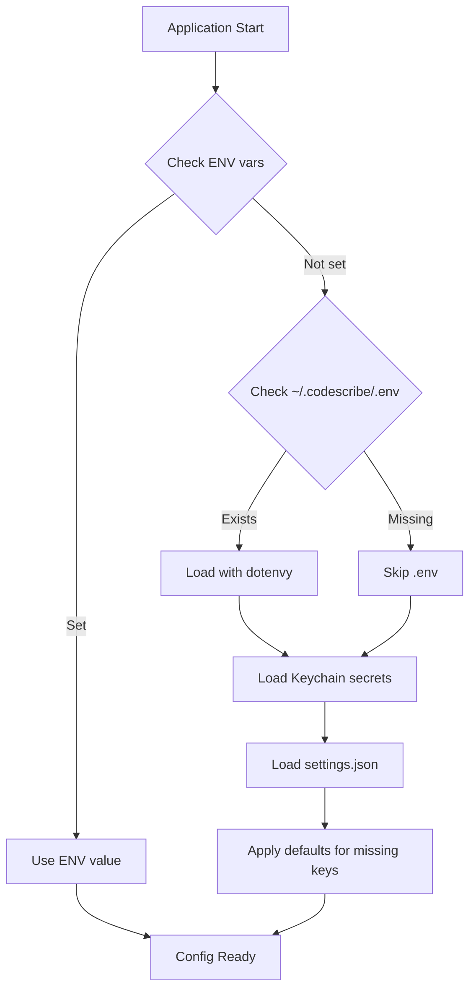
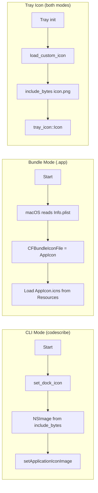

# CodeScribe Installation and Launch Guide

This document describes the installation methods, configuration paths, and how the application locates its resources.

## Installation Methods

### Method 1: CLI Install (Recommended for Development)

```bash
# If models are not cached yet:
make download-model   # Download Whisper (for embedding)

# Install CLI (~embedded Whisper + MiniLM)
make install
```

**Result**: Binary `codescribe` installed to `~/.cargo/bin/` (~888MB with embedded model).

**How it runs**: Direct execution from terminal or as background daemon.

### Method 2: App Bundle (For Distribution)

```bash
make bundle           # Creates bundle/CodeScribe.app
make install-app      # Copies to /Applications/CodeScribe.app (auto-caches models)
```

**Result**: Standard macOS .app bundle in `/Applications/`.

**How it runs**: Double-click or launch from Spotlight.

`make install-app` now prefers a stable local signing identity automatically:

- `Apple Development: ...` if present
- otherwise `Developer ID Application: ...`
- only falls back to `adhoc` when no usable signing identity exists

This matters because macOS TCC permissions are far more stable with a persistent code-signing identity than with ad-hoc signatures.

### Method 3: DMG Distribution (For End Users)

```bash
make dmg-signed       # Build signed DMG
make notarize         # Notarize with Apple (requires Developer ID)
# or one-shot:
# make release-full    # Build + sign + notarize
```

**Result**: `CodeScribe_X.Y.Z.dmg` ready for distribution.

## Configuration

### Config Directory

Configuration is **tiered**:

```
~/Library/Application Support/CodeScribe/
├── settings.json     # GUI-managed settings (regular-user tier)
└── ...               # app data

~/.codescribe/
├── .env              # Power-user overrides (optional)
├── prompts/          # Custom AI prompts
│   ├── formatting.txt
│   └── assistive.txt
├── history/          # Transcription history
├── reports/          # Quality reports
└── repo_path         # Path to source repo (set during install)
```

**Secrets** (API keys) are stored in **macOS Keychain** under service `com.vetcoders.codescribe`.

### Environment Variables (.env)

The application loads configuration with these priorities:

1. **Environment variables** (highest priority)
2. **~/.codescribe/.env** (power-user overrides)
3. **settings.json** (GUI-managed defaults)
4. **Built-in defaults** (fallback)



### Key Configuration Variables

```env
# Speech-to-Text
WHISPER_LANGUAGE=pl              # pl | en | de | fr
USE_LOCAL_STT=1                  # 1 = embedded Whisper

# Hotkeys (defaults)
HOLD_MODS=fn                     # fn | ctrl | ctrl_alt | ctrl_shift | ctrl_cmd
TOGGLE_TRIGGER=double_option     # double_option | double_lalt | double_ralt | none
DOUBLE_TAP_INTERVAL_MS=200       # 100–450
TOGGLE_SILENCE_SEC=5.0

# AI Formatting
AI_FORMATTING_ENABLED=1
LLM_ENDPOINT=https://api.openai.com/v1/responses
LLM_MODEL=gpt-4.1-mini
LLM_API_KEY=sk-xxx

# Optional: Separate providers for modes
LLM_FORMATTING_{ENDPOINT,MODEL,API_KEY}=...
LLM_ASSISTIVE_{ENDPOINT,MODEL,API_KEY}=...
```

## Bundle Structure

```
CodeScribe.app/
└── Contents/
    ├── Info.plist           # Bundle metadata (icon, identifier, version)
    ├── MacOS/
    │   └── codescribe       # Main executable (~888MB with embedded model)
    └── Resources/
        └── AppIcon.icns     # Application icon
```

### Info.plist Keys

| Key                          | Value                 | Purpose                      |
| ---------------------------- | --------------------- | ---------------------------- |
| CFBundleIdentifier           | com.codescribe.app    | Unique app identifier        |
| CFBundleIconFile             | AppIcon               | Points to AppIcon.icns       |
| CFBundleExecutable           | codescribe            | Main binary name             |
| LSMinimumSystemVersion       | 14.0                  | Requires macOS Sonoma+       |
| NSMicrophoneUsageDescription | ...                   | Microphone permission prompt |

## Icons

### Tray Icon

- **Source**: `assets/icon.png` (embedded via `include_bytes!`)
- **Location in code**: `src/tray/icons.rs`
- **Size**: 44x44 pixels (Retina), 22x22 logical

### Dock Icon

- **For CLI**: Programmatically set via `set_dock_icon()` in `src/ui.rs`
- **For Bundle**: Uses `CFBundleIconFile` from Info.plist pointing to `AppIcon.icns`
- **Source**: `assets/AppIcon.icns`

### Icon Loading Flow



## Permissions Required

Grant in **System Settings > Privacy & Security**:

| Permission       | Purpose                | When Prompted           |
| ---------------- | ---------------------- | ----------------------- |
| Microphone       | Audio recording        | First recording attempt |
| Accessibility    | Global hotkeys, paste  | First hotkey press      |
| Input Monitoring | Keyboard event capture | First hotkey press      |

## Troubleshooting

### Empty Dock Icon

- **CLI mode**: `set_dock_icon()` should set it programmatically
- **Bundle mode**: Check that `Info.plist` exists and has `CFBundleIconFile`
- **Verify**: `plutil -lint /Applications/CodeScribe.app/Contents/Info.plist`

### Empty Tray Icon

- Check that `assets/icon.png` exists and is valid PNG
- Rebuild with `cargo build --release`

### Config Not Loading

- Check `~/.codescribe/.env` exists
- Verify syntax: `cat ~/.codescribe/.env`
- Check logs: `codescribe -v` for verbose output

### Hotkeys Not Working

- Grant Accessibility permission
- Grant Input Monitoring permission
- Restart the application after granting

---

_Created by M&K (c)2026 VetCoders_
