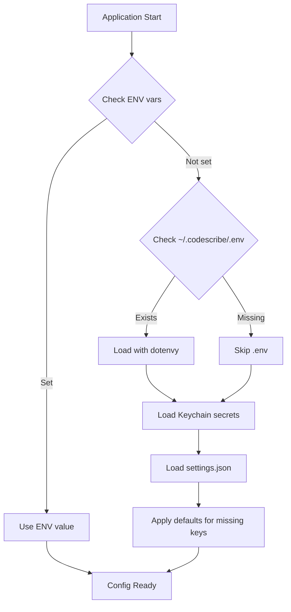
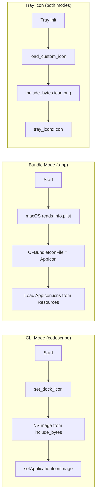

# Codescribe Installation and Launch Guide

This document describes the installation methods, configuration paths, and how the application locates its resources.

## Installation Methods

### Method 1: App Bundle From Source (Recommended for Development)

```bash
# Build an optimized local SwiftUI app bundle
make app PROFILE=local-release

# Build and copy to /Applications/Codescribe.app
make install-app
```

**Result**: App bundle installed at `/Applications/Codescribe.app`, with model/cache checks handled by `scripts/build-app.sh`.

**How it runs**: Launch from Finder, Spotlight, or `make start`.

### Method 2: Qube CLI Tools (Batch Quality Work)

```bash
make release-qube
make install
```

**Result**: `qube-report` and `qube-daemon` installed from `bin/qube_report.rs` and `bin/qube_daemon.rs`.

**How it runs**: Terminal-only quality/reporting utilities, not the user-facing app.

`make install-app` now prefers a stable local signing identity automatically:

- `Apple Development: ...` if present
- otherwise `Developer ID Application: ...`
- only falls back to `adhoc` when no usable signing identity exists

This matters because macOS TCC permissions are far more stable with a persistent code-signing identity than with ad-hoc signatures.

Local source installs use Cargo's optimized `local-release` profile and the
checked-in development license verifier. Production DMGs use the distinct
`release` profile, which fails closed unless `CODESCRIBE_LICENSE_PUBLIC_KEY_HEX`
is the real 32-byte Ed25519 public key paired with the production signer. A UUID
is not a license public key.

`make install-app` bakes Lab (`CSDeveloperSurface=1`) only when both the
Sparkle public key and the production-license public key resolve from
`~/.vibecrafted/secrets/codescribe/` (the same files a real release uses).
A public clone without those files still installs the daily app; Lab stays
off. Production DMGs refuse the bit.

### Method 3: DMG Distribution (For End Users)

```bash
make dmg-signed       # Build signed DMG
make notarize         # Notarize with Apple (requires Developer ID)
# or one-shot:
# make release-dmgs    # Build + sign + notarize standard and full DMGs
```

**Result**: standard `Codescribe_X.Y.Z-….dmg` (slim: Silero embedded, MiniLM signed as a runtime resource, Whisper via Settings download / cache) and optional `…_full.dmg` (embeds Whisper too). Daily operator flow is slim: `make release && make dmg-signed && make notarize`.

### About panel commit stamp

`CSBuildCommit` / `CSBuiltAt` are stamped in `scripts/build-app.sh` **before**
cargo / UniFFI / xcodegen run.

- Commit short SHA comes from `git rev-parse --short=9 HEAD`.
- `-dirty` is appended only when **tracked** source differs from HEAD,
  excluding UniFFI-generated `macos/Codescribe/Bridge/*`.
- Untracked local files (e.g. `*.dmg.sha256`, scratch) do **not** force `-dirty`.

A clean committed checkout must show e.g. `c5a3c290b`, never
`c5a3c290b-dirty`, just because a previous build regenerated bindings.

### Speech Recognition (required for Apple live)

See [SPEECH_RECOGNITION_TCC.md](./SPEECH_RECOGNITION_TCC.md). First-run wizard
includes a Speech Recognition step with the same grant path as Microphone
(Allow dialog while undetermined; System Settings when already decided).

## Configuration

### Config Directory

Configuration is **tiered**:

```
~/Library/Application Support/Codescribe/
├── settings.json     # GUI-managed settings (regular-user tier)
└── ...               # app data

~/.codescribe/
├── .env              # Power-user overrides (optional)
├── prompts/          # Custom AI prompts
│   ├── formatting.txt
│   └── assistive.txt
├── history/          # Transcription history
├── reports/          # Quality reports
```

**Secrets** (API keys) are stored in **macOS Keychain** under service `com.vetcoders.codescribe`.

### Environment Variables (.env)

The application loads configuration with these priorities:

1. **Environment variables** (highest priority)
2. **~/.codescribe/.env** (power-user overrides)
3. **settings.json** (GUI-managed defaults)
4. **Built-in defaults** (fallback)


```mermaid
flowchart TD
    A[Application Start] --> B{Check ENV vars}
    B -->|Set| C[Use ENV value]
    B -->|Not set| D{Check ~/.codescribe/.env}
    D -->|Exists| E[Load with dotenvy]
    D -->|Missing| F[Skip .env]
    E --> KC[Load Keychain secrets]
    F --> KC
    KC --> S[Load settings.json]
    S --> K[Apply defaults for missing keys]
    C --> L[Config Ready]
    K --> L
```

### Key Configuration Variables

```env
# Speech-to-Text
WHISPER_LANGUAGE=auto            # auto | pl | en
USE_LOCAL_STT=1                  # 1 = keep local transcript as committed result

# Hotkeys timing / behavior
# Per-mode bindings live in Settings -> Modes & Shortcuts (settings.json)
HOLD_EXCLUSIVE=1
DOUBLE_TAP_INTERVAL_MS=200       # 100–450
TOGGLE_SILENCE_SEC=5.0

# AI Formatting
AI_FORMATTING_ENABLED=1
LLM_ENDPOINT=https://api.openai.com/v1/responses
LLM_MODEL=gpt-4.1
# Store LLM_API_KEY in Settings / macOS Keychain.

# Optional: Mode-specific OpenAI overrides
LLM_FORMATTING_{ENDPOINT,MODEL,API_KEY}=...
LLM_ASSISTIVE_{ENDPOINT,MODEL,API_KEY}=...
```

## Bundle Structure

```
Codescribe.app/
└── Contents/
    ├── Info.plist           # Bundle metadata (icon, identifier, version)
    ├── MacOS/
    │   └── Codescribe       # App executable
    └── Resources/
        └── AppIcon.icns     # Application icon
```

### Info.plist Keys

| Key                          | Value                    | Purpose                      |
| ---------------------------- | ------------------------ | ---------------------------- |
| CFBundleIdentifier           | com.vetcoders.codescribe | Unique app identifier        |
| CFBundleIconFile             | AppIcon                  | Points to AppIcon.icns       |
| CFBundleExecutable           | Codescribe               | Main binary name             |
| LSMinimumSystemVersion       | 14.0                     | Requires macOS Sonoma+       |
| NSMicrophoneUsageDescription | ...                      | Microphone permission prompt |

## Icons

### Tray Icon

- **Source**: `assets/icon.png` (embedded via `include_bytes!`)
- **Location in code**: `src/tray/icons.rs`
- **Size**: 44x44 pixels (Retina), 22x22 logical

### Dock Icon

- **For CLI**: Programmatically set via `set_dock_icon()` in `src/ui.rs`
- **For Bundle**: Uses `CFBundleIconFile` from Info.plist pointing to `AppIcon.icns`
- **Source**: `assets/AppIcon.icns`

### Icon Loading Flow


```mermaid
flowchart LR
    subgraph CLI["CLI Mode (codescribe)"]
        A1[Start] --> A2[set_dock_icon]
        A2 --> A3[NSImage from include_bytes]
        A3 --> A4[setApplicationIconImage]
    end

    subgraph Bundle["Bundle Mode (.app)"]
        B1[Start] --> B2[macOS reads Info.plist]
        B2 --> B3[CFBundleIconFile = AppIcon]
        B3 --> B4[Load AppIcon.icns from Resources]
    end

    subgraph Tray["Tray Icon (both modes)"]
        C1[Tray init] --> C2[load_custom_icon]
        C2 --> C3[include_bytes icon.png]
        C3 --> C4[tray_icon::Icon]
    end
```

## Permissions Required

Grant in **System Settings > Privacy & Security**:

| Permission       | Purpose                | When Prompted           |
| ---------------- | ---------------------- | ----------------------- |
| Microphone       | Audio recording        | First recording attempt |
| Accessibility    | Global hotkeys, paste  | First hotkey press      |
| Input Monitoring | Keyboard event capture | First hotkey press      |

## Troubleshooting

### Empty Dock Icon

- **CLI mode**: `set_dock_icon()` should set it programmatically
- **Bundle mode**: Check that `Info.plist` exists and has `CFBundleIconFile`
- **Verify**: `plutil -lint /Applications/Codescribe.app/Contents/Info.plist`

### Empty Tray Icon

- Check that `assets/icon.png` exists and is valid PNG
- Rebuild with `make app PROFILE=local-release`

### Config Not Loading

- Check `~/.codescribe/.env` exists
- Verify syntax: `cat ~/.codescribe/.env`
- Check logs: `make logs`

### Hotkeys Not Working

- Grant Accessibility permission
- Grant Input Monitoring permission
- Restart the application after granting

---

_Created by Vetcoders (c)2026_
