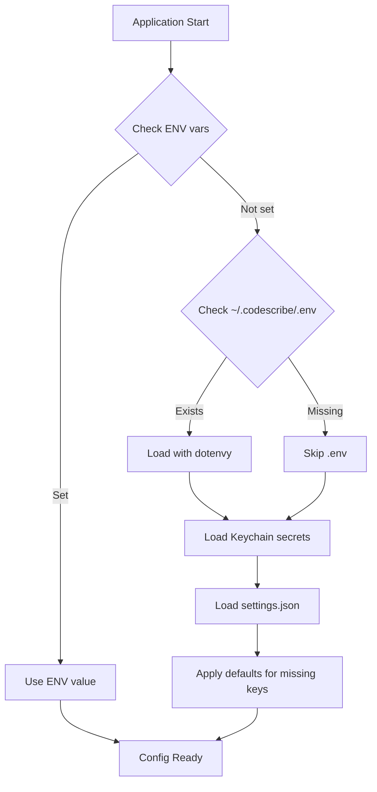
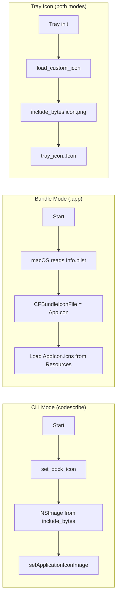

# Codescribe Installation and Launch Guide

This document describes the installation methods, configuration paths, and how the application locates its resources.

> **Published/source split:** GitHub currently publishes `v0.13.3` as Latest.
> The repository version is `0.14.1`, but a source version is not a public
> release until the signed/notarized/stapled DMG, tag, appcast, and GitHub
> Release have been cut and verified.

## Installation Methods

### Method 1: App Bundle From Source (Recommended for Development)

```bash
# Build an optimized local SwiftUI app bundle
make app PROFILE=local-release

# Build and copy to /Applications/Codescribe.app
make install-app
```

**Result**: App bundle installed at `/Applications/Codescribe.app`, with model/cache checks handled by `scripts/build-app.sh`.

**How it runs**: Launch from Finder, Spotlight, or `make start`.

### Method 2: Qube CLI Tools (Batch Quality Work)

```bash
make release-qube
make install
```

**Result**: `qube-report` and `qube-daemon` installed from `bin/qube_report.rs` and `bin/qube_daemon.rs`.

**How it runs**: Terminal-only quality/reporting utilities, not the user-facing app.

`make install-app` now prefers a stable local signing identity automatically:

- `Apple Development: ...` if present
- otherwise `Developer ID Application: ...`
- only falls back to `adhoc` when no usable signing identity exists

This matters because macOS TCC permissions are far more stable with a persistent code-signing identity than with ad-hoc signatures.

`make install-app` bakes the org public keys so Get license CSK1
verifies. The key files live in the local developer key pack (see
`scripts/developer-surface-gate.sh`). Production DMGs still use the
`release` profile and fail closed without the production signer public
key. A UUID is not a license public key.

`make install-app` builds the local-release app and copies it to
`/Applications`. Extra developer-console pieces are resolved from a
private sibling checkout when present; they are not part of the public
source path. A machine that already has `settings.json` keeps it.
Production DMGs do not bake the developer surface.

### Method 3: DMG Distribution (For End Users)

```bash
make release-standard # One-shot slim: sign + notarize + staple + verify-dmg

# Optional variants / lower-level debugging targets:
make release-full     # Fat build with embedded Whisper
make release-dmgs     # Standard + full
make dmg-signed       # Signed DMG only; not yet a release artifact
make notarize         # Notarize an existing signed DMG
```

**Result**: standard `Codescribe_X.Y.Z-….dmg` (slim: Silero embedded,
MiniLM signed as a runtime resource, Whisper via Settings download/cache) and
optional `…_full.dmg` (embeds Whisper too). `make release-standard` is the
canonical distribution cut. `make release-stable` adds installation of that
same stapled Release `.app` into `/Applications`; it does not publish a tag or
GitHub Release. Do not chain `VAR=x make release && make dmg-signed` — make
variables do not survive the `&&`.

Before calling any DMG production-ready, record four independent facts:

1. Developer ID signature verification passed.
2. Apple notarization was accepted.
3. The ticket was stapled and validates offline.
4. `verify-dmg` accepted the payload for the declared slim/full variant.

An ad-hoc or local-development install can be useful for daily testing, but it
does not satisfy those distribution facts.

### About panel commit stamp

`CSBuildCommit` / `CSBuiltAt` are stamped in `scripts/build-app.sh` **before**
cargo / UniFFI / xcodegen run.

- Commit short SHA comes from `git rev-parse --short=9 HEAD`.
- `-dirty` is appended only when **tracked** source differs from HEAD,
  excluding UniFFI-generated `macos/Codescribe/Bridge/*`.
- Untracked local files (e.g. `*.dmg.sha256`, scratch) do **not** force `-dirty`.

A clean committed checkout must show e.g. `c5a3c290b`, never
`c5a3c290b-dirty`, just because a previous build regenerated bindings.

### Speech Recognition (required for Apple live)

See [SPEECH_RECOGNITION_TCC.md](./SPEECH_RECOGNITION_TCC.md). First-run wizard
includes a Speech Recognition step with the same grant path as Microphone
(Allow dialog while undetermined; System Settings when already decided).

## Configuration

### Config Directory

Configuration is **tiered**:

```
~/Library/Application Support/Codescribe/
├── settings.json     # GUI-managed settings (regular-user tier)
└── ...               # app data

~/.codescribe/
├── .env              # Power-user overrides (optional)
├── prompts/          # Custom AI prompts
│   ├── formatting.txt
│   └── assistive.txt
├── history/          # Transcription history
├── reports/          # Quality reports
```

**Secrets** (API keys) are stored in **macOS Keychain** under service `com.vetcoders.codescribe`.

Settings UI is the regular-user authority, Keychain is secret authority, and
`.env` is an optional power-user override. When diagnostics disagree, inspect
all three explicitly; file presence alone does not prove the running process
loaded that value.

### Environment Variables (.env)

The application loads configuration with these priorities:

1. **Environment variables** (highest priority)
2. **~/.codescribe/.env** (power-user overrides)
3. **settings.json** (GUI-managed defaults)
4. **Built-in defaults** (fallback)


```mermaid
flowchart TD
    A[Application Start] --> B{Check ENV vars}
    B -->|Set| C[Use ENV value]
    B -->|Not set| D{Check ~/.codescribe/.env}
    D -->|Exists| E[Load with dotenvy]
    D -->|Missing| F[Skip .env]
    E --> KC[Load Keychain secrets]
    F --> KC
    KC --> S[Load settings.json]
    S --> K[Apply defaults for missing keys]
    C --> L[Config Ready]
    K --> L
```

### Key Configuration Variables

```env
# Speech-to-Text
WHISPER_LANGUAGE=auto            # auto | pl | en
USE_LOCAL_STT=1                  # 1 = keep local transcript as committed result

# Hotkeys timing / behavior
# Per-mode bindings live in Settings -> Modes & Shortcuts (settings.json)
HOLD_EXCLUSIVE=1
DOUBLE_TAP_INTERVAL_MS=200       # 100–450
TOGGLE_SILENCE_SEC=5.0

# AI Formatting
AI_FORMATTING_ENABLED=1
LLM_ENDPOINT=https://api.openai.com/v1/responses
LLM_MODEL=gpt-4.1
# Store LLM_API_KEY in Settings / macOS Keychain.

# Optional: Mode-specific OpenAI overrides
LLM_FORMATTING_{ENDPOINT,MODEL,API_KEY}=...
LLM_ASSISTIVE_{ENDPOINT,MODEL,API_KEY}=...
```

## Bundle Structure

```
Codescribe.app/
└── Contents/
    ├── Info.plist           # Bundle metadata (icon, identifier, version)
    ├── MacOS/
    │   └── Codescribe       # App executable
    └── Resources/
        ├── AppIcon.icns     # Application icon
        └── agent-bridge/    # Signed, checksumed external-agent payload
            ├── manifest.json
            ├── bin/bus-demux.py
            └── skills/codescribe/  # Complete skill + references + examples
```

## External Agent Bridge

The existing 13-step Setup Wizard exposes the bridge inside **Agentic
Readiness**. It does not write to the home directory merely because the step is
shown. The operator must explicitly select Codex, Claude Code, or both and click
Install/Reinstall.

The installed runtime is stable across checkout moves and deletions:

```text
~/.codescribe/agent-bridge/
├── receipt.json
├── runtime/
│   ├── manifest.json
│   ├── bin/bus-demux.py
│   └── skills/codescribe/
└── leases/
```

Selected client skills live at `~/.codex/skills/codescribe/` and/or
`~/.claude/skills/codescribe/`. `receipt.json` records the bundle version,
selected clients, installed paths, payload hashes, and one ownership id. Each
managed client folder carries a matching `.codescribe-managed.json`. Updates
use staged directory renames and an atomic receipt write. Existing unowned
folders are visible conflicts and are never overwritten; deselection removes
only a folder whose marker still matches the receipt.

Polish dictation selection shows the bridge explanation in Polish. All other
language selections use English fallback. Setup can be skipped and reopened
later from the existing **Setup Wizard…** tray action.

### Info.plist Keys

| Key                          | Value                    | Purpose                      |
| ---------------------------- | ------------------------ | ---------------------------- |
| CFBundleIdentifier           | com.vetcoders.codescribe | Unique app identifier        |
| CFBundleIconFile             | AppIcon                  | Points to AppIcon.icns       |
| CFBundleExecutable           | Codescribe               | Main binary name             |
| LSMinimumSystemVersion       | 14.0                     | Requires macOS Sonoma+       |
| NSMicrophoneUsageDescription | ...                      | Microphone permission prompt |

## Icons

### Tray Icon

- **Source**: `assets/icon.png` (embedded via `include_bytes!`)
- **Location in code**: `src/tray/icons.rs`
- **Size**: 44x44 pixels (Retina), 22x22 logical

### Dock Icon

- **For CLI**: Programmatically set via `set_dock_icon()` in `src/ui.rs`
- **For Bundle**: Uses `CFBundleIconFile` from Info.plist pointing to `AppIcon.icns`
- **Source**: `assets/AppIcon.icns`

### Icon Loading Flow


```mermaid
flowchart LR
    subgraph CLI["CLI Mode (codescribe)"]
        A1[Start] --> A2[set_dock_icon]
        A2 --> A3[NSImage from include_bytes]
        A3 --> A4[setApplicationIconImage]
    end

    subgraph Bundle["Bundle Mode (.app)"]
        B1[Start] --> B2[macOS reads Info.plist]
        B2 --> B3[CFBundleIconFile = AppIcon]
        B3 --> B4[Load AppIcon.icns from Resources]
    end

    subgraph Tray["Tray Icon (both modes)"]
        C1[Tray init] --> C2[load_custom_icon]
        C2 --> C3[include_bytes icon.png]
        C3 --> C4[tray_icon::Icon]
    end
```

## Permissions Required

Grant in **System Settings > Privacy & Security**:

| Permission       | Purpose                | When Prompted           |
| ---------------- | ---------------------- | ----------------------- |
| Microphone       | Audio recording        | First recording attempt |
| Accessibility    | Global hotkeys, paste  | First hotkey press      |
| Input Monitoring | Keyboard event capture | First hotkey press      |

## Troubleshooting

### Empty Dock Icon

- **CLI mode**: `set_dock_icon()` should set it programmatically
- **Bundle mode**: Check that `Info.plist` exists and has `CFBundleIconFile`
- **Verify**: `plutil -lint /Applications/Codescribe.app/Contents/Info.plist`

### Empty Tray Icon

- Check that `assets/icon.png` exists and is valid PNG
- Rebuild with `make app PROFILE=local-release`

### Config Not Loading

- Check `~/.codescribe/.env` exists
- Verify syntax: `cat ~/.codescribe/.env`
- Check logs: `make logs`

### Hotkeys Not Working

- Grant Accessibility permission
- Grant Input Monitoring permission
- Restart the application after granting

---

_Created by Vetcoders (c)2026_
