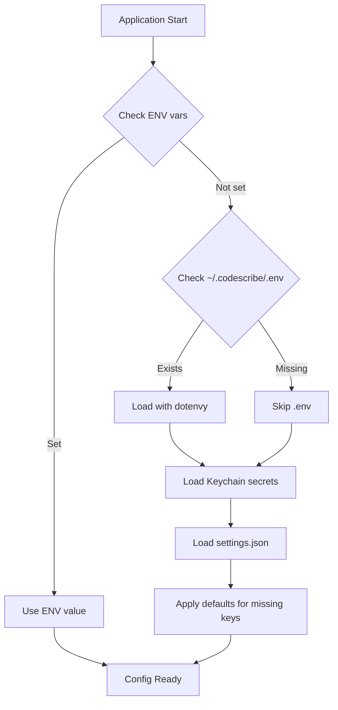
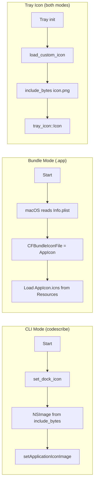

# Codescribe Installation and Launch Guide

This document describes the installation methods, configuration paths, and how the application locates its resources.

> **Published/source split:** GitHub currently publishes `v0.13.3` as Latest.
> The repository version is `0.14.1`, but a source version is not a public
> release until the signed/notarized/stapled DMG, tag, appcast, and GitHub
> Release have been cut and verified.

## Installation Methods

### Method 1: App Bundle From Source (Recommended for Development)

```bash
# Build an optimized local SwiftUI app bundle
make app PROFILE=local-release

# Build and copy to /Applications/Codescribe.app
make install-app
```

**Result**: App bundle installed at `/Applications/Codescribe.app`, with model/cache checks handled by `scripts/build-app.sh`.

**How it runs**: Launch the app bundle through LaunchServices using Finder,
Spotlight, or `make start`. For a specific build or per-launch environment,
use the explicit bundle commands below.

### Method 2: Qube CLI Tools (Batch Quality Work)

```bash
make release-qube
make install
```

**Result**: the `codescribe` CLI is installed; `codescribe report` and `codescribe daemon` are the authoritative spellings of the quality tools. The standalone `qube-report` and `qube-daemon` binaries run the same functions and are slated for removal under the one-throne rule.

**How it runs**: Terminal-only quality/reporting utilities, not the user-facing app.

`make install-app` now prefers a stable local signing identity automatically:

- `Apple Development: ...` if present
- otherwise `Developer ID Application: ...`
- only falls back to `adhoc` when no usable signing identity exists

This matters because macOS TCC permissions are far more stable with a persistent code-signing identity than with ad-hoc signatures.

`make install-app` bakes the org public keys so Get license CSK1
verifies. The key files live in the local developer key pack (see
`scripts/developer-surface-gate.sh`). Production DMGs still use the
`release` profile and fail closed without the production signer public
key. A UUID is not a license public key.

`make install-app` builds the local-release app and copies it to
`/Applications`. Extra developer-console pieces are resolved from a
private sibling checkout when present; they are not part of the public
source path. A machine that already has `settings.json` keeps it.
Production DMGs do not bake the developer surface.

The single-instance flag (`LSMultipleInstancesProhibited`) is stamped at install time — by `make install-app` (and so `make install-if-idle`) and every DMG lane, before codesign — never in `macos/project.yml`, so the XCTest host and dev builds still launch while the installed app runs.

### Supported native launch context

From the repository root, launch the intended bundle through LaunchServices:

```bash
# Installed app
/usr/bin/open "/Applications/Codescribe.app"

# Already-built Debug app (separate dev identity)
/usr/bin/open "$PWD/macos/build/Build/Products/Debug/Codescribe.app"
```

Direct execution of `Codescribe.app/Contents/MacOS/Codescribe` from a shell or
agent host is **unsupported** for native app startup and speech acceptance.
The launching host can remain responsible for the privacy request even when
the bundle has the required usage description. See
[Speech Recognition TCC](./SPEECH_RECOGNITION_TCC.md#supported-native-launch-context)
for attribution, the dated #93 observation and acceptance evidence.

For a disposable manual dev/test profile, pass variables with `open --env`.
Use this only when the intended Debug app is not already running:

```bash
codescribe_test_data="$(mktemp -d /private/tmp/codescribe-launch.XXXXXX)" || exit 1
/usr/bin/open "$PWD/macos/build/Build/Products/Debug/Codescribe.app" \
  --env "CODESCRIBE_DATA_DIR=$codescribe_test_data" \
  --env "RUST_LOG=info"
```

Shell exports alone are not a reliable way to supply a LaunchServices app's
environment. `--env` applies to a newly launched process; opening an already
running app activates it without replacing its environment. Do not use `-n`
to bypass instance ownership or quit/restart the Founder's installed app for
this test. Verify the actual PID/path and loaded data directory before using
the disposable profile. The data directory does not isolate TCC grants,
Keychain services or every application resource; Debug and Release permission
identities are described below. Retain the profile for evidence as needed.

### Agent launch and test-host identity

`macos/project.yml` assigns Debug (including the XCTest host) the bundle ID
`com.vetcoders.codescribe.dev`; Release keeps `com.vetcoders.codescribe`.
Debug has its own LaunchServices registration, standard `UserDefaults` domain,
and TCC grants (Microphone, Speech Recognition, Accessibility and Input
Monitoring). Grant permissions separately when manually using a Debug app;
the XCTest host skips application runtime startup. No permission migration is
needed for the installed Release app.

There are no App Group or Keychain access-group entitlements, sandbox containers,
registered URL schemes, or bundle-ID-based LaunchAgents in this app target.
The explicit Keychain service names (`com.vetcoders.codescribe` for core secrets,
`com.vetcoders.codescribe.license` for licenses) remain shared; existing item
access controls still apply and may prompt for a manually launched Debug build.
Settings and Setup acquire provider and license credentials in the background.
A manually launched Debug build can still wait for item authorization; pending
and retry UI must stay interactive during that wait. This scheduling does not
bypass Keychain protection. Native acceptance must exercise the real signed
application with actual Keychain access; a harness that disables Keychain cannot
prove responsiveness or authorization behavior. Check cold access, denied access,
focus changes during a pending call, and save/remove completion without changing
existing item ACLs or services as part of that check. Also keep a real store
write/import paused while opening Settings, account metadata and the palette:
passive reads must not inherit a wait through config/settings transaction locks.
Check an edited STT endpoint against an older delayed snapshot and confirm that
one malformed account leaves its Sign out and other credential controls usable.
Include capability matrix connector health while a credential write is paused.
For an installation with only `.env`, save an ordinary setting before provider
access, then acquire credentials: imported settings, the user's edit and pending
imports must survive. Repeat with concurrent initial acquisition and first write.
Before the first write, the passive snapshot must show imported promoted choices
without creating the settings document. After the first production bootstrap,
new credentials must resolve from cache without another process-env seed.
Exercise this ordering with the core using its production bootstrap lifetime;
the unit harness intentionally keeps its per-case env permission open. Repair fixtures
must call an admitted startup writer before requiring repair actions or backups.

Filesystem configuration is also shared by ordinary app launches; the test
runner supplies an isolated data directory. A distinct bundle ID does not
isolate every application resource.

Agents must verify the running executable belongs to `/Applications` before
activating it. Never quit or restart the Founder's app for this check. The
following receipt refuses when the installed app is absent at preflight and
verifies the original PID/path after activation:

```bash
(
  installed_pid="$(swift - <<'SWIFT'
import AppKit
let expected = "/Applications/Codescribe.app/Contents/MacOS/Codescribe"
let matches = NSRunningApplication.runningApplications(
  withBundleIdentifier: "com.vetcoders.codescribe"
).filter { !$0.isTerminated && $0.executableURL?.path == expected }
guard matches.count == 1 else {
  fputs("Expected one running installed Codescribe; refusing activation.\n", stderr)
  exit(1)
}
print(matches[0].processIdentifier)
SWIFT
  )" || exit 1
  open /Applications/Codescribe.app || exit 1
  executable="$(ps -p "$installed_pid" -o comm=)" || exit 1
  test "$executable" = /Applications/Codescribe.app/Contents/MacOS/Codescribe || exit 1
  printf 'Installed PID: %s; executable: %s\n' "$installed_pid" "$executable"
)
```

For the collision regression, leave the installed app running, run
`make app-bindings && make test-swift`, and repeat this receipt while the Debug
host is alive. Also exercise `open -a /Applications/Codescribe.app` and confirm
the same installed PID/path survives. Record both process paths and the host's
`CFBundleIdentifier`; a successful `open` exit alone is not evidence. Never
quit, restart, or reinstall the Founder's running app for this check.

### Method 3: DMG Distribution (For End Users)

```bash
make release-standard # One-shot slim: sign + notarize + staple + verify-dmg

# Optional variants / lower-level debugging targets:
make release-full     # Fat build with embedded Whisper
make release-dmgs     # Standard + full
make dmg-signed       # Signed DMG only; not yet a release artifact
make notarize         # Notarize an existing signed DMG
```

**Result**: standard `Codescribe_X.Y.Z-….dmg` (slim: Silero embedded,
MiniLM signed as a runtime resource, Whisper via Settings download/cache) and
optional `…_full.dmg` (embeds Whisper too). `make release-standard` is the
canonical distribution cut. `make release-stable` adds installation of that
same stapled Release `.app` into `/Applications`; it does not publish a tag or
GitHub Release. Do not chain `VAR=x make release && make dmg-signed` — make
variables do not survive the `&&`.

Before calling any DMG production-ready, record four independent facts:

1. Developer ID signature verification passed.
2. Apple notarization was accepted.
3. The ticket was stapled and validates offline.
4. `verify-dmg` accepted the payload for the declared slim/full variant.

An ad-hoc or local-development install can be useful for daily testing, but it
does not satisfy those distribution facts.

### About panel commit stamp

`CSBuildCommit` / `CSBuiltAt` are stamped in `scripts/build-app.sh` **before**
cargo / UniFFI / xcodegen run.

- Commit short SHA comes from `git rev-parse --short=9 HEAD`.
- `-dirty` is appended only when **tracked** source differs from HEAD,
  excluding UniFFI-generated `macos/Codescribe/Bridge/*`.
- Untracked local files (e.g. `*.dmg.sha256`, scratch) do **not** force `-dirty`.

A clean committed checkout must show e.g. `c5a3c290b`, never
`c5a3c290b-dirty`, just because a previous build regenerated bindings.

### Speech Recognition (required for Apple live)

See [SPEECH_RECOGNITION_TCC.md](./SPEECH_RECOGNITION_TCC.md). First-run wizard
includes a Speech Recognition step with the same grant path as Microphone
(Allow dialog while undetermined; System Settings when already decided).

## Configuration

### Config Directory

Configuration is **tiered**:

```
~/Library/Application Support/Codescribe/
├── settings.json     # GUI-managed settings (regular-user tier)
└── ...               # app data

~/.codescribe/
├── .env              # Power-user overrides (optional)
├── prompts/          # Custom AI prompts
│   ├── formatting.txt
│   └── assistive.txt
├── history/          # Transcription history
├── reports/          # Quality reports
```

**Secrets** (API keys) are stored in **macOS Keychain** under service `com.vetcoders.codescribe`.

Settings UI is the regular-user authority, Keychain is secret authority, and
`.env` is an optional power-user override. When diagnostics disagree, inspect
all three explicitly; file presence alone does not prove the running process
loaded that value.

### Environment Variables (.env)

The application loads configuration with these priorities:

1. **Environment variables** (highest priority)
2. **~/.codescribe/.env** (power-user overrides)
3. **settings.json** (GUI-managed defaults)
4. **Built-in defaults** (fallback)


```mermaid
flowchart TD
    A[Application Start] --> B{Check ENV vars}
    B -->|Set| C[Use ENV value]
    B -->|Not set| D{Check ~/.codescribe/.env}
    D -->|Exists| E[Load with dotenvy]
    D -->|Missing| F[Skip .env]
    E --> KC[Load Keychain secrets]
    F --> KC
    KC --> S[Load settings.json]
    S --> K[Apply defaults for missing keys]
    C --> L[Config Ready]
    K --> L
```

### Key Configuration Variables

```env
# Speech-to-Text
WHISPER_LANGUAGE=auto            # auto | pl | en
USE_LOCAL_STT=1                  # 1 = keep local transcript as committed result

# Hotkeys timing / behavior
# Per-mode bindings live in Settings -> Modes & Shortcuts (settings.json)
HOLD_EXCLUSIVE=1
DOUBLE_TAP_INTERVAL_MS=200       # 100–450
TOGGLE_SILENCE_SEC=5.0

# AI Formatting
AI_FORMATTING_ENABLED=1
LLM_ENDPOINT=https://api.openai.com/v1/responses
LLM_MODEL=gpt-4.1
# Store LLM_API_KEY in Settings / macOS Keychain.

# Optional: Mode-specific OpenAI overrides
LLM_FORMATTING_{ENDPOINT,MODEL,API_KEY}=...
LLM_ASSISTIVE_{ENDPOINT,MODEL,API_KEY}=...
```

## Bundle Structure

```
Codescribe.app/
└── Contents/
    ├── Info.plist           # Bundle metadata (icon, identifier, version)
    ├── MacOS/
    │   └── Codescribe       # App executable
    └── Resources/
        ├── AppIcon.icns     # Application icon
        └── agent-bridge/    # Signed, checksumed external-agent payload
            ├── manifest.json
            ├── bin/bus-demux.py
            └── skills/codescribe/  # Complete skill + references + examples
```

## External Agent Bridge

The existing 13-step Setup Wizard exposes the bridge inside **Agentic
Readiness**. It does not write to the home directory merely because the step is
shown. The operator must explicitly select Codex, Claude Code, or both and click
Install/Reinstall.

The installed runtime is stable across checkout moves and deletions:

```text
~/.codescribe/agent-bridge/
├── receipt.json
├── runtime/
│   ├── manifest.json
│   ├── bin/bus-demux.py
│   └── skills/codescribe/
└── leases/
```

Selected client skills live at `~/.codex/skills/codescribe/` and/or
`~/.claude/skills/codescribe/`. `receipt.json` records the bundle version,
selected clients, installed paths, payload hashes, and one ownership id. Each
managed client folder carries a matching `.codescribe-managed.json`. Updates
use staged directory renames and an atomic receipt write. Existing unowned
folders are visible conflicts and are never overwritten; deselection removes
only a folder whose marker still matches the receipt.

Polish dictation selection shows the bridge explanation in Polish. All other
language selections use English fallback. Setup can be skipped and reopened
later from the existing **Setup Wizard…** tray action.

### Info.plist Keys

| Key                                 | Value                    | Purpose                              |
| ----------------------------------- | ------------------------ | ------------------------------------ |
| CFBundleIdentifier                  | com.vetcoders.codescribe | Unique app identifier                |
| CFBundleIconFile                    | AppIcon                  | Points to AppIcon.icns               |
| CFBundleExecutable                  | Codescribe               | Main binary name                     |
| LSMinimumSystemVersion              | 14.0                     | Requires macOS Sonoma+               |
| NSMicrophoneUsageDescription        | ...                      | Microphone permission prompt         |
| NSSpeechRecognitionUsageDescription | ...                      | Speech Recognition permission prompt |

## Icons

### Tray Icon

- **Source**: `assets/icon.png` (embedded via `include_bytes!`)
- **Location in code**: `src/tray/icons.rs`
- **Size**: 44x44 pixels (Retina), 22x22 logical

### Dock Icon

- **For CLI**: Programmatically set via `set_dock_icon()` in `src/ui.rs`
- **For Bundle**: Uses `CFBundleIconFile` from Info.plist pointing to `AppIcon.icns`
- **Source**: `assets/AppIcon.icns`

### Icon Loading Flow


```mermaid
flowchart LR
    subgraph CLI["CLI Mode (codescribe)"]
        A1[Start] --> A2[set_dock_icon]
        A2 --> A3[NSImage from include_bytes]
        A3 --> A4[setApplicationIconImage]
    end

    subgraph Bundle["Bundle Mode (.app)"]
        B1[Start] --> B2[macOS reads Info.plist]
        B2 --> B3[CFBundleIconFile = AppIcon]
        B3 --> B4[Load AppIcon.icns from Resources]
    end

    subgraph Tray["Tray Icon (both modes)"]
        C1[Tray init] --> C2[load_custom_icon]
        C2 --> C3[include_bytes icon.png]
        C3 --> C4[tray_icon::Icon]
    end
```

## Permissions Required

Grant in **System Settings > Privacy & Security**:

| Permission         | Purpose                 | When Prompted                         |
| ------------------ | ----------------------- | ------------------------------------- |
| Microphone         | Audio recording         | First recording attempt               |
| Speech Recognition | SFSpeechRecognizer path | Setup / app launch while undetermined |
| Accessibility      | Global hotkeys, paste   | First hotkey press                    |
| Input Monitoring   | Keyboard event capture  | First hotkey press                    |

## Troubleshooting

### Empty Dock Icon

- **CLI mode**: `set_dock_icon()` should set it programmatically
- **Bundle mode**: Check that `Info.plist` exists and has `CFBundleIconFile`
- **Verify**: `plutil -lint /Applications/Codescribe.app/Contents/Info.plist`

### Empty Tray Icon

- Check that `assets/icon.png` exists and is valid PNG
- Rebuild with `make app PROFILE=local-release`

### Config Not Loading

- Check `~/.codescribe/.env` exists
- Verify syntax: `cat ~/.codescribe/.env`
- Check logs: `make logs`

### Hotkeys Not Working

- Grant Accessibility permission
- Grant Input Monitoring permission
- Restart the application after granting

---

_Created by Vetcoders (c)2026_
