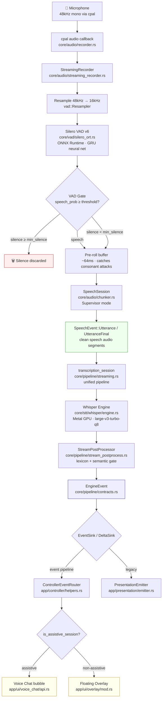

# Streaming Pipeline: Microphone → Overlay

> Complete data flow documentation for CodeScribe's real-time speech-to-text pipeline.
>
> Created by M&K (c)2026 VetCoders

## Pipeline Overview



---

## Stage 1: Audio Capture

| Component             | File                               | Details                               |
| --------------------- | ---------------------------------- | ------------------------------------- |
| **cpal**              | `core/audio/recorder.rs`           | macOS CoreAudio, typically 48kHz mono |
| **Recorder**          | `core/audio/recorder.rs`           | Manages cpal stream lifecycle         |
| **StreamingRecorder** | `core/audio/streaming_recorder.rs` | Orchestrates VAD + Whisper pipeline   |

The microphone delivers raw PCM f32 samples at the device's native sample rate (usually 48kHz on macOS).
`StreamingRecorder` owns the full pipeline from audio callback to delta delivery.

---

## Stage 2: VAD Gate (Voice Activity Detection)

| Component         | File                     | Details                               |
| ----------------- | ------------------------ | ------------------------------------- |
| **Resampler**     | `core/vad/silero_ort.rs` | Linear interpolation 48kHz → 16kHz    |
| **SileroVad**     | `core/vad/silero_ort.rs` | ONNX Runtime, GRU neural network      |
| **SpeechSession** | `core/audio/chunker.rs`  | State machine for speech segmentation |

### How it works

1. Raw audio is resampled to **16kHz** (Silero's native rate).
2. Resampled audio is fed in **512-sample frames** (32ms) to Silero VAD v6.
3. Each frame produces a **speech probability** (0.0–1.0).
4. The VAD gate makes a decision per frame:

```
speech_prob ≥ threshold (0.5)     → accumulate as speech
speech_prob < neg_threshold (0.35) → start silence counter
silence_counter ≥ min_silence      → END segment, discard silence
silence_counter < min_silence      → keep buffering (might be mid-sentence pause)
```

### Key parameters (hardcoded)

| Parameter                | Value     | Source                  |
| ------------------------ | --------- | ----------------------- |
| `threshold`              | 0.5       | Silero default profile  |
| `min_speech_duration`    | 0.064s    | Silero Rust example     |
| `min_silence_duration`   | 0.0s      | Silero Rust example     |
| `max_utterance_duration` | ∞         | Silero Rust example     |
| `speech_pad / pre_roll`  | 0.064s    | Silero Rust example     |

### Pre-roll buffer

A 64ms circular buffer (~1024 samples at 16kHz) captures audio **before** speech onset. This catches the attack transients of plosive consonants (k, t, p, b) that would otherwise be clipped. When speech begins, the pre-roll is prepended to the speech segment.

### Three gate modes

| Mode         | Description                                             | Output sample rate |
| ------------ | ------------------------------------------------------- | ------------------ |
| `Simple`     | Basic threshold + silence counter                       | 16kHz (VAD rate)   |
| `Iter`       | State machine with min_speech/min_silence/max_utterance | 16kHz (VAD rate)   |
| `Supervisor` | Same as Iter but preserves raw sample rate              | Original (48kHz)   |

### Two Silero instances

The application runs **two independent Silero VAD paths**:

1. **Inline in SpeechSession** (`SileroVad` struct) — synchronous, called directly in the audio processing loop. This is the gate that filters audio before Whisper. Zero latency, blocking.

2. **Singleton worker** (`vad::speech_probability()`) — async fire-and-forget via bounded channel (capacity=4). Used by the auto-stop monitor in `main.rs` to detect when the user stops speaking during toggle recording. Returns last computed probability (eventual consistency).

### Flush fallback

When recording stops but VAD never fired `Start` (e.g. speech was too quiet or short for the threshold), `SpeechSession::flush()` checks `max_speech_prob`. If it exceeds `FALLBACK_PROB` (0.25) and at least 0.5s of audio is available, the raw buffer is emitted as a degraded fallback. The engine reports this as `EngineEvent::VadFallback`.

---

## Stage 3: Whisper Transcription

| Component                 | File                                  | Details                           |
| ------------------------- | ------------------------------------- | --------------------------------- |
| **WhisperEngine**         | `core/stt/whisper/engine.rs`          | Candle + Metal GPU, singleton     |
| **transcription_session** | `core/pipeline/streaming.rs`          | Unified pipeline (event-based)    |
| **StreamPostProcessor**   | `core/pipeline/stream_postprocess.rs` | Lexicon + semantic gate + cleanup |

### Streaming transcription

Speech segments from the VAD gate arrive as `SpeechEvent::Utterance` (interim) or `SpeechEvent::UtteranceFinal` (boundary). The unified `transcription_session` function:

1. Receives utterance audio from `SpeechSession`.
2. Transcribes with Whisper (Metal GPU acceleration).
3. Post-processes via `StreamPostProcessor` (lexicon correction, hallucination filter, semantic gate).
4. Emits `EngineEvent::Preview` with accumulated text for the current utterance.
5. Optionally runs Phase 2 correction (re-transcription of accumulated audio for better accuracy).

### Anti-repetition

Whisper uses `no_repeat_ngram_size = 5` to suppress the model's tendency to repeat phrases (a known Whisper artifact, especially with Polish).

---

## Stage 4: Engine Events (Intent, not Presentation)

| Component            | File                         | Details                      |
| -------------------- | ---------------------------- | ---------------------------- |
| **EngineEvent**      | `core/pipeline/contracts.rs` | Semantic event enum          |
| **EventSink**        | `core/pipeline/contracts.rs` | Trait for event consumers    |
| **DeltaSinkAdapter** | `core/pipeline/sinks.rs`     | EventSink → DeltaSink bridge |
| **TranscriptDelta**  | `core/pipeline/contracts.rs` | Backspace-encoded delta      |

### Event types

The engine emits **semantic events** — it communicates what happened, not how to display it:

| Event            | Meaning                                                     |
| ---------------- | ----------------------------------------------------------- |
| `VadStart`       | VAD detected speech start (with `speech_prob` and `ts_ms`)  |
| `VadEnd`         | VAD detected speech end                                     |
| `VadFallback`    | Flush path used (VAD never fired Start but speech detected) |
| `Preview`        | Latest transcription of current utterance (full text)       |
| `Correction`     | Re-transcription improved previous output                   |
| `UtteranceFinal` | Complete utterance — VAD-bounded or flush                   |
| `Drop`           | Content dropped (hallucination, semantic gate)              |
| `Stats`          | Session-level statistics (emitted on stop/flush)            |
| `Warning`        | Recoverable error — engine continues                        |

### Preview semantics (contract)

- `Preview.text` is **utterance-local**: full post-processed text for the current utterance only.
- On each Whisper decode, `text` replaces the previous Preview (not appended). `rev` increments.
- After `UtteranceFinal`, the engine resets internal state — next Preview starts fresh.
- **Sinks must track `last_preview`** and compute diffs themselves (e.g. `TranscriptDelta::from_diff`).
- On `UtteranceFinal`, sinks must reset their diff state.

### Delta generation (backspace magic)

When Whisper processes overlapping audio chunks, later chunks may **correct** earlier transcription. The `TranscriptDelta::from_diff` function generates a minimal delta:

```
Previous: "Kubernetes wymaga konfiguracji po zgrze"
Current:  "Kubernetes wymaga konfiguracji PostgreSQL"

Delta: "\u{0008}\u{0008}\u{0008}\u{0008}\u{0008}\u{0008}\u{0008}\u{0008}PostgreSQL"
       ^^^^^^^^^^^^^^^^^^^^^^^^^^^^^^^^^^^^^^^^^^^^^^^^^^^^^^^^^^^^^^^^
       8 backspaces to erase "po zgrze" + new text "PostgreSQL"
```

The `\u{0008}` character is ASCII backspace. The UI applies it character-by-character via `TranscriptDelta::apply()`.

---

## Stage 5: UI Routing

| Component                     | File                          | Details                              |
| ----------------------------- | ----------------------------- | ------------------------------------ |
| **ControllerEventRouter**     | `app/controller/helpers.rs`   | Event pipeline: routes by mode       |
| **PresentationEmitter**       | `app/presentation/emitter.rs` | Typing animation via BufferedEmitter |
| **route_transcription_delta** | `app/controller/helpers.rs`   | Legacy: routes delta by mode         |

### Runtime pipeline path

App runtime uses a single path:

- `start_event_session` → `transcription_session` (event pipeline only).
- Preview → computes delta via `TranscriptDelta::from_diff` → `append_*_delta`.
- Correction → delta diff (keeps `is_streaming = true`).
- UtteranceFinal → utterance callback → AI pipeline (skips user bubble re-write).

Legacy worker path is kept only as deprecated compatibility/diagnostic code and is not used by app runtime.

### Session modes

The controller checks `is_assistive_session()`:

- **Assistive** (Fn+Shift hold / toggle-assistive): deltas go to voice chat user bubble.
- **Non-assistive** (Fn hold / toggle): deltas go to floating overlay.

**Toggle nuance:** In toggle mode, each VAD silence boundary produces an `UtteranceFinal`. The utterance callback processes each utterance independently (AI formatting, clipboard). In the event pipeline, Preview streams into the user bubble, and the commit path finalizes without re-writing (`skip_user_bubble`). Recording continues until double-tap Option.

---

## Stage 6: Overlay Display

### Non-assistive mode (dictation)

Delta arrives at the **Floating Overlay**:

- `TranscriptDelta::from_raw(delta).apply(&mut state.accumulated_text)` (`app/ui/overlay/mod.rs`)
- Updates the always-on-top transparent overlay window.
- Auto-resizes to fit text content.
- Auto-hides after 5 seconds of inactivity (with hover guard).

### Assistive mode (AI chat)

Delta arrives at the **Agent Tab**:

- `TranscriptDelta::from_raw(delta).apply(&mut msg.text)` (`app/ui/voice_chat/api.rs`)
- Updates the streaming user message bubble.
- After utterance is complete, the transcribed text is sent to the LLM.
- LLM response streams back via a separate `delta_callback` into assistant message bubbles.

### Thread safety

All UI updates are dispatched to the **main thread** via `Queue::main().exec_async()` (Grand Central Dispatch). The delta callback fires from the pipeline worker thread; the GCD dispatch ensures AppKit operations happen on the main thread.

---

## Complete Timing Breakdown

```
Event                          Latency        Cumulative
─────────────────────────────  ─────────────  ──────────
Microphone capture             ~5ms           ~5ms
Resample 48k→16k              <1ms           ~6ms
Silero VAD (per 32ms frame)   ~2ms           ~8ms
VAD gate decision             <1ms           ~9ms
Whisper chunk accumulation    ~4000ms        ~4009ms
Whisper inference (Metal GPU) ~2000-7000ms   ~6000-11000ms
PostProcess + delta           <1ms           ~6001ms
GCD dispatch to main thread   <1ms           ~6002ms
AppKit text update            <1ms           ~6003ms
─────────────────────────────────────────────────────────
First visible text:           ~6s after speech starts
Corrections (backspace):      ~4s after each new chunk
```

---

## Data Transformations Summary

```
Raw PCM f32 (48kHz)
    │ resample
    ▼
PCM f32 (16kHz)
    │ Silero VAD
    ▼
SpeechEvent (speech segments, silence removed)
    │ transcription_session
    ▼
Whisper inference → raw transcript
    │ StreamPostProcessor (lexicon + semantic gate)
    ▼
EngineEvent::Preview { text } (utterance-local)
    │ EventSink / DeltaSinkAdapter
    ▼
TranscriptDelta (backspace-encoded diff)
    │ apply to UI buffer
    ▼
Displayed text (String, visible in overlay/bubble)
```

---

## Key Source Files

| File                                  | Role                                                       |
| ------------------------------------- | ---------------------------------------------------------- |
| `core/audio/recorder.rs`              | cpal audio capture, device management                      |
| `core/audio/streaming_recorder.rs`    | Pipeline orchestrator, connects recorder to engine         |
| `core/audio/chunker.rs`               | SpeechSession, VAD gate, Supervisor mode, flush fallback   |
| `core/vad/silero_ort.rs`              | Silero VAD v6 (ONNX), worker thread, resampler             |
| `core/stt/whisper/engine.rs`          | Whisper singleton, Metal GPU inference                     |
| `core/pipeline/contracts.rs`          | EngineEvent, EventSink, DeltaSink, TranscriptDelta         |
| `core/pipeline/streaming.rs`          | transcription_session (unified), BufferedEmitter           |
| `core/pipeline/sinks.rs`              | DeltaSinkAdapter, CallbackSink, CollectorEventSink         |
| `core/pipeline/stream_postprocess.rs` | Lexicon correction, semantic gate, hallucination filter    |
| `app/controller/mod.rs`               | Recording state machine, Hold/Toggle orchestration         |
| `app/controller/helpers.rs`           | ControllerEventRouter, session mode routing                |
| `app/presentation/emitter.rs`         | PresentationEmitter (typing animation via BufferedEmitter) |
| `app/ui/overlay/mod.rs`               | Floating overlay window (Cocoa/AppKit)                     |
| `app/ui/voice_chat/api.rs`            | Voice chat panel API (drawer/agent/settings)               |

---

## Test Coverage

| Test file                    | What it validates                                                                                   |
| ---------------------------- | --------------------------------------------------------------------------------------------------- |
| `tests/e2e_vad_flow.rs`      | VAD init, speech detection, resampling, real audio with canonical recordings                        |
| `tests/e2e_vad_auto_stop.rs` | Atomic flag mechanism, cross-thread callbacks, monitor polling                                      |
| `tests/e2e_full_pipeline.rs` | Full pipeline: Whisper × 4 canonical recordings, PostProcessor, Delta backspace, Unicode round-trip |
| `tests/e2e_vad_gate_live.rs` | Live VAD gate integration with real audio files                                                     |

### Canonical test recordings

| File                                    | Duration | Content                             | Difficulty   |
| --------------------------------------- | -------- | ----------------------------------- | ------------ |
| `01_no-to-dobra.wav`                    | ~60s     | Casual Polish speech                | Easy         |
| `02_kubernetes-wymaga-konfiguracji.wav` | ~55s     | Tech + veterinary terms             | Medium       |
| `03_algorytm-ma-zlozonosc.wav`          | ~80s     | Algorithm complexity, medical terms | Medium-Hard  |
| `04_runda-3-czyli.wav`                  | ~72s     | Intentional mispronunciations       | Hard         |
| `VAD_voice_real_pauses.wav`             | ~59s     | Real speech with deliberate pauses  | VAD-specific |

---

_Vibecrafted with AI Agents by VetCoders (c)2026_
