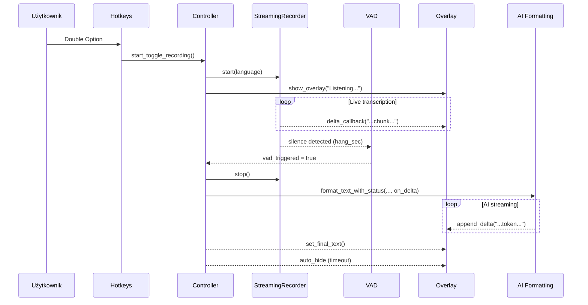

# Overlay + Live Streaming + VAD (Pure Rust)

> **Status:** Implemented (2026-01-19)
>
> Dokument opisuje zintegrowaną implementację: **live transkrypcji**, **streamingu odpowiedzi AI** oraz **VAD (auto‑stop)** w natywnym (Pure Rust) UI overlay.

## Zakres i cel

Celem jest spójny przepływ „hands‑off”, w którym użytkownik:

- widzi **na żywo** tekst własnej wypowiedzi (live transcript),
- widzi **na żywo** stream odpowiedzi AI (SSE delty),
- otrzymuje wynik końcowy bez blokowania audio/ASR/LLM,
- korzysta z natywnego overlay bez Web UI i bez Tauri.

## Główne komponenty (warstwy)

- **Audio + VAD**: `codescribe-core/src/audio/recorder.rs`
  - RMS + próg `silence_db` + histereza `hang_sec`, auto‑stop przez `on_vad_stop`.
- **Live STT (Whisper)**: `codescribe-core/src/audio/streaming_recorder.rs`
  - chunking (~15s) + overlap dedup, `StreamDeltaCallback` dla live transcript.
- **Orkiestracja**: `src/controller.rs`
  - spina VAD, STT, overlay i AI streaming.
- **AI streaming**: `codescribe-core/src/ai_formatting.rs`
  - SSE (Responses API) + `AiStreamCallback`.
- **Overlay UI**: `src/voice_chat_ui.rs`
  - natywne okno Cocoa/AppKit, always‑on‑top, click‑through.

## Przepływ danych (wysoki poziom)

```mermaid
flowchart TD
    %% Monochrome styling
    classDef default fill:#fff,stroke:#333,stroke-width:1px;
    classDef box fill:#f5f5f5,stroke:#666,stroke-width:1px;

    HK[Hotkey: Double Option]:::box --> CTRL[RecordingController]:::box
    CTRL -->|start()| REC[StreamingRecorder]:::box
    REC -->|f32 samples| ASR[Whisper Engine]:::box
    ASR -->|live chunks| POST[Stream Postprocess]:::box
    POST -->|delta callback| UI[Overlay: voice_chat_ui]:::box

    REC -->|silence detected| VAD[VAD watchdog]:::box
    VAD -->|finish_recording()| CTRL

    CTRL -->|raw transcript| LLM[AI Formatting / Assistive]:::box
    LLM -->|SSE deltas| UI
    CTRL -->|final result| PASTE[Paste / Clipboard]:::box
```

## Tryb „hands‑off” – sekwencja zdarzeń



## VAD – stabilny auto‑stop

VAD jest wbudowany w `Recorder` i działa na podstawie RMS (dBFS). Zasada jest prosta:

- Próbki `f32` są liczone w pętli audio.
- Jeśli `rms_db < silence_db`, rośnie licznik ciszy.
- Po przekroczeniu `hang_sec` ustawiany jest stan `is_recording=false`.
- `Recorder` odpala `on_vad_stop` i sygnalizuje auto‑stop.

Kluczowe elementy:

- **Histereza**: `hang_sec` zapobiega natychmiastowym fluktuacjom.
- **Natywna częstotliwość**: VAD działa na realnym `sample_rate` urządzenia.
- **Asynchroniczny watchdog**: task w `main.rs` obserwuje flagę i woła `finish_recording()`.

## Live transcript (Whisper) → Overlay

`StreamingRecorder` wysyła częściowe transkrypcje przez `StreamDeltaCallback`. Callback jest podpinany w `controller.rs` i kieruje tekst do UI:

- `append_voice_chat_delta(...)` – dopisuje kolejne fragmenty do widoku.
- Overlay startuje przed nagrywaniem i pokazuje „Listening…”.
- Tok live nie blokuje audio, bo callback działa poza wątkiem audio.

## Live AI response (SSE) → Overlay

`ai_formatting.rs` obsługuje SSE z Responses API. Dla trybu assistive `format_text_with_status` przyjmuje `AiStreamCallback`, który:

- dopisuje delty na żywo do overlay,
- finalny tekst jest ustawiany przez `set_voice_chat_text(...)`.

W efekcie użytkownik widzi **narastającą odpowiedź AI** w tym samym oknie, w którym wcześniej widział transkrypcję.

## Overlay UI – właściwości techniczne

Implementacja w `src/voice_chat_ui.rs`:

- **Cocoa/AppKit** (NSWindow + NSTextField), brak Web UI.
- **Always-on-top** (`NS_FLOATING_WINDOW_LEVEL`).
- **Click-through** i brak fokusowania – overlay nie przerywa pracy w aktywnej aplikacji.
- **Auto‑hide** po zakończeniu generacji (konfigurowalny timeout).

## Kopiowanie wyniku

Wynik końcowy jest dostępny przez:

- automatyczne wklejenie do aktywnej aplikacji (standardowy flow),
- wpis w tray menu „Copy Last Transcript” (fallback, gdy użytkownik nie chce auto‑paste).

## Odporność i stabilność

- Audio → STT działa przez buforowanie i `try_send`, aby nie blokować audio.
- AI streaming ma timeouts i retry logic (bez wpływu na audio).
- Overlay zawsze może zostać zamknięty przez timeout (nie blokuje pipeline).

## Miejsca w kodzie (mapa)

- VAD: `codescribe-core/src/audio/recorder.rs`
- Live STT: `codescribe-core/src/audio/streaming_recorder.rs`
- Orkiestracja: `src/controller.rs`
- AI streaming: `codescribe-core/src/ai_formatting.rs`
- Overlay: `src/voice_chat_ui.rs`
- Watchdog VAD: `src/main.rs`

## Diagram – pipeline z eventami

```mermaid
flowchart LR
    classDef default fill:#fff,stroke:#333,stroke-width:1px;
    classDef edge fill:#f2f2f2,stroke:#666,stroke-width:1px;

    A[Audio input (cpal)]:::edge --> B[Recorder + VAD]:::edge
    B --> C[StreamingRecorder worker]:::edge
    C --> D[Whisper Engine]:::edge
    D --> E[Delta callback]:::edge
    E --> F[Overlay: append_voice_chat_delta]:::edge

    B --> G[on_vad_stop]:::edge --> H[finish_recording()]:::edge
    H --> I[AI Formatting SSE]:::edge --> J[Overlay: append_delta]:::edge
    H --> K[Paste / Clipboard]:::edge
```

## Uwagi praktyczne

- Overlay jest elementem informacyjnym; interakcja odbywa się przez hotkeys i tray.
- System działa bez Tauri i bez Web UI.
- Wersja release pozostaje zgodna z polityką embedded modelu.
