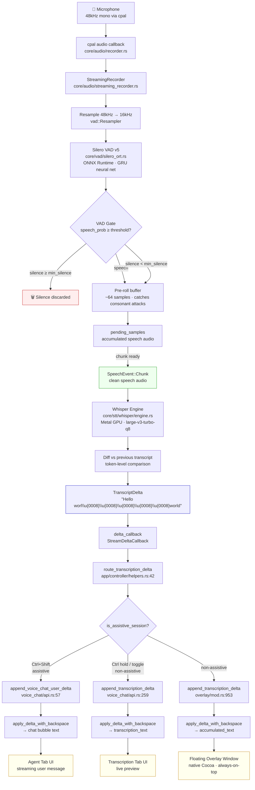

# Streaming Pipeline: Microphone → Overlay

> Complete data flow documentation for CodeScribe's real-time speech-to-text pipeline.
>
> Created by M&K (c)2026 VetCoders

## Pipeline Overview



---

## Stage 1: Audio Capture

| Component             | File                               | Details                               |
| --------------------- | ---------------------------------- | ------------------------------------- |
| **cpal**              | `core/audio/recorder.rs`           | macOS CoreAudio, typically 48kHz mono |
| **Recorder**          | `core/audio/recorder.rs`           | Manages cpal stream lifecycle         |
| **StreamingRecorder** | `core/audio/streaming_recorder.rs` | Orchestrates VAD + Whisper pipeline   |

The microphone delivers raw PCM f32 samples at the device's native sample rate (usually 48kHz on macOS).
`StreamingRecorder` owns the full pipeline from audio callback to delta delivery.

---

## Stage 2: VAD Gate (Voice Activity Detection)

| Component         | File                               | Details                               |
| ----------------- | ---------------------------------- | ------------------------------------- |
| **Resampler**     | `core/vad/silero_ort.rs`           | Linear interpolation 48kHz → 16kHz    |
| **SileroVad**     | `core/vad/silero_ort.rs`           | ONNX Runtime, GRU neural network      |
| **SpeechSession** | `core/audio/streaming_recorder.rs` | State machine for speech segmentation |

### How it works

1. Raw audio is resampled to **16kHz** (Silero's native rate).
2. Resampled audio is fed in **512-sample frames** (32ms) to Silero VAD v5.
3. Each frame produces a **speech probability** (0.0–1.0).
4. The VAD gate makes a decision per frame:

```
speech_prob ≥ threshold (0.5)     → accumulate as speech
speech_prob < neg_threshold (0.35) → start silence counter
silence_counter ≥ min_silence      → END segment, discard silence
silence_counter < min_silence      → keep buffering (might be mid-sentence pause)
```

### Key parameters (env-configurable)

| Env Variable                       | Default | Effect                              |
| ---------------------------------- | ------- | ----------------------------------- |
| `CODESCRIBE_VAD_THRESHOLD`         | 0.5     | Speech probability threshold        |
| `CODESCRIBE_VAD_SILENCE_SEC`       | 1.2     | Seconds of silence before auto-stop |
| `CODESCRIBE_VAD_MIN_SPEECH_SEC`    | 0.25    | Minimum speech duration to emit     |
| `CODESCRIBE_VAD_MAX_UTTERANCE_SEC` | 300     | Maximum utterance length            |
| `CODESCRIBE_VAD_SPEECH_PAD_SEC`    | 0.0     | Padding after speech end            |

### Pre-roll buffer

A 64-sample circular buffer captures audio **before** speech onset. This catches the attack transients of plosive consonants (k, t, p, b) that would otherwise be clipped. When speech begins, the pre-roll is prepended to the speech segment.

### Three gate modes

| Mode         | Description                                             | Output sample rate |
| ------------ | ------------------------------------------------------- | ------------------ |
| `Simple`     | Basic threshold + silence counter                       | 16kHz (VAD rate)   |
| `Iter`       | State machine with min_speech/min_silence/max_utterance | 16kHz (VAD rate)   |
| `Supervisor` | Same as Iter but preserves raw sample rate              | Original (48kHz)   |

### Two Silero instances

The application runs **two independent Silero VAD paths**:

1. **Inline in SpeechSession** (`SileroVad` struct) — synchronous, called directly in the audio processing loop. This is the gate that filters audio before Whisper. Zero latency, blocking.

2. **Singleton worker** (`vad::speech_probability()`) — async fire-and-forget via bounded channel (capacity=4). Used by the auto-stop monitor in `main.rs` to detect when the user stops speaking during toggle recording. Returns last computed probability (eventual consistency).

---

## Stage 3: Whisper Transcription

| Component            | File                               | Details                       |
| -------------------- | ---------------------------------- | ----------------------------- |
| **WhisperEngine**    | `core/stt/whisper/engine.rs`       | Candle + Metal GPU, singleton |
| **Streaming worker** | `core/audio/streaming_recorder.rs` | Feeds chunks to Whisper       |

### Streaming transcription

Speech chunks from the VAD gate are accumulated in `pending_samples`. When enough audio has accumulated (configurable chunk duration, typically ~4s with ~1s overlap), a `SpeechEvent::Chunk` is emitted.

The streaming worker thread:

1. Receives `SpeechEvent::Chunk` (clean speech, no silence).
2. Transcribes with Whisper (Metal GPU acceleration).
3. Compares new transcript against previous transcript.
4. Generates a **delta** with backspace corrections.

### Anti-repetition

Whisper uses `no_repeat_ngram_size = 5` to suppress the model's tendency to repeat phrases (a known Whisper artifact, especially with Polish).

---

## Stage 4: Delta Generation (Backspace Magic)

| Component               | File                                  | Details                           |
| ----------------------- | ------------------------------------- | --------------------------------- |
| **diff logic**          | `core/audio/streaming_recorder.rs`    | Token-level diff                  |
| **StreamDeltaCallback** | `core/audio/streaming_recorder.rs:30` | `Arc<dyn Fn(&str) + Send + Sync>` |

### How backspace magic works

When Whisper processes overlapping audio chunks, later chunks may **correct** earlier transcription. Instead of replacing the entire text, the system generates a minimal delta:

```
Previous: "Kubernetes wymaga konfiguracji po zgrze"
Current:  "Kubernetes wymaga konfiguracji PostgreSQL"

Delta: "\u{0008}\u{0008}\u{0008}\u{0008}\u{0008}\u{0008}\u{0008}\u{0008}PostgreSQL"
       ^^^^^^^^^^^^^^^^^^^^^^^^^^^^^^^^^^^^^^^^^^^^^^^^^^^^^^^^^^^^^^^^
       8 backspaces to erase "po zgrze" + new text "PostgreSQL"
```

The `\u{0008}` character is ASCII backspace. The UI applies it character-by-character:

```rust
fn apply_delta_with_backspace(target: &mut String, delta: &str) {
    for ch in delta.chars() {
        if ch == '\u{0008}' {
            target.pop();   // erase last character
        } else {
            target.push(ch); // append new character
        }
    }
}
```

This creates a smooth "self-correcting typewriter" effect in the overlay — the user sees text appear, and occasionally characters erase and rewrite as Whisper refines its understanding.

---

## Stage 5: UI Routing

| Component                     | File                           | Details                      |
| ----------------------------- | ------------------------------ | ---------------------------- |
| **route_transcription_delta** | `app/controller/helpers.rs:42` | Routes delta by session mode |
| **RecordingController**       | `app/controller/mod.rs`        | Sets up delta_callback       |

### Session modes

The controller registers the delta callback at recording start (`controller/mod.rs:171-172`):

```rust
recorder.set_delta_callback(Some(Arc::new(|delta| {
    route_transcription_delta(delta);
})));
```

The router checks the current session mode:

```rust
pub fn route_transcription_delta(delta: &str) {
    if is_assistive_session() {
        // Ctrl+Shift → AI chat mode
        voice_chat_ui::append_voice_chat_user_delta(delta);
    } else {
        // Ctrl hold / toggle → dictation mode
        voice_chat_ui::append_transcription_delta(delta);
    }
}
```

---

## Stage 6: Overlay Display

### Non-assistive mode (dictation)

Delta arrives at **two UI targets** simultaneously:

1. **Transcription Tab** (`voice_chat/api.rs:266-272`)

   - `apply_delta_with_backspace(&mut state.transcription_text, delta)`
   - Updates NSTextView in the Transcription tab of the voice chat panel.

2. **Floating Overlay** (`overlay/mod.rs:960-964`)
   - `apply_delta_with_backspace(&mut state.accumulated_text, delta)`
   - Updates the always-on-top transparent overlay window.
   - Auto-resizes to fit text content.
   - Auto-hides after 5 seconds of inactivity (with hover guard).

### Assistive mode (AI chat)

Delta arrives at the **Agent Tab**:

- `apply_delta_with_backspace(&mut last.text, delta)` (`voice_chat/api.rs:467`)
- Updates the streaming user message bubble.
- After recording stops, the transcribed text is sent to the LLM.
- LLM response streams back via a separate `delta_callback` into assistant message bubbles.

### Thread safety

All UI updates are dispatched to the **main thread** via `Queue::main().exec_async()` (Grand Central Dispatch). The delta callback fires from the Whisper worker thread; the GCD dispatch ensures AppKit operations happen on the main thread.

---

## Complete Timing Breakdown

```
Event                          Latency        Cumulative
─────────────────────────────  ─────────────  ──────────
Microphone capture             ~5ms           ~5ms
Resample 48k→16k              <1ms           ~6ms
Silero VAD (per 32ms frame)   ~2ms           ~8ms
VAD gate decision             <1ms           ~9ms
Whisper chunk accumulation    ~4000ms        ~4009ms
Whisper inference (Metal GPU) ~2000-7000ms   ~6000-11000ms
Delta generation              <1ms           ~6001ms
GCD dispatch to main thread   <1ms           ~6002ms
AppKit text update            <1ms           ~6003ms
─────────────────────────────────────────────────────────
First visible text:           ~6s after speech starts
Corrections (backspace):      ~4s after each new chunk
```

---

## Data Transformations Summary

```
Raw PCM f32 (48kHz)
    │ resample
    ▼
PCM f32 (16kHz)
    │ Silero VAD
    ▼
Speech segments only (silence removed)
    │ accumulate chunks (~4s + overlap)
    ▼
SpeechEvent::Chunk (Vec<f32>)
    │ Whisper inference
    ▼
Raw transcript (String)
    │ diff vs previous
    ▼
Delta with backspaces (String containing \u{0008})
    │ apply_delta_with_backspace
    ▼
Displayed text (String, visible in overlay)
```

---

## Key Source Files

| File                               | LOC   | Role                                                        |
| ---------------------------------- | ----- | ----------------------------------------------------------- |
| `core/audio/streaming_recorder.rs` | ~2100 | Pipeline orchestrator, VAD gate, chunking, delta generation |
| `core/vad/silero_ort.rs`           | ~500  | Silero VAD v5 (ONNX), worker thread, resampler              |
| `core/stt/whisper/engine.rs`       | ~600  | Whisper singleton, Metal GPU inference                      |
| `app/controller/mod.rs`            | ~1200 | Recording state machine, callback wiring                    |
| `app/controller/helpers.rs`        | ~100  | Delta routing by session mode                               |
| `app/ui/overlay/mod.rs`            | ~1200 | Floating overlay window (Cocoa/AppKit)                      |
| `app/ui/voice_chat/api.rs`         | ~500  | Voice chat panel API, transcription tab                     |

---

## Test Coverage

| Test file                    | What it validates                                                                                   |
| ---------------------------- | --------------------------------------------------------------------------------------------------- |
| `tests/e2e_vad_flow.rs`      | VAD init, speech detection, resampling, real audio with canonical recordings                        |
| `tests/e2e_vad_auto_stop.rs` | Atomic flag mechanism, cross-thread callbacks, monitor polling                                      |
| `tests/e2e_full_pipeline.rs` | Full pipeline: Whisper × 4 canonical recordings, PostProcessor, Delta backspace, Unicode round-trip |
| `tests/e2e_vad_gate_live.rs` | Live VAD gate integration with real audio files                                                     |

### Canonical test recordings

| File                                    | Duration | Content                             | Difficulty   |
| --------------------------------------- | -------- | ----------------------------------- | ------------ |
| `01_no-to-dobra.wav`                    | ~60s     | Casual Polish speech                | Easy         |
| `02_kubernetes-wymaga-konfiguracji.wav` | ~55s     | Tech + veterinary terms             | Medium       |
| `03_algorytm-ma-zlozonosc.wav`          | ~80s     | Algorithm complexity, medical terms | Medium-Hard  |
| `04_runda-3-czyli.wav`                  | ~72s     | Intentional mispronunciations       | Hard         |
| `VAD_voice_real_pauses.wav`             | ~59s     | Real speech with deliberate pauses  | VAD-specific |

---

_Vibecrafted with AI Agents by VetCoders (c)2026_
