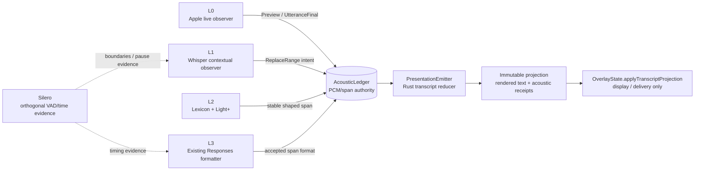

# Streaming Pipeline: Microphone → Overlay

> Complete data flow documentation for codescribe's real-time speech-to-text pipeline.
>
> **Re-framed 2026-08-22** as the rendering surface for the canonical
> [four-layer engine contract](./THE_ENGINE_CONTRACT.md). The 2026-05-26
> [five-layer ADR](./ADR/2026-05-26-LAYERED_INCREMENTAL_TRANSCRIPTION.md)
> is a superseded historical inventory.
>
> Created by Vetcoders (c)2026

## Four-layer rendering model

The overlay displays one ordered document reduced from four machine layers.
Every observation addresses the same PCM/span truth in `AcousticLedger`.
`PresentationEmitter` owns the Rust transcript reducer and publishes a complete,
immutable rendered projection with acoustic receipts; Swift does not replay or
fold the observations into a second transcript.

| Layer                        | Owner                                         | Reducer surface                                                          | Current status                                                                                                                      |
| ---------------------------- | --------------------------------------------- | ------------------------------------------------------------------------ | ----------------------------------------------------------------------------------------------------------------------------------- |
| **L0 — Apple**               | `SFSpeechRecognizer` live observer            | `Preview`, `Correction`, `UtteranceFinal`                                | Shipped first paint on the Apple progressive route.                                                                                 |
| **L1 — Whisper**             | Typed tail provider over proven PCM spans     | bounded `ReplaceRange { source: TailPatch }` / corrected final           | Wired on exact-span Apple progressive; VAD/Whisper-first uses Whisper as its primary observer and refuses a second unbound patcher. |
| **L2 — Lexicon + Light+**    | Deterministic vocabulary and sentence shaping | lexicon rewrite followed by Light+ before stable commit                  | Currently wired on progressive seals and as the delivery floor; explicit `force_raw` skips Light+.                                  |
| **L3 — Responses formatter** | Existing configured Formatting lane           | span-keyed accepted formatting result through the same reducer authority | Implemented behind `CODESCRIBE_INLINE_FORMAT`; “inline” is scheduling over stable L2 spans, not a small model or second client.     |

The human receives the sealed document after L3; the human is not a fifth
machine layer. Silero is orthogonal VAD and PCM-time evidence. Plain Silero may
report speech probability, boundaries, silence duration, and pause timing; named
laughter/noise annotations require an optional measured paralingual provider.

The historical `InlineLlm` and `FinalBam` enum values remain reserved wire
vocabulary, not active layer owners. Final BAM is superseded and has no
automatic producer. `SessionFinalised` is lifecycle-only.

**Hard invariant:** every layer submits observations and bounded mutation intent
against `AcousticLedger`; the Rust reducer alone resolves appends, corrections,
replacement ranges, annotations, and markers into the canonical document. No
layer may wipe the document and rebuild the session. Swift receives only the
resulting complete `CsTranscriptProjectionEvent`: rendered text plus acoustic
receipts. `OverlayState.applyTranscriptProjection` is the only admitted Swift
transcript-text input. See ADR §Hard invariants for the historical rationale.


```mermaid
flowchart LR
    L0[L0<br/>Apple live observer]
    L1[L1<br/>Whisper contextual observer]
    L2[L2<br/>Lexicon + Light+]
    L3[L3<br/>Existing Responses formatter]
    SILERO[Silero<br/>orthogonal VAD/time evidence]
    LEDGER[(AcousticLedger<br/>PCM/span authority)]
    REDUCER[PresentationEmitter<br/>Rust transcript reducer]
    PROJECTION[Immutable projection<br/>rendered text + acoustic receipts]
    SWIFT[OverlayState.applyTranscriptProjection<br/>display / delivery only]

    L0 -- Preview / UtteranceFinal --> LEDGER
    L1 -- ReplaceRange intent --> LEDGER
    L2 -- stable shaped span --> LEDGER
    L3 -- accepted span format --> LEDGER
    LEDGER --> REDUCER
    REDUCER --> PROJECTION
    PROJECTION --> SWIFT
    SILERO -. boundaries / pause evidence .-> L1
    SILERO -. timing evidence .-> L3
```

The Whisper-first VAD/scheduler pipeline below is a separate runtime route. It
uses Whisper as its primary observer when Apple is unavailable or explicitly
unselected. Apple progressive instead submits exact PCM spans through the typed
tail-provider seam. Both routes converge on the same reducer; they do not claim
identical mutation-fence geometry.

## Pipeline Overview


```mermaid
flowchart TD
    MIC[🎤 Microphone\n48kHz mono via cpal]
    CPAL[cpal audio callback\ncore/audio/recorder.rs]
    SR[StreamingRecorder\ncore/audio/streaming_recorder.rs]
    RESAMPLE[Resample 48kHz → 16kHz\nvad::Resampler]
    VAD[Silero VAD v6\ncore/vad/silero_ort.rs\nONNX Runtime · GRU neural net]
    GATE{VAD Gate\nspeech_prob ≥ threshold?}
    DROP[🗑️ Silence discarded]
    PREROLL[Pre-roll buffer\n~64ms · catches consonant attacks]
    SPEECH[SpeechSession\ncore/audio/chunker.rs\nSupervisor mode]
    CHUNK[SpeechEvent::Utterance / UtteranceFinal\nclean speech audio segments]
    WORKER[transcription_session\ncore/pipeline/streaming/session.rs\nunified pipeline]
    WHISPER[Whisper Engine\ncore/stt/whisper/engine.rs\nMetal GPU · large-v3-turbo fp16]
    POSTPROC[StreamPostProcessor\ncore/pipeline/stream_postprocess.rs\nlexicon + semantic gate]
    EVENT[EngineEvent\ncore/pipeline/contracts.rs]
    LEDGER[AcousticLedger\ncore/pipeline/acoustic_ledger.rs]
    REDUCER[PresentationEmitter\nRust transcript reducer]
    BUS[Transcript Bus projection\nrendered text + acoustic receipts]
    BRIDGE[UniFFI projection listener]
    OVERLAY[OverlayState projection consumer\nScreens/Overlay/OverlayState.swift]
    ASSIST[Agent Chat delivered message\nScreens/AgentChat/MessageList.swift]

    MIC --> CPAL
    CPAL --> SR
    SR --> RESAMPLE
    RESAMPLE --> VAD
    VAD --> GATE
    GATE -->|speech| PREROLL
    GATE -->|silence < min_silence| PREROLL
    GATE -->|silence ≥ min_silence| DROP
    PREROLL --> SPEECH
    SPEECH --> CHUNK
    CHUNK --> WORKER
    WORKER --> WHISPER
    WHISPER --> POSTPROC
    POSTPROC --> EVENT
    EVENT --> LEDGER
    LEDGER --> REDUCER
    REDUCER --> BUS
    BUS --> BRIDGE
    BRIDGE --> OVERLAY
    OVERLAY -->|assistive delivery policy| ASSIST

    style DROP stroke:#c33,stroke-width:2px
    style CHUNK stroke:#3a3,stroke-width:2px
    style REDUCER stroke:#33c,stroke-width:2px
    style OVERLAY stroke:#c93,stroke-width:2px
    style ASSIST stroke:#c93,stroke-width:2px
```

---

## Stage 1: Audio Capture

| Component             | File                               | Details                               |
| --------------------- | ---------------------------------- | ------------------------------------- |
| **cpal**              | `core/audio/recorder.rs`           | macOS CoreAudio, typically 48kHz mono |
| **Recorder**          | `core/audio/recorder.rs`           | Manages cpal stream lifecycle         |
| **StreamingRecorder** | `core/audio/streaming_recorder.rs` | Orchestrates VAD + Whisper pipeline   |

The microphone delivers raw PCM f32 samples at the device's native sample rate (usually 48kHz on macOS).
`StreamingRecorder` owns the full pipeline from audio callback to delta delivery.

---

## Stage 2: VAD Gate (Voice Activity Detection)

| Component         | File                     | Details                               |
| ----------------- | ------------------------ | ------------------------------------- |
| **Resampler**     | `core/vad/silero_ort.rs` | Linear interpolation 48kHz → 16kHz    |
| **SileroVad**     | `core/vad/silero_ort.rs` | ONNX Runtime, GRU neural network      |
| **SpeechSession** | `core/audio/chunker.rs`  | State machine for speech segmentation |

### How it works

1. Raw audio is resampled to **16kHz** (Silero's native rate).
2. Resampled audio is fed in **512-sample frames** (32ms) to Silero VAD v6.
3. Each frame produces a **speech probability** (0.0–1.0).
4. The VAD gate makes a decision per frame:

```
speech_prob ≥ threshold (0.5)     → accumulate as speech
speech_prob < neg_threshold (0.35) → start silence counter
silence_counter ≥ min_silence      → END segment, discard silence
silence_counter < min_silence      → keep buffering (might be mid-sentence pause)
```

### Key parameters (hardcoded)

| Parameter                | Value  | Source                 |
| ------------------------ | ------ | ---------------------- |
| `threshold`              | 0.5    | Silero default profile |
| `min_speech_duration`    | 0.064s | Silero Rust example    |
| `min_silence_duration`   | 0.0s   | Silero Rust example    |
| `max_utterance_duration` | ∞      | Silero Rust example    |
| `speech_pad / pre_roll`  | 0.064s | Silero Rust example    |

### Pre-roll buffer

A 64ms circular buffer (~1024 samples at 16kHz) captures audio **before** speech onset. This catches the attack transients of plosive consonants (k, t, p, b) that would otherwise be clipped. When speech begins, the pre-roll is prepended to the speech segment.

### Three gate modes

| Mode         | Description                                             | Output sample rate |
| ------------ | ------------------------------------------------------- | ------------------ |
| `Simple`     | Basic threshold + silence counter                       | 16kHz (VAD rate)   |
| `Iter`       | State machine with min_speech/min_silence/max_utterance | 16kHz (VAD rate)   |
| `Supervisor` | Same as Iter but preserves raw sample rate              | Original (48kHz)   |

### Single Silero ingress

The Apple progressive session owns **one** `SileroIngress` / `SpeechSession`.
The same observation feeds both the utterance ledger and `EpochGate`; a second
VAD over the same PCM is forbidden because it could disagree on sample
boundaries. Exact threshold crossings are drained as
`EngineEvent::SidebandEvidence`. The existing fusion flag decides whether
Silero identity may reach the seal; it does not create another VAD.

### Flush fallback

When Silero is unavailable on the Apple lane, sideband evidence is absent and
`EpochGate` is disarmed. PCM continues through one uninterrupted Apple stream;
sideband absence is not a gate. Buffered/VAD paths keep their existing flush
and `NoSpeech` behavior without inventing a sideband claim.

---

## Stage 3: Whisper Transcription

| Component                 | File                                  | Details                           |
| ------------------------- | ------------------------------------- | --------------------------------- |
| **WhisperEngine**         | `core/stt/whisper/engine.rs`          | Candle + Metal GPU, singleton     |
| **transcription_session** | `core/pipeline/streaming/session.rs`  | Unified pipeline (event-based)    |
| **StreamPostProcessor**   | `core/pipeline/stream_postprocess.rs` | Lexicon + semantic gate + cleanup |

### Streaming transcription

Speech segments from the VAD gate arrive as `SpeechEvent::Utterance` (interim) or `SpeechEvent::UtteranceFinal` (boundary). The unified `transcription_session` function:

1. Receives utterance audio from `SpeechSession`.
2. Transcribes with Whisper (Metal GPU acceleration).
3. Post-processes via `StreamPostProcessor` (lexicon correction, hallucination filter, semantic gate).
4. Applies the deterministic Light+ floor where the route promises L2 shaping.
5. Emits `EngineEvent::Preview` with accumulated text for the current utterance.
6. Optionally runs Phase 2 correction (re-transcription of accumulated audio for better accuracy).

### Repetition authority

Equal words may be intentional repetition. Occurrence identity and replay adjudication belong to the `AcousticLedger` and transcript reducer path. Decoder diagnostics may observe repetition, but they do not delete it before the ledger.

---

## Stage 4: Engine Events (Intent, not Presentation)

| Component            | File                         | Details                      |
| -------------------- | ---------------------------- | ---------------------------- |
| **EngineEvent**      | `core/pipeline/contracts.rs` | Semantic event enum          |
| **EventSink**        | `core/pipeline/contracts.rs` | Trait for event consumers    |
| **DeltaSinkAdapter** | `core/pipeline/sinks.rs`     | EventSink → DeltaSink bridge |
| **TranscriptDelta**  | `core/pipeline/contracts.rs` | Backspace-encoded delta      |

### Event types

The engine emits **semantic events** — it communicates what happened, not how to display it:

| Event              | Meaning                                                                      |
| ------------------ | ---------------------------------------------------------------------------- |
| `VadStart`         | VAD detected speech start (with `speech_prob` and `ts_ms`)                   |
| `VadEnd`           | VAD detected speech end                                                      |
| `SidebandEvidence` | Exact PCM edge or pause; typed `silero_vad` provenance; never text authority |
| `Preview`          | Latest transcription of current utterance (full text)                        |
| `Correction`       | Re-transcription improved previous output                                    |
| `UtteranceFinal`   | Complete utterance — VAD-bounded or flush                                    |
| `Drop`             | Content dropped (hallucination, semantic gate)                               |
| `Stats`            | Session-level statistics (emitted on stop/flush)                             |
| `Warning`          | Recoverable error — engine continues                                         |
| `ReplaceRange`     | Bounded mutation for a proven span                                           |
| `InsertAnnotation` | Optional visible annotation; needs a measured content provider               |
| `SessionFinalised` | Lifecycle closure only; never a text producer                                |

### Preview semantics (contract)

- `Preview.text` is **utterance-local**: full post-processed text for the current utterance only.
- On each Whisper decode, `text` replaces the previous Preview (not appended). `rev` increments.
- After `UtteranceFinal`, the engine resets internal state — next Preview starts fresh.
- The Rust reducer must keep **session structure**, not only a flat string:
  - committed utterances that are already safe to keep
  - one active preview/correction tail for the current utterance
- Span order and PCM identity stay append-only. An authorized downstream L1/L2/L3
  observation may still correct wording inside its proven span before
  `transcript_sealed`; no layer may rebuild or reorder the session.
- The reducer resolves those events before the Swift boundary. The overlay never
  receives preview/final/correction mutations or a backspace stream; it receives
  the complete rendered projection and its acoustic receipts.

### Upstream delta generation (delivery compatibility)

When Whisper processes overlapping audio chunks, later chunks may **correct** earlier transcription. The `TranscriptDelta::from_diff` function generates a minimal delta:

```
Previous: "Kubernetes wymaga konfiguracji po zgrze"
Current:  "Kubernetes wymaga konfiguracji PostgreSQL"

Delta: "\u{0008}\u{0008}\u{0008}\u{0008}\u{0008}\u{0008}\u{0008}\u{0008}PostgreSQL"
       ^^^^^^^^^^^^^^^^^^^^^^^^^^^^^^^^^^^^^^^^^^^^^^^^^^^^^^^^^^^^^^^^
       8 backspaces to erase "po zgrze" + new text "PostgreSQL"
```

The `\u{0008}` character is ASCII backspace. This remains an upstream/delivery
compatibility representation derived from successive Rust reducer revisions; it
is not an input to `OverlayState` and is not Swift transcript authority.

---

## Stage 5: UI Routing

| Component                     | File                          | Details                              |
| ----------------------------- | ----------------------------- | ------------------------------------ |
| **ControllerEventRouter**     | `app/controller/helpers.rs`   | Event pipeline: routes by mode       |
| **PresentationEmitter**       | `app/presentation/emitter.rs` | Typing animation via BufferedEmitter |
| **route_transcription_delta** | `app/controller/helpers.rs`   | Legacy: routes delta by mode         |

### Runtime pipeline path

App runtime uses one transcript-authority path:

- `start_event_session` → `transcription_session` (event pipeline only).
- Engine observations are admitted against `AcousticLedger`; corrections,
  patches, annotations, and markers are reduced in
  `app/presentation/emitter.rs`.
- Each accepted reducer revision is published by the Transcript Bus as complete
  `rendered_text` plus immutable projected acoustic receipts.
- The bridge forwards that projection to Swift; it does not expose a parallel
  Swift mutation protocol.
- `UtteranceFinal` still drives the utterance callback and downstream AI policy,
  but it does not grant Swift reducer ownership.

Legacy worker path is kept only as deprecated compatibility/diagnostic code and is not used by app runtime.

### Session modes

The controller checks `is_assistive_session()`:

- **Assistive** (Fn+Shift hold / toggle-assistive): the projection consumer hands
  the Rust-owned rendered transcript to delivery policy; Agent Chat presents the
  resulting user message without re-reducing transcript events.
- **Non-assistive** (Fn hold / toggle): the floating overlay consumes the
  immutable transcript projection.

**Toggle nuance:** In toggle mode, each VAD silence boundary produces an
`UtteranceFinal`. The Rust reducer continues to publish canonical revisions; the
utterance callback processes each resolved utterance independently (AI
formatting, clipboard), and delivery avoids rewriting an already-presented user
message (`skip_user_bubble`). Recording continues until double-tap Option.

---

## Stage 6: Projection Display

### Non-assistive mode (dictation)

An immutable transcript projection arrives at the **Floating Overlay**:

- The UniFFI listener forwards `CsTranscriptProjectionEvent` to
  `OverlayState.applyTranscriptProjection`, the only admitted Swift
  transcript-text input.
- Swift rejects non-monotonic sequences, zero reducer revisions, or projections
  without complete acoustic receipts, then replaces its display from the
  projection's complete `renderedText`.
- Transcript segments, preview/final folding, correction and patch application,
  marker rebasing, and highlight reconstruction remain upstream Rust reducer
  concerns. Swift neither recreates nor owns that state.
- Updates the always-on-top transparent overlay window.
- Auto-resizes to fit text content.
- Auto-hides after 5 seconds of inactivity (with hover guard).

### Assistive mode (AI chat)

The resolved transcript reaches the **Agent Tab** through delivery policy:

- `AgentChatStore` presents the delivered user message; it does not fold engine
  events into a competing transcript.
- After utterance is complete, the transcribed text is sent to the LLM.
- LLM response streams back via a separate `delta_callback` into assistant message bubbles.

### Thread safety

Projection callbacks cross the bridge onto the app's main-actor listener before
`OverlayState.applyTranscriptProjection` updates display/delivery state. Rust
owns transcript ordering and reduction; main-actor isolation only protects the
Swift presentation surface.

---

## Complete Timing Breakdown

```
Event                          Latency        Cumulative
─────────────────────────────  ─────────────  ──────────
Microphone capture             ~5ms           ~5ms
Resample 48k→16k              <1ms           ~6ms
Silero VAD (per 32ms frame)   ~2ms           ~8ms
VAD gate decision             <1ms           ~9ms
Whisper chunk accumulation    ~4000ms        ~4009ms
Whisper inference (Metal GPU) ~2000-7000ms   ~6000-11000ms
PostProcess + Rust reducer    <1ms           ~6001ms
Projection bridge dispatch   <1ms           ~6002ms
Swift projection display     <1ms           ~6003ms
─────────────────────────────────────────────────────────
First visible text:           ~6s after speech starts
Corrected projections:       ~4s after each new chunk
```

---

## Data Transformations Summary

```
Raw PCM f32 (48kHz)
    │ resample
    ▼
PCM f32 (16kHz)
    │ Silero VAD
    ▼
SpeechEvent (speech segments, silence removed)
    │ transcription_session
    ▼
Whisper inference → raw transcript
    │ StreamPostProcessor (lexicon + semantic gate) → Light+
    ▼
stable L2 span / EngineEvent::Preview { text }
    │ optional L3 scheduling through existing Responses formatter
    ▼
AcousticLedger admission + Rust transcript reducer
    │ accepted TranscriptRevision
    ▼
Transcript Bus evidence projection
    │ complete rendered_text + acoustic receipts
    ▼
CsTranscriptProjectionEvent → OverlayState.applyTranscriptProjection
    │ display / delivery only
    ▼
Displayed projected text (String, visible in overlay)
```

---

## Key Source Files

| File                                                      | Role                                                       |
| --------------------------------------------------------- | ---------------------------------------------------------- |
| `core/audio/recorder.rs`                                  | cpal audio capture, device management                      |
| `core/audio/streaming_recorder.rs`                        | Pipeline orchestrator, connects recorder to engine         |
| `core/audio/chunker.rs`                                   | SpeechSession, VAD gate, Supervisor mode, flush fallback   |
| `core/vad/silero_ort.rs`                                  | Silero VAD v6 (ONNX), worker thread, resampler             |
| `core/stt/whisper/engine.rs`                              | Whisper singleton, Metal GPU inference                     |
| `core/pipeline/contracts.rs`                              | EngineEvent, EventSink, DeltaSink, TranscriptDelta         |
| `core/pipeline/streaming/session.rs`                      | transcription_session (unified, VAD/scheduler path)        |
| `core/pipeline/streaming/apple_live_session.rs`           | Apple progressive live session + Layer 1 seal hand-off     |
| `core/stt/tail_patcher/mod.rs`                            | Layer 1 gate, job computation, bounded-patch decision      |
| `core/pipeline/sinks.rs`                                  | DeltaSinkAdapter, CallbackSink, CollectorEventSink         |
| `core/pipeline/stream_postprocess.rs`                     | Lexicon correction, semantic gate, hallucination filter    |
| `core/pipeline/light_plus.rs`                             | Deterministic L2 sentence shaping                          |
| `core/llm/inline_format.rs`                               | L3 stable-span scheduling and fail-open ledger             |
| `core/llm/ai_formatting.rs`                               | Existing Responses Formatting lane used by L3              |
| `app/controller/mod.rs`                                   | Recording state machine, Hold/Toggle orchestration         |
| `app/controller/helpers.rs`                               | ControllerEventRouter, session mode routing                |
| `core/pipeline/acoustic_ledger.rs`                        | PCM/span evidence authority and immutable receipts         |
| `app/presentation/emitter.rs`                             | Canonical Rust transcript reducer                           |
| `app/presentation/transcript_bus.rs`                      | Immutable rendered projections with acoustic receipts      |
| `macos/Codescribe/Screens/Overlay/OverlayState.swift`     | Projection display/delivery consumer                       |
| `macos/Codescribe/Screens/AgentChat/AgentChatStore.swift` | Agent chat state (threads, streaming bubbles)              |

---

## Test Coverage

| Test file                    | What it validates                                                                                   |
| ---------------------------- | --------------------------------------------------------------------------------------------------- |
| `tests/e2e_vad_flow.rs`      | VAD init, speech detection, resampling, real audio with canonical recordings                        |
| `tests/e2e_vad_auto_stop.rs` | Atomic flag mechanism, cross-thread callbacks, monitor polling                                      |
| `tests/e2e_full_pipeline.rs` | Full pipeline: Whisper × 4 canonical recordings, PostProcessor, Delta backspace, Unicode round-trip |
| `tests/e2e_vad_gate_live.rs` | Live VAD gate integration with real audio files                                                     |

### Canonical test recordings

| File                                    | Duration | Content                             | Difficulty   |
| --------------------------------------- | -------- | ----------------------------------- | ------------ |
| `01_no-to-dobra.wav`                    | ~60s     | Casual Polish speech                | Easy         |
| `02_kubernetes-wymaga-konfiguracji.wav` | ~55s     | Tech + veterinary terms             | Medium       |
| `03_algorytm-ma-zlozonosc.wav`          | ~80s     | Algorithm complexity, medical terms | Medium-Hard  |
| `04_runda-3-czyli.wav`                  | ~72s     | Intentional mispronunciations       | Hard         |
| `VAD_voice_real_pauses.wav`             | ~59s     | Real speech with deliberate pauses  | VAD-specific |

---

_Vibecrafted with AI Agents by Vetcoders (c)2026_
