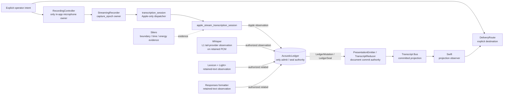
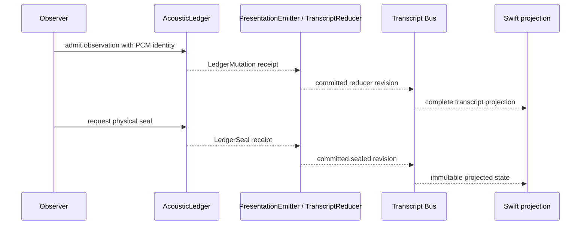

# Streaming Pipeline: Microphone → Ledger → Projection

> Current structural documentation (2026-08-25). `484095ce` was the last
> executable-code cut before docs successor `d57196ab`; C11 is the next
> structural executable cut and records its actual hash in its durable report.
> Compiler and runtime are `NOT_ASSESSED`. The 2026-05-26
> [five-layer ADR](./ADR/2026-05-26-LAYERED_INCREMENTAL_TRANSCRIPTION.md) and
> older Whisper-first scheduler diagrams are superseded historical snapshots;
> they have no current runtime authority.
>
> Created by Vetcoders (c)2026

## Authority in one sentence

`RecordingController` owns the in-app microphone, `StreamingRecorder` owns the
successful physical-open epoch, `AcousticLedger` alone admits and seals physical
occurrences, and `PresentationEmitter` / `TranscriptReducer` alone commit the
document projected to Transcript Bus and Swift.


```mermaid
flowchart LR
    INTENT[Explicit operator intent]
    CONTROLLER[RecordingController<br/>only in-app microphone owner]
    RECORDER[StreamingRecorder<br/>capture_epoch owner]
    DISPATCH[transcription_session<br/>Apple-only dispatcher]
    APPLE[apple_stream_transcription_session]
    SILERO[Silero<br/>boundary / time / energy evidence]
    WHISPER[Whisper<br/>L1 tail-provider observation<br/>on retained PCM]
    LEXICON[Lexicon + Light+<br/>retained-text observation]
    FORMATTER[Responses formatter<br/>retained-text observation]
    LEDGER[(AcousticLedger<br/>only admit / seal authority)]
    REDUCER[PresentationEmitter / TranscriptReducer<br/>document commit authority]
    BUS[Transcript Bus<br/>committed projection]
    SWIFT[Swift<br/>projection observer]
    ROUTE[DeliveryRoute<br/>explicit destination]

    INTENT --> CONTROLLER
    CONTROLLER --> RECORDER
    RECORDER --> DISPATCH
    DISPATCH --> APPLE
    SILERO -. evidence .-> APPLE
    APPLE -- Apple observation --> LEDGER
    WHISPER -- authorized observation --> LEDGER
    LEXICON -- authorized relabel --> LEDGER
    FORMATTER -- authorized relabel --> LEDGER
    LEDGER -- LedgerMutation / LedgerSeal --> REDUCER
    REDUCER --> BUS
    BUS --> SWIFT
    INTENT --> ROUTE
    SWIFT --> ROUTE
```

This is one microphone, one capture clock, one occurrence ledger, and one Rust
document reducer. No observer may create a second recorder, derive occurrence
identity from text, or rebuild the transcript in Swift.

## Four machine observations

| Layer | Role | Authority boundary |
| --- | --- | --- |
| L0 — Apple | First live text observer inside the Apple session | May describe an occurrence; may not mint physical speech |
| L1 — Whisper | Tail-provider observation over retained PCM | May correct the same authorized occurrence; never owns a parallel live route |
| L2 — Lexicon + Light+ | Deterministic retained-text relabeling | May relabel an authorized occurrence; equal strings are not identity |
| L3 — Responses formatter | Configured formatting observation | May format authorized text; may not add physical occurrences |

Silero is outside the text-layer stack. It supplies time, energy, pause, and
boundary evidence to the Apple session. It owns neither text nor a microphone.
`SessionFinalised` is lifecycle only.

## Stage 1: operator intent and microphone ownership

`RecordingController::handle_hotkey_event` routes the hotkey gesture to the
current recording handler. `RecordingController` is the only in-app microphone
owner. Dictation, Agent, and Assistive modes may choose different downstream
delivery, but none may open another recorder.

`StreamingRecorder::bind_session_authority` binds a new operator session to one
`AcousticLedger` and resets its session-local capture counter. On physical open,
`StreamingRecorder::start_event_session`:

1. computes the next `capture_epoch` with checked arithmetic;
2. attempts `recorder.start()`;
3. assigns the new epoch only after that start succeeds; and
4. passes the issued epoch into the live Apple session.

The counter therefore identifies successful physical opens, not attempts.

## Stage 2: the live Apple dispatcher

`transcription_session` currently delegates only to
`apple_stream_transcription_session`. The normal live route does not select a
Whisper-first VAD/scheduler pipeline.

The Apple session receives capture PCM and the recorder-issued session/epoch.
Its two Apple bridge transports are an A/B seam inside the same Apple route:

- `CODESCRIBE_APPLE_STT_LIVE_MODE=stream` uses live Apple AudioBuffer delivery;
- `CODESCRIBE_APPLE_STT_LIVE_MODE=wav` uses the older Apple `transcribe_live`
  temp-WAV request transport.

`wav` does not restore any deleted scheduler or create a second authority.

## Stage 3: boundary evidence and retained-PCM observers

The Apple session feeds one Silero observation path. `seal_sliced_by_silero`
uses Silero boundary/time/energy evidence to describe PCM ranges on the same
session clock. Each selected slice now admits its own slice-local Apple label
and exact-range no-change Lexicon observation before any raw final telemetry.
Callback-wide text is not copied into multiple ranges. Silero cannot author text
and cannot seal a transcript by itself.

Whisper may observe retained PCM as the Layer 1 tail provider. Apple, Whisper,
Lexicon/Light+, and Responses formatting all offer observations about an
already-identifiable occurrence. A later, higher-authority observation may
relabel that occurrence; it cannot increase or decrease the number of physical
speech events.

## Stage 4: occurrence admission and seal

`AcousticLedger` is the only physical occurrence authority.

```text
OccurrenceIdentity = (session, capture_epoch, sample_start, sample_end)
ObservationIdentity = (producer, request, generation, occurrence)
```

- Equal text never creates, merges, or erases an occurrence.
- Equal text on disjoint PCM ranges represents distinct speech and survives.
- Re-delivery of the same observation identity/range is refused structurally.
- An unanchored observation may remain visible as evidence but has no mutation
  authority.
- `AcousticLedger::admit` records the observation decision.
- `AcousticLedger::seal` closes the occurrence against later automatic mutation.

In the Apple session, `admit_ledger_label` converts qualified Apple, Whisper,
Lexicon, or formatting evidence into ledger admission. `seal_utterance_final`
binds segment-less Apple callbacks to new session-clock PCM before offering
Apple and Lexicon observations; it does not use canvas text as identity.

## Stage 5: Rust reduction and Transcript Bus

Accepted ledger decisions leave the ledger as
`EngineEvent::LedgerMutation`; physical closure leaves as
`EngineEvent::LedgerSeal`. `PresentationEmitter` / `TranscriptReducer` reduce
those events into the canonical document.

The Transcript Bus observes committed reducer revisions and publishes a
complete rendered projection with acoustic receipts. Preview callbacks and raw
engine strings are not bus truth. Preview uses a distinct overlay-only command
that cannot write the delivery buffer. Raw final/correction/range-patch/
annotation events are diagnostics only. The Bus exposes no draft or arbitrary
text seal API; terminal ledger seal is the only automatic close of committed
truth. The old raw-event-to-delta adapter no longer exists.


```mermaid
sequenceDiagram
    participant O as Observer
    participant L as AcousticLedger
    participant R as PresentationEmitter / TranscriptReducer
    participant B as Transcript Bus
    participant S as Swift projection

    O->>L: admit observation with PCM identity
    L-->>R: LedgerMutation receipt
    R-->>B: committed reducer revision
    B-->>S: complete transcript projection
    O->>L: request physical seal
    L-->>R: LedgerSeal receipt
    R-->>B: committed sealed revision
    B-->>S: immutable projected state
```

## Stage 6: Swift projection and explicit delivery

Swift receives `CsTranscriptProjectionEvent` and applies it through
`OverlayState.applyTranscriptProjection`. Swift is a projection observer: it
does not replay Apple/Whisper events or run a second text reducer.

Delivery uses `DeliveryRoute` resolved from explicit operator intent. OS focus
alone does not select the destination. Dictation, Agent, and Assistive modes
share the same transcript authority even when their destinations differ.

## Normal live route versus explicit non-live work

| Surface | Microphone / authority status |
| --- | --- |
| Normal live capture | The Apple-only dispatcher and the single ledger/reducer path described above |
| Explicit Retranscribe | A new operator-authorized inference over a selected completed artifact; not a normal-stop continuation and not live capture |
| Corpus, replay, or bench tooling | Offline evidence surfaces; they do not prove or replace the normal live path |
| Historical W13 / five-layer diagrams | Dated archaeology only; no authority to restore deleted runtime surfaces |

## Transformation summary

```text
explicit operator intent
  → RecordingController
  → StreamingRecorder(session, successful-open capture_epoch, retained PCM)
  → transcription_session
  → apple_stream_transcription_session
      + Silero boundary/time/energy evidence
      + Apple / Whisper / Lexicon-Light+ / Responses observations
  → AcousticLedger::admit / AcousticLedger::seal
  → EngineEvent::LedgerMutation / EngineEvent::LedgerSeal
  → PresentationEmitter / TranscriptReducer
  → Transcript Bus committed projection
  → Swift projection observer
  → DeliveryRoute chosen from explicit operator intent
```

## Key source files

| File | Current role |
| --- | --- |
| `app/controller/mod.rs` | `RecordingController`, hotkey handling, single in-app microphone ownership |
| `app/controller/delivery_route.rs` | `DeliveryRoute` from explicit operator intent |
| `core/audio/streaming_recorder.rs` | Session authority binding and successful-open `capture_epoch` allocation |
| `core/pipeline/streaming/session.rs` | `transcription_session`, currently an Apple-only dispatcher |
| `core/pipeline/streaming/apple_live_session.rs` | Live Apple session, observer qualification, ledger admission and seal |
| `core/pipeline/streaming/silero_fusion.rs` | Silero boundary/time/energy evidence for Apple-session slicing |
| `core/stt/apple_stt/mod.rs` | Apple AudioBuffer versus temp-WAV bridge transport selection |
| `core/stt/apple_stt/live_stream.rs` | Apple live bridge helpers and structurally uncalled compatibility accessor |
| `core/pipeline/acoustic_ledger.rs` | Only occurrence admission/seal authority and immutable receipts |
| `core/pipeline/contracts.rs` | Ledger mutation/seal event contracts |
| `app/presentation/emitter.rs` | Canonical Rust transcript reducer |
| `app/presentation/transcript_bus.rs` | Committed projection observer and bus publication |
| `macos/Codescribe/Screens/Overlay/OverlayState.swift` | Swift projection consumer |

---

_Vibecrafted with AI Agents by Vetcoders (c)2026_
