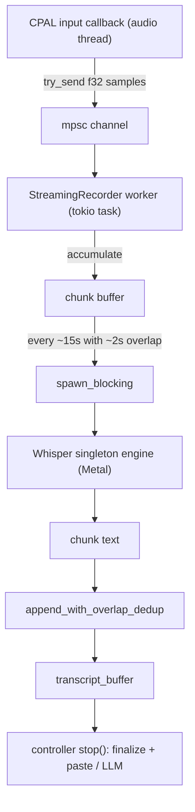

# WHISPER LIVE (Embedded Whisper + Streaming Transcription)

> **Status:** DONE ✅ (2026-01-16) · **Re-framed:** 2026-08-22 as the L1 observer feeding deterministic L2 and the existing L3 formatter.
>
> **Tagline:** Whisper stays local, ships embedded by default, and patches the live overlay in the background — it is no longer the first thing the user sees.

## Role in the canonical four-layer pipeline

Whisper is **L1 — contextual observer** and feeds **L2 — Lexicon + Light+**
inside the canonical [four-layer engine contract](./THE_ENGINE_CONTRACT.md).
Live first-pass text in the overlay comes from **Layer 0 — Apple Speech Recognizer**
(`CODESCRIBE_STT_ENGINE=apple`); Whisper runs on the same audio tail in the background, diffs
against Layer 0's committed buffer, and emits `EngineEvent::ReplaceRange { source: TailPatch }`
events that visibly patch tokens Apple missed — mixed-language inserts, rare terminology, proper
nouns. The legacy "Whisper-as-primary" path stays as automatic fallback when Apple Speech
is unavailable (no permission, no macOS Speech framework).

> **Delivery status (2026-08-22).** Local Power + Apple/Auto arms the exact-span
> Apple progressive L1 path; VAD/Whisper-first uses Whisper as its primary
> observer and refuses a second unbound patcher. Normal stop never performs a
> hidden Whisper file pass; full-file decoding belongs only to explicit
> Retranscribe/HQ. L2 Lexicon + Light+ is currently wired. L3 uses the existing
> Responses Formatting lane behind `CODESCRIBE_INLINE_FORMAT`; “inline” names
> scheduling, not another model or client.

The contract has exactly four machine layers. Silero remains orthogonal VAD/time
evidence, with richer annotations optional and provider-bound. Final BAM is
superseded and has no automatic producer; `SessionFinalised` is lifecycle-only.

**Hard invariant that gates every Whisper write:** _NEVER REWRITE FROM ZERO._
Tail Patch may only `ReplaceRange` inside a proven PCM/span identity. Text
alignment and change ratios may judge a candidate after authority is
established, but they never mint authority. Unproven or cross-span work fails
closed. See the engine contract for the full rule.

## TL;DR

Codescribe’s Whisper layer power-ups:

1. **FP16-only Whisper model** (`whisper-large-v3-turbo`, mlx-community weights; q8 is rejected before load)
   - readiness requires a parsed config and tokenizer, pinned mel SHA-256, and a
     structurally complete safetensors file containing only supported runtime dtypes
   - build policy embeds Whisper whenever the model is available at build time
   - runtime lookup from `CODESCRIBE_MODEL_PATH`, configured model dirs, bundled app resources, or the Hugging Face cache is a fallback path for `CODESCRIBE_NO_EMBED=1` builds or recovery
2. **Live (streaming) transcription** while the user is recording
   - Audio is chunked and transcribed in the background
   - In the layered model: Whisper events arrive as `ReplaceRange` patches **after** Apple's live
     deltas — the user sees Layer 0 first, then watches Whisper magically correct mixed-language /
     terminology tokens within ~1 s of utterance end
   - In fallback (no Apple): Whisper takes over the live preview path, behaving like pre-ADR builds
3. **Full WAV is always teed to disk** — L1 may read retained PCM without a
   second microphone; the saved WAV remains available for explicit
   Retranscribe/HQ and diagnostics, not an automatic fifth layer

## What we shipped

### 1) Embedded Whisper (Current Policy)

- **Embedded-first:** `core/build.rs` embeds Whisper by default when a complete model snapshot is available.
  - Prefer the embedded payload for shipped behavior.
  - If embedding is disabled with `CODESCRIBE_NO_EMBED=1` or the model is absent at build time, resolve from `CODESCRIBE_MODEL_PATH`, configured model dirs, app resources, or HF cache.
  - Both paths stay local and use Metal once loaded.
- **Global Singleton:** A process-wide engine instance loads once and stays resident.

Key behavior:

- **Shipped build:** embedded Whisper is the canonical path.
- **Fallback build/runtime:** runtime model lookup remains available when embedding is intentionally unavailable.

### 2) Streaming transcription (during recording)

We removed the old bottleneck:

```text
Audio callback → buffer → stop() → WAV write/read → transcribe entire audio → LLM
```

And replaced it with:

```text
Audio callback → non-blocking channel → chunking worker → spawn_blocking(Whisper) → transcript buffer
                                                         ↓
                                                     overlap dedup

stop() → transcribe last pending samples → return final transcript → LLM/paste
```

Practical win:

- **~35s recording:** `stop()` is ~0.5s (last chunk only) instead of ~4s (whole audio)

## What’s new around Whisper Live

- **Stream postprocess** (`core/pipeline/stream_postprocess.rs`) — semantic gating and cleanup of
  chunk output. In the layered model this feeds Layer 1's diff input — patches are made against
  the post-processed text, not the raw decoder output.
- **IPC server** (`app/ipc/`) — stable runtime interface for GUI/clients; Whisper Live can be
  consumed and extended outside the tray flow. After the ADR, the IPC contract also carries
  `ReplaceRange` and `InsertAnnotation` events for clients that render the layered view.
- **Quality loop/report** (`bin/codescribe_quality`, `bin/codescribe_loop`) — automated scoring and
  batch diagnostics. Layer receipts identify Whisper proposals, L2 shaping,
  L3 formatting outcomes, and orthogonal timing evidence so regression hunts
  target the right owner.
- **Cloud STT** — optional Layer 1 backend (libraxis cluster / OpenAI whisper-1 / `mlx-audio` +
  `openai/whisper-large-v3`). Latency vs. privacy trade-off lives in Settings; not live preview.

## Layer mapping for this file

| Section below                                   | Layer it lights up                                               |
| ----------------------------------------------- | ---------------------------------------------------------------- |
| Embedded Whisper (build + runtime lookup)       | Layer 1 (Tail Patch) backend resolution                          |
| Streaming transcription, chunker, overlap dedup | Layer 1 background pass on utterance tail                        |
| Stream postprocess, semantic gate               | Pre-diff cleanup feeding Layer 1's `ReplaceRange` decision       |
| Cloud STT alternatives                          | Pluggable Layer 1 backend                                        |
| Lexicon substitution + Light+                   | L2 — deterministic and currently wired at seal/delivery          |
| Inline formatting scheduler                     | L3 — existing Responses Formatting lane; no separate small model |

Everything below this point is the same Whisper-Live tech that existed before the ADR — it is
**not removed**, just relocated in the architecture: Whisper became the silent partner that makes
Apple's first pass true.

## How it works (high level)



## Where in the code

### Embedded payload + singleton engine

- `core/stt/whisper/embedded.rs` — embedded Whisper payload exposed to the engine when compiled in
- `core/stt/whisper/singleton.rs` — global engine singleton (prefers embedded payload, falls back to runtime model lookup)
- `core/stt/whisper/engine.rs` — Candle/Whisper inference, chunking, overlap dedup (`append_with_overlap_dedup`)

### Live streaming recorder

- `core/audio/recorder.rs`
  - CPAL input stream at **native device rate** (often `48000Hz`)
  - callback hook for raw `f32` samples
  - exposes `Recorder::actual_sample_rate()`
- `core/audio/streaming_recorder.rs`
  - connects recorder callback → `mpsc::channel` (non-blocking)
  - chunking (default: `15s` chunks + `2s` overlap)
  - background transcription via `tokio::spawn_blocking`
  - dedup between chunks via `append_with_overlap_dedup`
- `app/controller/mod.rs`
  - uses `StreamingRecorder` and prefers the streaming transcript on `stop()`
  - can still save the WAV for logs and/or cloud final transcript replacement

## Build & distribution

### Install from source (embedded-first Whisper)

```bash
make install          # ensures runtime model/cache availability and installs the CLI
```

### Bundle / DMG

```bash
make app PROFILE=local-release
make dmg-signed
```

Notes:

- DMG / app builds now prefer embedded Whisper when the model is available in the build context.
- `make install-no-embed` or `CODESCRIBE_NO_EMBED=1` disables optional embedding and requires runtime Whisper lookup.

## Troubleshooting / FAQ

### “Whisper cannot be found at runtime”

Checklist:

- set `CODESCRIBE_MODEL_PATH` to a valid Whisper directory, or
- warm the HF cache with `make install` / `make download-model`
- verify the resolved path has `config.json`, `tokenizer.json`, `mel_filters.npz`, and safetensors weights

### “How do I know which provisioning path I’m on?”

- Default build with model available: embedded Whisper payload
- Explicit `CODESCRIBE_NO_EMBED=1`: runtime lookup
- Missing model during build: runtime lookup fallback for that artifact

### “Why does streaming care about actual sample rate?”

Microphones usually run at `48kHz`. We record at the device’s native rate for compatibility,
and Whisper internally resamples to `16kHz`.

**Important:** streaming must pass the **real** `sample_rate` to the engine — otherwise you
get hallucinations and low confidence (classic “gibberish” pattern).

## Benchmarks (rule of thumb)

- Model load: first init depends on local path/cache, then the engine stays resident
- Live transcription: overlaps with recording
- After `stop()`: usually just final chunk, typically well below 1s

---

**Made with (งಠ_ಠ)ง by the ⌜ Codescribe ⌟ 𝖙𝖊𝖆𝖒 (c) 2024-2026**
