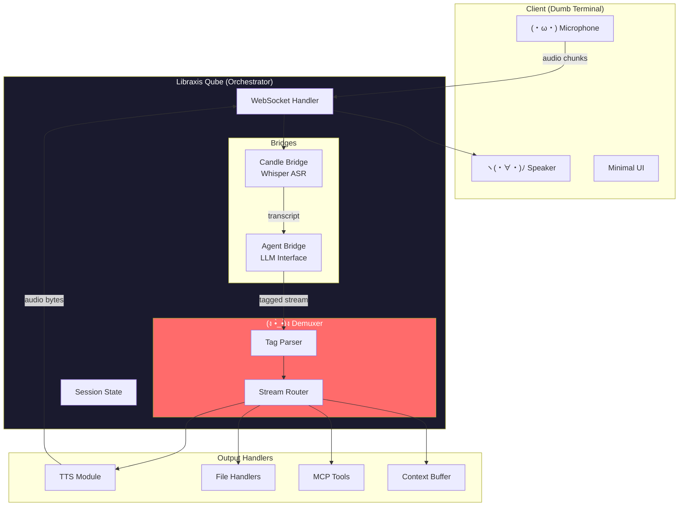

# Speech-to-Speech SSE-Tags-Routed Multitool Agent

> **Status:** Conceptual Analysis
> **Date:** 2026-01-26
> **Authors:** M&K (c)2026 Vetcoders

---

## Executive Summary

This document describes the architecture for a **full-duplex Speech-to-Speech AI agent** with multi-modal output routing. The system uses **SSE tag demuxing** to route LLM response streams to appropriate handlers (audio synthesis, file generation, tool execution) while maintaining real-time conversational flow.

The core innovation is the **Demuxer** - a streaming parser that identifies tagged sections in LLM output and routes them to specialized handlers without breaking the conversational experience.

---

## 1. Problem Statement

### Current Limitations

| Issue                    | Impact                                         |
| ------------------------ | ---------------------------------------------- |
| Text-only LLM output     | User must read responses, breaking voice flow  |
| Single output channel    | Cannot generate files AND speak simultaneously |
| Request-response pattern | No streaming artifacts during generation       |
| Monolithic processing    | All output treated identically                 |

### Target Experience

```
User: "Wygeneruj raport sprzedaży i powiedz mi podsumowanie"

System (simultaneously):
  - Speaks: "Przygotowuję raport. Sprzedaż wzrosła o 15%..."
  - Generates: sales_report_2026.pdf (silently, in background)
  - Notifies: "Raport zapisany w Downloads"
```

---

## 2. Architecture Overview



---

## 3. The Demuxer: Core Innovation

### 3.1 Tag Protocol Specification

```xml
<!-- Audio/Speech output -->
<speak voice="moshika" emotion="friendly">
  Cześć! Przygotowuję Twój raport.
</speak>

<!-- File artifact generation -->
<artifact type="pdf" filename="report.pdf" silent="true">
  [PDF content or generation instructions]
</artifact>

<!-- Tool/MCP execution -->
<tool name="web_search" async="true">
  {"query": "latest sales data"}
</tool>

<!-- Structured data for UI -->
<data type="chart" target="sidebar">
  {"labels": [...], "values": [...]}
</data>

<!-- Default: plain text goes to context buffer -->
Regular text without tags is buffered for context.
```

### 3.2 Parsing Strategy

**Challenge:** LLM streams tokens, not complete tags. Parser must handle partial tags.

```
Stream: "Preparing <sp" [pause] "eak>Hello</speak> world"
                   ↑
            Partial tag - buffer until closed
```

**State Machine:**

```
┌─────────┐    '<'     ┌──────────┐   '>'    ┌─────────────┐
│  TEXT   │ ─────────► │ TAG_OPEN │ ───────► │ TAG_CONTENT │
└─────────┘            └──────────┘          └─────────────┘
     ▲                                              │
     │              '</'              '>'           │
     └──────────── TAG_CLOSE ◄─────────────────────┘
```

**Implementation Approach:**

```rust
pub struct DemuxerState {
    buffer: String,
    current_tag: Option<TagInfo>,
    state: ParseState,
}

pub enum ParseState {
    Text,
    TagOpen,      // Saw '<', collecting tag name
    TagContent,   // Inside tag, collecting content
    TagClose,     // Saw '</', expecting closing tag
}

impl Demuxer {
    /// Process incoming token, may emit zero or more routed chunks
    pub fn process_token(&mut self, token: &str) -> Vec<RoutedChunk> {
        // Incremental parsing logic
    }
}
```

### 3.3 Routing Rules

| Tag          | Handler        | Behavior                                 |
| ------------ | -------------- | ---------------------------------------- |
| `<speak>`    | TTS Module     | Convert to audio, stream to client       |
| `<artifact>` | File Handler   | Generate file, send notification only    |
| `<tool>`     | MCP Bridge     | Execute tool, inject result into context |
| `<data>`     | UI Handler     | Send structured data to client UI        |
| (none)       | Context Buffer | Accumulate for conversation history      |

### 3.4 Concurrency Model

```
LLM Stream ──┬──► [speak] ──► TTS Queue ──► Audio Out
             │
             ├──► [artifact] ──► File Worker (async)
             │
             ├──► [tool] ──► MCP Executor ──► Result Injection
             │
             └──► [text] ──► Context Buffer
```

**Key Principle:** Non-blocking. Audio must not wait for file generation.

---

## 4. Component Deep Dives

### 4.1 Client (Workstation)

**Role:** Minimal "dumb terminal" - I/O only.

| Responsibility   | Implementation                  |
| ---------------- | ------------------------------- |
| Audio capture    | WebAudio API / CoreAudio        |
| Audio playback   | WebAudio API / CoreAudio        |
| WebSocket client | Native / Browser                |
| Minimal UI       | Status indicator, notifications |

**Why dumb?**

- All intelligence in Qube
- Client can be browser, native app, or embedded device
- Easy to replace/upgrade client without touching core logic

### 4.2 Libraxis Qube (Orchestrator)

**Role:** The "brain stem" - all coordination happens here.

```rust
pub struct LibraxisQube {
    // Connection management
    sessions: HashMap<SessionId, Session>,

    // Processing bridges
    candle_bridge: CandleBridge,      // Whisper ASR
    agent_bridge: AgentBridge,        // LLM interface
    tts_bridge: TtsBridge,            // Moshi/CSM TTS

    // Routing
    demuxer: Demuxer,

    // Tool execution
    mcp_client: McpClient,
}

pub struct Session {
    id: SessionId,
    ws: WebSocketSender,
    context: ConversationContext,
    state: SessionState,
}
```

**Bridges:**

| Bridge       | Input                | Output       | Latency Target     |
| ------------ | -------------------- | ------------ | ------------------ |
| Candle (ASR) | Audio f32 chunks     | Text tokens  | <200ms             |
| Agent (LLM)  | Conversation context | Token stream | <500ms first token |
| TTS          | Text chunks          | Audio bytes  | <300ms             |

### 4.3 Candle Transformers (ASR)

**Model:** Whisper v3 Turbo (quantized)

```rust
pub struct CandleBridge {
    model: WhisperModel,
    mel_filters: MelFilters,
    tokenizer: Tokenizer,
}

impl CandleBridge {
    /// Process audio chunk, return partial/final transcripts
    pub fn process_audio(&mut self, samples: &[f32]) -> Vec<TranscriptSegment>;
}
```

**Streaming Strategy:**

- VAD-based chunking (Silero VAD)
- Overlapping windows for continuity
- Partial results with confidence scores

### 4.4 LLM Agent

**Interface:** OpenAI-compatible `/v1/responses` with SSE streaming.

**System Prompt (excerpt):**

```
You are a voice-first AI assistant. Your responses will be processed
by a tag router. Use these tags appropriately:

<speak voice="default">Text to be spoken aloud</speak>
<artifact type="pdf|txt|json" filename="name">Content to save</artifact>
<tool name="tool_name">{"params": "here"}</tool>

Rules:
1. ALWAYS wrap spoken content in <speak> tags
2. Long artifacts should be silent - speak only a summary
3. Tool results will be injected into your context automatically
4. Keep spoken segments conversational and concise
```

---

## 5. Data Flow: Complete Example

```
┌─────────────────────────────────────────────────────────────────────┐
│ User says: "Sprawdź pogodę i powiedz mi czy brać parasol"           │
└─────────────────────────────────────────────────────────────────────┘
                                    │
                                    ▼
┌─────────────────────────────────────────────────────────────────────┐
│ 1. AUDIO CAPTURE                                                     │
│    Client: Mic → 48kHz f32 chunks → WebSocket                       │
└─────────────────────────────────────────────────────────────────────┘
                                    │
                                    ▼
┌─────────────────────────────────────────────────────────────────────┐
│ 2. ASR (Candle Bridge)                                               │
│    Whisper: Audio → "Sprawdź pogodę i powiedz mi czy brać parasol" │
└─────────────────────────────────────────────────────────────────────┘
                                    │
                                    ▼
┌─────────────────────────────────────────────────────────────────────┐
│ 3. LLM GENERATION (Agent Bridge)                                     │
│    Context + Transcript → LLM → Tagged stream:                       │
│                                                                      │
│    <tool name="weather">{"city": "Kielce"}</tool>                   │
│    <speak>Sprawdzam pogodę w Kielcach...</speak>                    │
│    [tool result injected: {"temp": 12, "rain_prob": 0.8}]           │
│    <speak>Jest 12 stopni z 80% szansą na deszcz.                    │
│    Zdecydowanie weź parasol!</speak>                                │
└─────────────────────────────────────────────────────────────────────┘
                                    │
                                    ▼
┌─────────────────────────────────────────────────────────────────────┐
│ 4. DEMUXER ROUTING                                                   │
│                                                                      │
│    <tool> ──► MCP Executor ──► weather API ──► result injection     │
│    <speak> ──► TTS Queue ──► Moshi ──► Audio bytes                  │
└─────────────────────────────────────────────────────────────────────┘
                                    │
                                    ▼
┌─────────────────────────────────────────────────────────────────────┐
│ 5. AUDIO PLAYBACK                                                    │
│    Qube: Audio bytes → WebSocket → Client: Speaker                  │
│    User hears: "Sprawdzam pogodę... Zdecydowanie weź parasol!"      │
└─────────────────────────────────────────────────────────────────────┘
```

---

## 6. Technology Stack

### 6.1 Confirmed Technologies

| Component     | Technology                | Status        |
| ------------- | ------------------------- | ------------- |
| ASR           | Whisper v3 Turbo (Candle) | ✅ Production |
| TTS           | Moshi/Mimi (Candle)       | ✅ Integrated |
| VAD           | Silero VAD (ONNX)         | ✅ Production |
| LLM Interface | OpenAI-compatible API     | ✅ Production |
| WebSocket     | tokio-tungstenite         | ✅ Available  |
| MCP           | rmcp crate                | ✅ Available  |

### 6.2 To Be Implemented

| Component        | Approach                | Complexity |
| ---------------- | ----------------------- | ---------- |
| Demuxer          | Custom streaming parser | Medium     |
| Session Manager  | Actor model (tokio)     | Medium     |
| Tag Protocol     | Custom XML-like         | Low        |
| Audio Codec (WS) | Opus encoding           | Medium     |
| Client SDK       | TypeScript + Rust       | High       |

### 6.3 Infrastructure

```
┌─────────────────────────────────────────────────────────────┐
│                    DEPLOYMENT OPTIONS                        │
├─────────────────────────────────────────────────────────────┤
│                                                              │
│  Option A: Local (Current Codescribe model)                 │
│  ┌─────────┐     ┌─────────────────────────────┐            │
│  │ Client  │────►│ Qube (same machine)         │            │
│  └─────────┘     │ - All models local          │            │
│                  │ - Zero network latency      │            │
│                  └─────────────────────────────┘            │
│                                                              │
│  Option B: LAN (Home/Office)                                │
│  ┌─────────┐     ┌─────────────────────────────┐            │
│  │ Client  │─WS─►│ Qube (Dragon M3 Ultra)      │            │
│  │ (laptop)│     │ - Heavy models on server    │            │
│  └─────────┘     │ - ~1ms network latency      │            │
│                  └─────────────────────────────┘            │
│                                                              │
│  Option C: Cloud (Future)                                   │
│  ┌─────────┐     ┌─────────────────────────────┐            │
│  │ Client  │─WSS►│ Qube (Cloud GPU)            │            │
│  │ (any)   │     │ - Scalable                  │            │
│  └─────────┘     │ - ~50ms network latency     │            │
│                  └─────────────────────────────┘            │
│                                                              │
└─────────────────────────────────────────────────────────────┘
```

---

## 7. Challenges & Mitigations

### 7.1 Latency Budget

**Target:** <1s end-to-end (user stops speaking → audio response starts)

| Stage           | Budget     | Risk   | Mitigation                            |
| --------------- | ---------- | ------ | ------------------------------------- |
| VAD detection   | 100ms      | Low    | Silero is fast                        |
| ASR processing  | 200ms      | Medium | Stream partial results                |
| LLM first token | 500ms      | High   | Use fast models, speculative decoding |
| TTS synthesis   | 200ms      | Medium | Moshi streaming, pre-buffer           |
| **Total**       | **1000ms** |        |                                       |

**Fallback:** If latency exceeds budget, play "thinking" audio cue.

### 7.2 Tag Parsing Edge Cases

| Edge Case            | Example                         | Handling                          |
| -------------------- | ------------------------------- | --------------------------------- |
| Nested tags          | `<speak><b>bold</b></speak>`    | Allow, pass inner tags to handler |
| Malformed tags       | `<speak>unclosed`               | Timeout, flush as text            |
| Escaped content      | `<speak>&lt;code&gt;</speak>`   | XML entity decode                 |
| Binary in tags       | `<artifact>[binary]</artifact>` | Base64 encode                     |
| Interruption mid-tag | `<speak>Hel--[user interrupts]` | Discard partial                   |

### 7.3 Concurrency Hazards

| Hazard        | Scenario                                   | Solution                         |
| ------------- | ------------------------------------------ | -------------------------------- |
| Audio overlap | TTS still playing when new response starts | Interrupt queue, fade out        |
| Tool timeout  | MCP tool hangs                             | Timeout + "still working" speech |
| Session leak  | Client disconnects mid-stream              | Cleanup on WS close              |
| Context race  | Tool result arrives during generation      | Inject at safe points only       |

### 7.4 Model Memory Pressure

**On Dragon (512GB):**

| Model            | VRAM/RAM | Status      |
| ---------------- | -------- | ----------- |
| Whisper v3 Turbo | ~2GB     | OK          |
| Moshi (q8)       | ~8GB     | OK          |
| LLM (70B q4)     | ~40GB    | OK          |
| **Headroom**     | ~460GB   | Comfortable |

**On Consumer Hardware:**

| Config    | Feasible? | Notes                            |
| --------- | --------- | -------------------------------- |
| 16GB RAM  | ⚠️ Tight  | Use smaller models, no local LLM |
| 32GB RAM  | ✅ OK     | Whisper + Moshi + 7B LLM         |
| 64GB+ RAM | ✅ Great  | Full stack locally               |

---

## 8. Implementation Phases

### Phase 1: Demuxer Core (2 weeks)

- [ ] Tag protocol specification (formal grammar)
- [ ] Streaming parser implementation
- [ ] Unit tests for edge cases
- [ ] Integration with existing LLM client

### Phase 2: WebSocket Bridge (2 weeks)

- [ ] Session manager with actor model
- [ ] Audio codec (Opus) for efficient streaming
- [ ] Client handshake protocol
- [ ] Reconnection handling

### Phase 3: Handler Integration (2 weeks)

- [ ] TTS handler (connect existing Moshi)
- [ ] File handler (PDF, TXT, JSON)
- [ ] MCP tool handler
- [ ] UI data handler

### Phase 4: Client SDK (3 weeks)

- [ ] TypeScript SDK (browser)
- [ ] Rust SDK (native apps)
- [ ] React components
- [ ] Example applications

### Phase 5: Polish & Production (2 weeks)

- [ ] Latency optimization
- [ ] Error recovery
- [ ] Monitoring/metrics
- [ ] Documentation

**Total:** ~11 weeks

---

## 9. Success Metrics

| Metric                | Target       | Measurement      |
| --------------------- | ------------ | ---------------- |
| End-to-end latency    | <1000ms p95  | Timestamp traces |
| ASR accuracy          | >95% WER     | Test corpus      |
| Tag parse success     | >99.9%       | Unit tests       |
| Concurrent sessions   | 10+ per Qube | Load test        |
| Client battery impact | <5% increase | Mobile profiling |

---

## 10. Open Questions

1. **Tag syntax:** XML-like vs JSON-like vs custom?
2. **Interruption UX:** Hard cut vs fade vs "hold that thought"?
3. **Multi-language:** Per-tag language hints or session-wide?
4. **Artifact preview:** Generate thumbnail for files in chat?
5. **Tool approval:** Auto-execute vs user confirmation for sensitive tools?

---

## Appendix A: Tag Protocol Grammar (Draft)

```ebnf
stream      = { chunk }
chunk       = text | tagged
tagged      = open_tag content close_tag
open_tag    = '<' tag_name { attribute } '>'
close_tag   = '</' tag_name '>'
tag_name    = 'speak' | 'artifact' | 'tool' | 'data'
attribute   = attr_name '=' '"' attr_value '"'
content     = { any_char - '</' }
text        = { any_char - '<' }
```

---

## Appendix B: Example Session Transcript

```
[00:00.000] USER: "Napisz email do klienta o opóźnieniu dostawy"
[00:00.100] ASR: "Napisz email do klienta o opóźnieniu dostawy"
[00:00.600] LLM: <speak>Przygotowuję email.</speak>
[00:00.800] TTS: [audio: "Przygotowuję email."]
[00:01.200] LLM: <artifact type="email" silent="true">
                  Subject: Informacja o opóźnieniu dostawy
                  ...
                </artifact>
[00:02.500] LLM: <speak>Email gotowy. Wysłać teraz czy chcesz przejrzeć?</speak>
[00:02.700] TTS: [audio: "Email gotowy..."]
[00:03.500] USER: "Wyślij"
[00:03.600] ASR: "Wyślij"
[00:04.000] LLM: <tool name="send_email">{"draft_id": "123"}</tool>
[00:04.500] TOOL: {"status": "sent", "recipient": "klient@example.com"}
[00:04.600] LLM: <speak>Wysłano do klient@example.com</speak>
[00:04.800] TTS: [audio: "Wysłano do klient@example.com"]
```

---

_Created by M&K (c)2026 Vetcoders_
