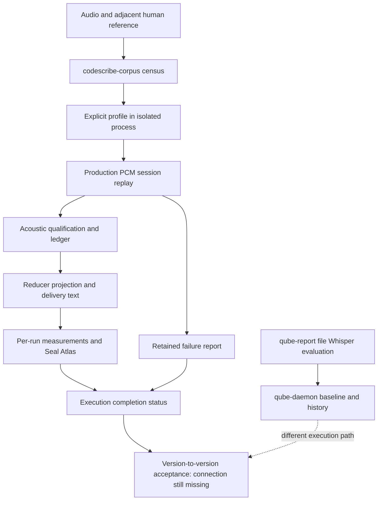

# Repeatable acceptance: measured scope, not a green report

## Recovered intent

The historical architecture diagrams proposed a useful cycle: fixed audio and
references, measurements, comparison with a baseline, explicit repairs, and
retained history. Keep that ambition without restoring historical engines or
letting evaluation rewrite production settings automatically.

## Current executable paths

`qube-daemon` contains baseline selection, regression analysis, tuning proposals
and history. Its local arm runs file Whisper; its scores do not certify the live
Apple/controller path. `codescribe-teacher compare` compares supplied texts, not
two versioned production runs. `codescribe-corpus` records audio/reference hashes,
explicit profiles and per-execution outcomes, but has no cross-release comparison
command yet. Seal Atlas makes PCM evidence visible; it does not turn missing
measurements into proof or certify lexical accuracy by itself.

## What the command proves

`make test-corpus-parity` preserves reports before reporting unsuccessful or
missing executions as a command failure. A successful command means the requested
measurements completed, not that accuracy meets a release threshold. Check every
profile and its observed configuration, not only aggregate mean scores.

File replay does not cover microphone capture, hotkey handling, GUI painting,
target-app paste, Max formatting or voice delivery. Those require separate live
acceptance receipts. A pointer module harness likewise does not prove the entire
installed application interaction.

## Human reference admission

For `take.wav`, corpus discovery accepts the same adjacent human-reference names
as `scripts/lib/data-assets.sh`:

- `take_human_transcription.txt`
- `take_codescribe_raw_human_transcription_from_wav.txt`

Both may exist only with identical nonempty content. A conflicting, unreadable
or empty human reference is an error, not a reason to choose another label.
Ordinary `take.txt` is historical text, admitted only by explicit policy. It is
not silently promoted to human truth. Do not rename private source files merely
to satisfy an incomplete evaluator.

## Open acoustic admission boundary

The current replay session supplies no capture device identity. The production
engine deliberately cannot qualify occurrences without a measured calibration
bound to the capture path. Therefore present file replay cannot certify qualified
delivery merely because Apple or Whisper emitted candidate text.

Do not invent an identity, use an unrelated current microphone calibration for an
old WAV, or insert permissive thresholds. Repeatable production acceptance needs
recording-bound capture/calibration provenance. The admissible storage/replay
connection remains to be implemented and verified. Historical WAVs without that
evidence can still be useful for explicitly scoped text/engine experiments, not
as proof of calibrated production delivery.

## Comparison contract to implement

- Match audio and human-reference hashes; expose additions, removals and changes.
- Record source/build, engine artifact, language, profile and calibration evidence.
- Refuse corrupt, empty, incomparable or incomplete inputs rather than reporting
  no regression. Keep execution failures separate from accuracy regressions.
- Preserve individual repeated runs and variability; do not hide failed rows in
  successful-run averages.
- Keep acoustic coverage, lexical accuracy, latency and delivery integrity as
  distinct measured dimensions. A score cannot stand in for an unmeasured one.
- Retain baseline and candidate artifacts and the exact acceptance decision.
- Repairs are explicit work followed by another measurement, never automatic
  mutation of the Founder's running configuration by the evaluator.

This document describes current wiring and open requirements, not completion.
