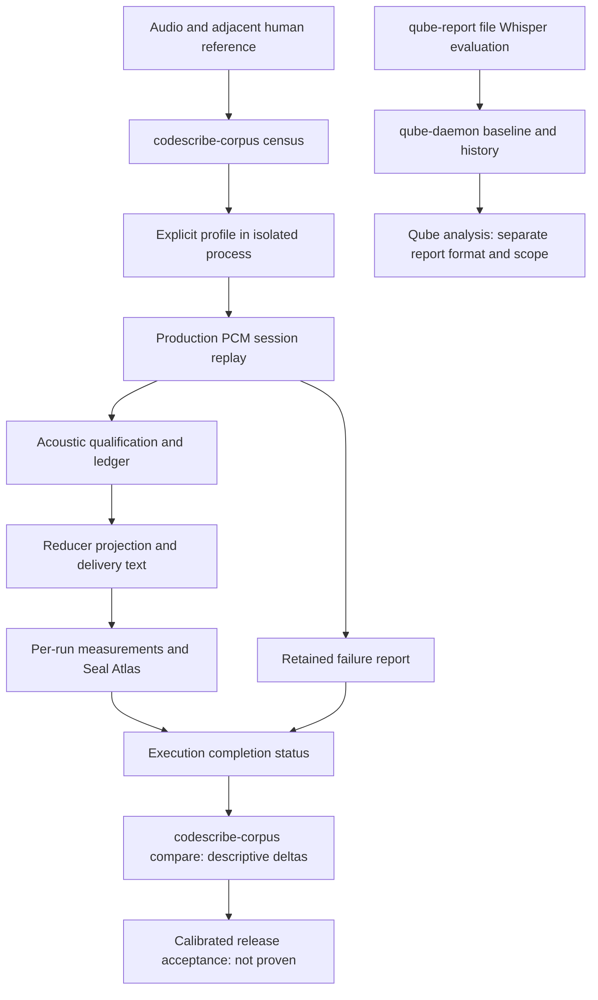

# Repeatable acceptance: measured scope, not a green report

## Recovered intent

The historical architecture diagrams proposed a useful cycle: fixed audio and
references, measurements, comparison with a baseline, explicit repairs, and
retained history. Keep that ambition without restoring historical engines or
letting evaluation rewrite production settings automatically.

## Current executable paths



`qube-daemon` contains baseline selection, regression analysis, tuning proposals
and history. Its local arm runs file Whisper; its scores do not certify the live
Apple/controller path. `codescribe-teacher compare` compares supplied texts, not
two versioned production runs. `codescribe-corpus` records audio/reference hashes,
explicit profiles and per-execution outcomes. Its `compare` command matches
complete profile reports by audio hash, reference hash and run number. Seal Atlas
makes PCM evidence visible; it does not turn missing
measurements into proof or certify lexical accuracy by itself.

Qube reports are not inputs to `codescribe-corpus compare`. These are separate
executable paths, not connected stages of one acceptance pipeline. Selected Qube
baselines now fail on read/parse errors, unavailable targets or a canonical path
equal to the current report. Qube still matches entry IDs rather than binding
audio/reference hashes; its history reader tolerates malformed lines and hides
read errors. Its zero-regression result is not production acceptance.

## What the command proves

`make test-corpus-parity` preserves reports before reporting unsuccessful or
missing executions as a command failure. A successful command means the requested
measurements completed, not that accuracy meets a release threshold. Check every
profile and its observed configuration, not only aggregate mean scores.

File replay does not cover microphone capture, hotkey handling, GUI painting,
target-app paste, Max formatting or voice delivery. Those require separate live
acceptance receipts. A pointer module harness likewise does not prove the entire
installed application interaction.

## Human reference admission

For `take.wav`, corpus discovery accepts the same adjacent human-reference names
as `scripts/lib/data-assets.sh`:

- `take_human_transcription.txt`
- `take_codescribe_raw_human_transcription_from_wav.txt`

Both may exist only with identical nonempty content. A conflicting, unreadable
or empty human reference is an error, not a reason to choose another label.
Ordinary `take.txt` is historical text, admitted only by explicit policy. It is
not silently promoted to human truth. Do not rename private source files merely
to satisfy an incomplete evaluator.

## Open acoustic admission boundary

The current replay session supplies no capture device identity. The production
engine deliberately cannot qualify occurrences without a measured calibration
bound to the capture path. Therefore present file replay cannot certify qualified
delivery merely because Apple or Whisper emitted candidate text.

Do not invent an identity, use an unrelated current microphone calibration for an
old WAV, or insert permissive thresholds. Repeatable production acceptance needs
recording-bound capture/calibration provenance. The admissible storage/replay
connection remains to be implemented and verified. Historical WAVs without that
evidence can still be useful for explicitly scoped text/engine experiments, not
as proof of calibrated production delivery.

The recorder sends mono `f32` to the live callback and writes converted `i16`
samples to its archive. An archive hash establishes the replay input, not
bit-identical live ingress. Keep archival replay and live capture checks separate.

## Evidence checkpoint: 2026-09-15

| Question                           | Observed evidence                                                                                                                           | Boundary                                                                                |
| ---------------------------------- | ------------------------------------------------------------------------------------------------------------------------------------------- | --------------------------------------------------------------------------------------- |
| Does the pointer race reproduce?   | Current pointer source in the supplied AppKit harness: rapid 8-cycle case settles to one updater; all nine started workers exit after hide. | Module harness, not installed-app hotkey/UI acceptance; transient overlap still occurs. |
| Are human references discovered?   | Four existing fixtures selected as human after supporting both documented suffixes.                                                         | Discovery, not transcription accuracy.                                                  |
| Does production replay complete?   | Two actual runs of one 86-second fixture failed with no deliverable ledger text.                                                            | No accuracy score; capture-bound calibration missing in replay.                         |
| Are failures visible?              | Real negative command preserves its report and returns nonzero; count tests reject incomplete execution.                                    | Negative-path proof, not positive replay.                                               |
| Can measurements be compared?      | Corpus comparison matches audio/reference/run identities and refuses failed inputs; synthetic unit tests verify deltas.                     | Positive real-audio comparison still missing.                                           |
| Is the historical loop executable? | Qube baseline/history/tuning code exists; 37 module tests pass after baseline repairs.                                                      | File Whisper path; no full daemon/audio experiment in this investigation.               |

Private experiment receipts are retained under
`~/.vibecrafted/artifacts/vetcoders/codescribe/2026_0915/reports/quality-recovery/`.
`STATUS.md` records exact commits and gate scope; `pointer/RECEIPT.md` separates
current harness results from historical copied artifacts. No private audio or
human transcript is committed here.

## Next runtime cut, not yet implemented

Use the existing recorder/session owners: freeze the actually admitted measured
profile, capture path, session/epoch and timestamp at recording start; bind that
evidence to the finalized archive at stop. Failure to persist evidence must retain
the audio and report it as ineligible for calibrated replay, not lose the take.
Validate schema, audio/profile hashes, sample dimensions, capture identity and
calibration validity at the recorded time before replay. Do not introduce a
second threshold owner or alter current live calibration expiry.

Before calling this cut accepted, prove rejection of absent/tampered/foreign
evidence and invalid-at-capture profiles, then repeat a fresh human-confirmed
recording through the production path. A synthetic profile can test refusal logic
but cannot replace the positive measured receipt. Recording requires the Founder;
this investigation does not start the microphone automatically.

## Compare retained profile reports

```sh
cargo run --bin codescribe-corpus -- compare \
  --baseline /path/to/baseline/profile-apple-layer0.json \
  --candidate /path/to/candidate/profile-apple-layer0.json
```

JSON is written to stdout without overwriting either input. The command refuses
identical files, incomplete executions, duplicate/missing runs, changed reference
sets, and changed profiles or Apple bridge artifacts. It reports per-run WER,
CER and wall-time deltas, not an automatic accuracy threshold verdict. The output
explicitly says release readiness and full runtime/calibration equivalence are
not proven. Positive delta means the candidate value increased; interpretation
requires the stated measurement scope. These descriptive comparisons do not
replace the remaining calibration provenance and acceptance work below.

## Full acceptance contract still to complete

- Match audio and human-reference hashes; expose additions, removals and changes.
- Record source/build, engine artifact, language, profile and calibration evidence.
- Refuse corrupt, empty, incomparable or incomplete inputs rather than reporting
  no regression. Keep execution failures separate from accuracy regressions.
- Preserve individual repeated runs and variability; do not hide failed rows in
  successful-run averages.
- Keep acoustic coverage, lexical accuracy, latency and delivery integrity as
  distinct measured dimensions. A score cannot stand in for an unmeasured one.
- Retain baseline and candidate artifacts and the exact acceptance decision.
- Repairs are explicit work followed by another measurement, never automatic
  mutation of the Founder's running configuration by the evaluator.

This document describes current wiring and open requirements, not completion.
