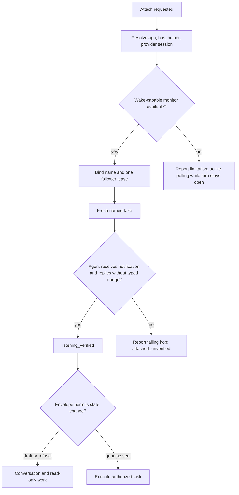

# Codescribe attach flow

Foundation skill; execute in this conversation.

Recovery preserves the provider session, lease and cursor and rechecks monitor
delivery. Explicit stop closes owned handles. Neither recovery nor an observer
creates a second microphone.

Procedures: [attach](references/attach.md), [monitor](references/monitor.md),
[live vs seal](references/live-vs-seal.md), [CLI](references/cli.md).
