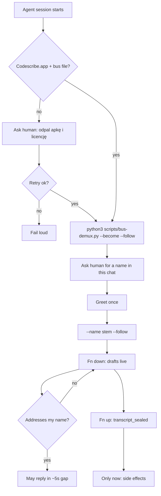

# `codescribe` attach flow

> Foundation skill. No `vibecrafted codescribe <agent>` worker.

## Flow

## Routes

| Entry | Args | Produces | Exit |
| --- | --- | --- | --- |
| `/codescribe` | none | agent attached, named, listening | in-session |
| Worker CLI | **none** | — | do not invent |

### Escalation edges

- Repo surgery after attach → `vc-justdo` / `vc-implement` (not this skill)
- Session orientation of the checkout → `vc-init`
- In-app Agent window → Codescribe Assistive / `⌘⇧Space`, not this skill

### Session artifacts

- Bus: `~/.codescribe/transcript-events.jsonl` (`CODESCRIBE_TRANSCRIPT_BUS_PATH` wins)
- Follower stdout: one JSON object per matching event (kielbasa)

### Anti-patterns

- Fake `vibecrafted codescribe <agent>`
- Second microphone / Voice Lab
- Acting on a half utterance
