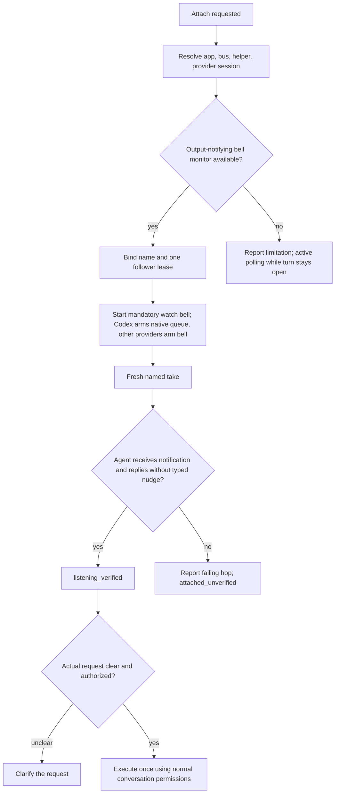

# Codescribe attach flow

Foundation skill; execute in this conversation.

```mermaid
flowchart TD
    A[Attach requested] --> B[Resolve app, bus, helper, provider session]
    B --> C{Output-notifying bell monitor available?}
    C -->|yes| D[Bind name and one follower lease]
    C -->|no| E[Report limitation; active polling while turn stays open]
    D --> M[Start mandatory watch bell; Codex arms native queue, other providers arm bell]
    M --> F[Fresh named take]
    F --> G{Agent receives notification and replies without typed nudge?}
    G -->|yes| H[listening_verified]
    G -->|no| I[Report failing hop; attached_unverified]
    H --> J{Actual request clear and authorized?}
    J -->|unclear| K[Clarify the request]
    J -->|yes| L[Execute once using normal conversation permissions]
```

Recovery preserves the provider session, lease and cursor and rechecks monitor
delivery. Explicit stop closes owned handles and releases the channel with
`--detach`; the lease and its backlog stay for the next session of the same
name, which attaches with `--takeover`. Neither recovery nor an observer
creates a second microphone.

`--wakeup bell` lives only while the session is active and must be renewed with
bounded watcher windows; it cannot resume after the final answer.

Procedures: [attach](references/attach.md), [monitor](references/monitor.md),
[live vs seal](references/live-vs-seal.md), [CLI](references/cli.md),
[voice reply](references/voice-reply.md).
